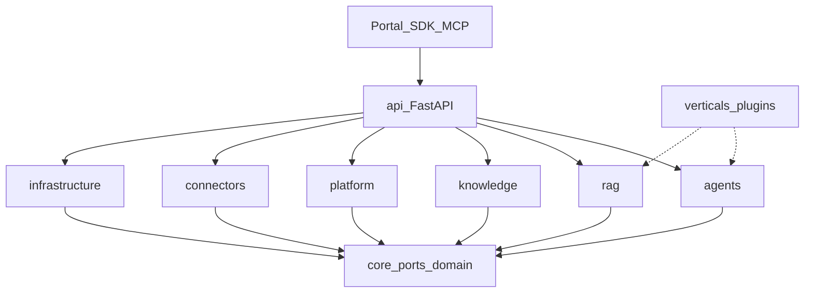

# Zent — RAG-as-a-Service Platform

**Orquestación de agentes de IA con Retrieval-Augmented Generation multi-organización, Text-to-SQL seguro, facturación integrada y observabilidad completa.**

Zent convierte los datos privados de una empresa (SQL, documentos, APIs, S3) en respuestas citables y accionables vía API REST, SDKs y MCP — sin que el cliente tenga que montar embeddings, vector DB, RBAC ni billing desde cero.

| | |
|---|---|
| **Producto** | RAG-as-a-Service / AI Agent Platform |
| **App** | `0.1.0` ([`pyproject.toml`](pyproject.toml)) |
| **API pública** | `1.0.0` en `/api/v1` ([`src/api/versioning.py`](src/api/versioning.py)) |
| **SDKs** | Python `zent` 1.0.0 · Node `zent-node` 1.0.0 |
| **Licencia** | Proprietary — todos los derechos reservados |
| **Estado** | En desarrollo activo · contrato API estable 1.0.0 · CI en `master` |

```python
from zent import Zent

client = Zent(api_key="zent_sk_live_...")
print(client.chat("What is our refund policy?").answer)
```

OpenAPI: `/docs` · `/redoc` · `/api/v1/openapi.json`

---

## Tabla de contenidos

1. [Descripción general](#1-descripción-general)
2. [Zent vs RAG estándar](#2-zent-vs-rag-estándar)
3. [Para quién y casos de uso](#3-para-quién-y-casos-de-uso)
4. [Estado del proyecto](#4-estado-del-proyecto)
5. [Quickstart](#5-quickstart)
6. [Stack tecnológico](#6-stack-tecnológico)
7. [Arquitectura](#7-arquitectura)
8. [Flujos end-to-end](#8-flujos-end-to-end)
9. [Estructura de carpetas](#9-estructura-de-carpetas)
10. [Capacidades y features](#10-capacidades-y-features)
11. [APIs y endpoints principales](#11-apis-y-endpoints-principales)
12. [Requisitos e instalación](#12-requisitos-e-instalación)
13. [Variables de entorno](#13-variables-de-entorno)
14. [Seguridad multi-tenant](#14-seguridad-multi-tenant)
15. [Roadmap](#15-roadmap)
16. [Documentación relacionada](#16-documentación-relacionada)
17. [Licencia](#17-licencia)

---

## 1. Descripción general

### El problema

Las empresas quieren preguntar a sus datos en lenguaje natural (“¿cuántas ventas hubo en enero?”, “¿cuál es la política de reembolsos?”), pero montar eso en producción implica:

- Embeddings, vector store, chunking y retrieval híbrido
- Aislamiento multi-tenant (sin filtrar datos entre clientes)
- Text-to-SQL seguro (solo lectura, sin filtraciones)
- Agentes con tools, cuotas y auditoría
- Facturación por uso, API keys y un portal self-service
- Métricas, logs y evaluación de calidad (regresión)

Hacerlo bien es meses de ingeniería. Hacerlo mal es un incidente de seguridad o un producto que alucina.

### La solución

**Zent** es una plataforma SaaS lista para desplegar que ofrece:

- **RAG** sobre knowledge bases multi-fuente (SQL, PDF, CSV/Excel, web, S3, APIs)
- **SQL Expert** (NL → SQL validado, rol PostgreSQL read-only)
- **Agent Runtime** (ReAct, guardrails, runs con traza y streaming SSE)
- **MCP Server** (`/mcp`) para Claude, Cursor y otros clientes MCP
- **Billing & usage** (trials, planes, cuotas, invoices, webhooks)
- **Portal B2B** (signup, chat, keys, ingestion, agentes, conectores)
- **Evaluation Engine** (golden sets, LLM-judge, detección de regresión)
- **Observabilidad PLG** (Prometheus + Loki + Grafana) + OpenTelemetry

### Diferenciadores

| Diferenciador | Qué significa en la práctica |
|---|---|
| **Multi-tenant estricto** | Identidad solo del Bearer; filtro `organization_id` en Qdrant/SQL/Redis/audit; cross-tenant → 404 |
| **RAG + SQL + Agents** | Un solo stack: semántica, tablas y agentes con tools |
| **MCP de primera clase** | Mismas auth, cuotas y rate limits que REST |
| **Clean Architecture** | `core/` isla sin frameworks; dependencias enforced por tests |
| **Connectors como plugins** | Postgres, MySQL, MSSQL, Oracle, DB2, CSV, Excel, PDF, REST, GraphQL, S3 |
| **Eval con regresión** | Compara versiones (prompt/model/retriever) y falla el CI si baja calidad |
| **Verticals como plugins** | Dominio (ej. farmacia) fuera de core — prompts, heuristics, golden sets |

---

## 2. Zent vs RAG estándar

Un RAG «de laboratorio» es chunk → embed → top-k → prompt. Zent es la versión de producción de ese flujo: retrieval híbrido, SQL validado, aislamiento multi-tenant, evaluación con regresión y controles de seguridad que un naive RAG no tiene.

### Comparación directa

| Aspecto | RAG estándar / naive | Zent |
|---|---|---|
| **Retrieval** | Solo vectorial (dense top-k) | `vector` · `lexical` (BM25) · `hybrid` con fusión RRF o weighted + rerank cross-encoder/LLM |
| **Datos** | Documentos sueltos | KBs multi-fuente: SQL, PDF, CSV/Excel, web, S3, REST/GraphQL — normalizados a Markdown y versionados por `content_hash` |
| **SQL** | No soportado (el LLM inventa SQL) | SQL Expert: NL → SQL SELECT-only con validación AST (sqlglot), límites de costo/tablas, rol Postgres `rag_reader` READ ONLY y **auto-repair** de SQL inválido |
| **Contexto** | Todo en el prompt | Context budget fit, schema relevance (solo tablas relevantes al LLM), historial en Redis con TTL |
| **Multi-tenant** | Inexistente o por filtro manual | Identidad solo del Bearer, filtro obligatorio `organization_id` en Qdrant/SQL/Redis/audit, cross-tenant → 404 |
| **Seguridad** | Ninguna | Anti prompt-injection, guards SSRF en connectors y tool `call_api`, DNS-rebinding protection en `/mcp`, redaction de secrets, bcrypt + brute-force login, idempotency |
| **Agentes** | — | Agent Runtime ReAct con guardrails (max steps/tools/tokens/costo/timeout), tools allowlisted con guards (schema input, rate limit, timeout) |
| **Calidad** | «Parece bien» | Evaluation Engine: golden sets, métricas deterministas + LLM-judge (`faithfulness`, `hallucination_rate`), snapshot por deploy y compare de regresión que falla el CI |
| **Ops** | Script suelto | Compose completo, Prometheus + Loki + Grafana, OpenTelemetry, circuit breaker, jobs durables con retry/resume/dead-letter, facturación por uso |
| **Frescura de datos** | Re-index manual | Lazy ingestion con **auto-promotion** (umbral de actividad → sync completo auto-encolado, cooldown, cap horario) |

### Mejoras implementadas (evidencia en código)

**Retrieval y generación**

- **Hybrid retrieval** con fusión RRF o weighted — [`src/rag/retrieval/`](src/rag/retrieval/)
- **Reranking** opcional por LLM o cross-encoder — [`src/rag/reranking/`](src/rag/reranking/)
- **Clasificación de query / detección de idioma** (densidad léxica, stopwords ES/EN) para elegir estrategia — [`src/rag/retrieval/classify.py`](src/rag/retrieval/classify.py)
- **Chunking por KB** configurable: `fixed` · `recursive` · `sentence` — [`src/rag/chunking/`](src/rag/chunking/)
- **SQL Expert con auto-repair**: SQL inválido → prompt de reparación → re-validación AST antes de ejecutar — [`src/agents/tools/sql_expert_postgres.py`](src/agents/tools/sql_expert_postgres.py)
- **Lazy ingestion con auto-promotion**: actividad en tablas → auto-enqueue de sync completo con cooldown y caps — [`src/agents/runtime/orchestrator.py`](src/agents/runtime/orchestrator.py)

**Seguridad**

- **Detección de prompt-injection** en inputs de API y agentes — [`src/api/schemas.py`](src/api/schemas.py), [`src/agents/policies/authorization.py`](src/agents/policies/authorization.py)
- **Guards SSRF** en connectors y en la tool `call_api` de agentes (allowlist, bloqueo de rangos privados) — [`src/connectors/plugin/`](src/connectors/plugin/), [`src/agents/tools/tools_builtin.py`](src/agents/tools/tools_builtin.py)
- **DNS-rebinding protection** en el servidor MCP (`RAG_RAG_MCP_ALLOWED_HOSTS`) — [`src/mcp_server/app.py`](src/mcp_server/app.py)
- **Redaction de secrets** en salidas y logs de connectors — [`src/connectors/plugin/redaction.py`](src/connectors/plugin/redaction.py)
- **Secrets** con HashiCorp Vault + fallback AES-GCM en Postgres — [`src/infrastructure/secrets/`](src/infrastructure/secrets/)
- **Login brute-force protection** (máx. intentos por ventana) — [`src/platform/auth/rate_limit.py`](src/platform/auth/rate_limit.py)
- **Fail-fast en producción**: settings rechazan secretos inseguros, CORS `*` y endpoints de admin — [`src/core/config.py`](src/core/config.py)
- **Hardening de contenedor**: usuario non-root y security headers (CSP, X-Frame-Options, …) — [`Dockerfile.api`](Dockerfile.api), [`portal/nginx.conf`](portal/nginx.conf)

**Fiabilidad y facturación**

- **Circuit breaker** en llamadas LLM/embeddings — [`src/infrastructure/resilience/circuit_breaker.py`](src/infrastructure/resilience/circuit_breaker.py)
- **Idempotency middleware** (`Idempotency-Key`) en mutaciones sensibles — [`src/api/idempotency_middleware.py`](src/api/idempotency_middleware.py)
- **Usage events idempotentes** (UNIQUE `(request_id, event_type)` + Redis SADD): reintentos no duplican cobro — [`src/platform/usage/usage_engine.py`](src/platform/usage/usage_engine.py)
- **Invoices idempotentes** por (org, período) — [`src/scripts/billing_invoice.py`](src/scripts/billing_invoice.py)
- **Guardrails del Agent Runtime**: max steps, tool calls, tokens, costo y timeouts por run — [`src/agents/runtime/agent_runtime.py`](src/agents/runtime/agent_runtime.py)
- **Tool guards**: validación de input por JSON-schema, rate limit por tenant y timeout duro — [`src/agents/tools/guards.py`](src/agents/tools/guards.py)

**Calidad y observabilidad**

- **Evaluation Engine** con LLM-judge, métricas deterministas y compare de regresión entre deploys — [`src/rag/evaluation/`](src/rag/evaluation/)
- **Observabilidad PLG + OpenTelemetry**: métricas custom, structlog JSON → Loki, dashboards Grafana preconfigurados — [`src/infrastructure/observability/`](src/infrastructure/observability/)
- **Benchmark de retrieval** (precision@k, coverage, latencia p50/p95 por estrategia) — [`src/scripts/benchmark_retrieval.py`](src/scripts/benchmark_retrieval.py)
- **Jobs de ingesta durables** con retry, resume (`cursor_snapshot`) y dead letter — [`src/knowledge/`](src/knowledge/)

---

## 3. Para quién y casos de uso

| Audiencia | Cómo usa Zent |
|---|---|
| **CTO / Product** | Plataforma white-label o internal RAG con billing y compliance multi-tenant |
| **Backend / Platform eng.** | API `/api/v1`, workers, connectors, scopes developer |
| **Integradores** | SDK Python/Node o MCP desde Claude Desktop / Cursor |
| **Ops / SRE** | Compose completo + Grafana/Prometheus/Loki out of the box |
| **Dominio / vertical** | Plugin en `src/verticals/` (prompts, SQL heuristics, tools, golden) |

**Casos de uso típicos**

1. **Chat corporativo sobre docs + DB** — políticas, catálogos, tickets, inventario
2. **Analítica conversacional** — “top productos del mes” vía SQL Expert read-only
3. **Agentes operativos** — run de agente con tools allowlisted y cuota de costo
4. **Self-service B2B** — trial en portal → API key → ingestión → chat
5. **Copilot en IDE / Claude** — tools MCP (`search_knowledge`, `query_database`, `execute_agent`)
6. **QA de calidad RAG** — golden sets + compare de regresión entre deploys

Demo incluida: vertical `demo_farmacia` (prompts, heuristics SQL, golden set).

---

## 4. Estado del proyecto

| Indicador | Valor |
|---|---|
| Madurez app | `0.1.0` — desarrollo activo, features de plataforma ya operativos |
| Contrato API | `1.0.0` — versionado en `/api/v1`; `GET /api/v1` → `{ "version": "1.0.0" }` |
| SDKs | Python y Node en `1.0.0` (instalación local; aún no publicados en PyPI/npm) |
| Portal | `0.1.0` (Vite + React 19) |
| CI | [`.github/workflows/ci.yml`](.github/workflows/ci.yml) — gitleaks, ruff, pytest (pgvector/qdrant/redis) |
| Licencia | **Proprietary** (declarada en `pyproject.toml` y SDKs; no hay archivo `LICENSE` open-source) |
| Seed demo | `RAG_SEED_DEMO_DATA` (solo development) |

---

## 5. Quickstart

### SDK (contra stack local)

```bash
cp .env.example .env
docker compose up -d --build
docker exec rag-ollama ollama pull bge-m3   # si usás embeddings locales

pip install -e sdk/python
```

```python
from zent import Zent

client = Zent(api_key="zent_sk_live_...")  # default base: http://localhost:8000/api/v1
print(client.chat("What is our refund policy?").answer)
```

Node:

```bash
cd sdk/node && npm install && npm run build
```

Guía detallada: [sdk/python/README.md](sdk/python/README.md) · [sdk/node/README.md](sdk/node/README.md) · OpenAPI `/docs`

### Flujo típico en portal

1. **Trial** → http://localhost:8080/signup  
2. **Ingestión** → Portal → Ingestión / Knowledge Bases → sync  
3. **Chat** → Portal → Chat demo  
4. **Keys / cuota** → API Keys y Usage  

---

## 6. Stack tecnológico

Versiones tomadas de `docker-compose.yml`, `pyproject.toml` y `portal/package.json`.

| Capa | Tecnología | Versión / nota | Rol |
|---|---|---|---|
| **API** | Python + FastAPI + Uvicorn | Python ≥3.11 (`python:3.11-slim`) | REST, Pydantic, OpenAPI |
| **Portal** | Vite + React + Tailwind | React 19 · React Router 7 · Vite 6 · Tailwind 4 · portal `0.1.0` | UI B2B self-service |
| **Portal UI libs** | Recharts · Marked + DOMPurify · Phosphor Icons · Geist | `package.json` | Charts, markdown seguro, iconografía, tipografía |
| **Portal serve** | build Node 22 → nginx | `nginx:1.27-alpine` | Static + proxy `/api` · `/mcp` · CSP + security headers |
| **BD relacional** | PostgreSQL + pgvector | `pgvector/pgvector:pg16` | Orgs, users, billing, jobs, RBAC |
| **Vector DB** | Qdrant | `v1.13.4` | Embeddings HNSW + sparse BM25 (hybrid) |
| **Caché / colas** | Redis | `7-alpine` | Rate limit, sessions, conversation TTL, job wakeup |
| **LLM / embeddings** | LiteLLM → OpenAI/Anthropic/Novita/Ollama | deps `litellm>=1.40` | Proxy unificado |
| **Embeddings locales** | Ollama + bge-m3 | `ollama/ollama:0.6.5` · 1024-d | Offline / CPU (más lento) |
| **Migrations** | Alembic | `>=1.14` | Schema versionado |
| **MCP** | Model Context Protocol | `mcp>=2.0` | Streamable HTTP en `/mcp` |
| **Observabilidad** | Prometheus · Loki · Promtail · Grafana | `v2.54.1` · `3.2.0` · `3.2.0` · `11.3.0` | Métricas + logs + dashboards |
| **Alerting** | Reglas Prometheus | [`config/prometheus/alert-rules.yml`](config/prometheus/alert-rules.yml) | Alertmanager pendiente (ver [Roadmap](#15-roadmap)) |
| **Tracing** | OpenTelemetry | deps OTel en `[prod]` | Instrumentación FastAPI / OTLP |
| **Tests / lint** | PyTest · Ruff · Mypy · Bandit · Pyright | extras `[dev]` | CI y calidad |
| **API client** | Bruno | carpeta `bruno/` | Colección executable (Postman-like) |
| **Secrets** | HashiCorp Vault (opcional) + AES-GCM local | `hvac` | Credenciales de connectors |

**Extras de instalación** (`pyproject.toml`):

| Extra | Contenido |
|---|---|
| `[prod]` | 43 dependencias de runtime: FastAPI, SQLAlchemy, LiteLLM, Qdrant, Alembic, sqlglot, hvac, bcrypt, markitdown, boto3, OTel, … |
| `[connectors]` | Drivers SQL opcionales: PyMySQL, pyodbc, oracledb, ibm-db-sa |
| `[dev]` | Ruff, Mypy, Bandit, Pyright, PyTest (+asyncio/timeout), httpx |

**Connector plugins** (12 entry-points `zent_connectors`): `postgres, mysql, mssql, oracle, db2, csv, excel, json_file, pdf, rest_api, graphql, s3_compat`.

---

## 7. Arquitectura

Clean Architecture con composición en la capa API. Las reglas de dependencia las enforcea [`tests/test_architecture.py`](tests/test_architecture.py).

```
┌─────────────────────────────────────────────────────────────────┐
│                 Zent — RAG-as-a-Service Platform                │
├─────────────────────────────────────────────────────────────────┤
│  API Layer (FastAPI) — composition root                         │
│  ├── /health  /metrics  /docs  /redoc                           │
│  ├── /api/v1/*   REST versionada                                │
│  └── /mcp        MCP Streamable HTTP (stateless)                │
├─────────────────────────────────────────────────────────────────┤
│  agents/     orchestrator (SQL-first vs RAG) + Agent Runtime    │
│  rag/        chunking · retrieval · rerank · evaluation         │
│              adaptive/ (plan · evidence gate · grounding)       │
│  decision/   JEV · rules · LLM composite · policy · trazas      │
│  runtime/    wallet · executor · efficiency · experiment lab    │
│  knowledge/  sources · normalize → MD · engine · jobs           │
│  connectors/ plugin registry (SQL, files, APIs, S3)             │
│  platform/   auth · tenants · rbac · billing · usage · audit    │
│  mcp_server/ tools · policy · audit                             │
├─────────────────────────────────────────────────────────────────┤
│  core/ — isla agnóstica (cero frameworks)                       │
│  ├── domain/   entidades y servicios puros                      │
│  ├── ports/    ABCs (repos, LLM, VectorStore, Cache, …)         │
│  └── config.py Settings tipados (prefix RAG_, fail-fast prod)   │
├─────────────────────────────────────────────────────────────────┤
│  infrastructure/ — adaptadores (implementan ports)              │
│  postgres · qdrant · redis · llm(LiteLLM) · observability       │
│  resilience(circuit breaker) · secrets · billing providers      │
│  db_init (SQL + Alembic + seed-demo gated)                      │
├─────────────────────────────────────────────────────────────────┤
│  verticals/ — plugins de dominio (demo_farmacia, …)             │
│  prompts · SQL heuristics · tools · golden sets                 │
├─────────────────────────────────────────────────────────────────┤
│  Observability (PLG) + Portal (nginx → api) + ingestion-worker  │
└─────────────────────────────────────────────────────────────────┘
```

**Reglas de dependencia**

- `core/` no importa nada fuera de `src.core`
- `infrastructure/` no importa `api` / `rag` / `agents` / `platform` / `connectors` / `verticals`
- `rag/` y `agents/` hablan con puertos (+ factory de sesión), no con adaptadores concretos
- Sin strings de negocio vertical en `core` / `rag` / `agents` / `platform` — viven en `verticals/` o `organizations.config_json`



---

## 8. Flujos end-to-end

### RAG Query

```
1. POST /api/v1/rag/query  (+ Bearer zent_sk_live_… / rag_sess_)
2. Resolver organización + scopes + rate limit / cuota
3. Embedding de la pregunta (LiteLLM → Novita/Ollama bge-m3)
4. Retrieval en Qdrant (vector | lexical | hybrid + filtro organization_id)
5. SQL Expert opcional (NL → SQL read-only validado)
6. Ensamblar prompt: system + schema/chunks + historial Redis + query
7. LLM (LiteLLM) → respuesta con fuentes
8. Usage / billing events
9. { query_id, answer, sources[], usage{}, latency_ms }
```

Streaming: `POST /api/v1/rag/query/stream` (SSE).

### Knowledge Platform (ingestion)

```
SourceConnector (sql|file|csv|excel|web|s3|api)
  → validate / discover / fetch
  → normalize a Markdown (markitdown)
  → chunking del KB (fixed | recursive | sentence)
  → embed batch → Qdrant (payload org + kb + source)
  → source_documents registry (content_hash, delete detection)
  → jobs durables en Postgres + wakeup Redis
```

Worker: servicio `ingestion-worker` (`worker_entry.py`). Endpoints legacy `/api/v1/ingestion/*` siguen operativos.

### Agent run

```
POST /api/v1/agents/{id}/run  (o /run/stream)
  → RBAC agents:execute + allowlist de tools
  → Agent Runtime (max steps / tool calls / cost / timeout)
  → trace persistido → GET /api/v1/agents/runs/{run_id}
```

### MCP tool call

```
Cliente MCP → POST /mcp  (Authorization: Bearer …)
  → mismos middlewares de auth / cuota / rate limit
  → tools: search_knowledge | query_database | get_document
           | execute_agent | get_usage
  → audit_logs + usage_events
```

---

## 9. Estructura de carpetas

```
zent_RAG/
├── src/
│   ├── api/                 # FastAPI: main, deps, middleware, routes/, security
│   ├── mcp_server/          # MCP Streamable HTTP montado en /mcp
│   ├── core/                # domain + ports + config (isla)
│   ├── agents/              # orchestrator, agent_runtime, tools, policies
│   ├── rag/                 # chunking, retrieval, reranking, evaluation, embeddings
│   │   └── adaptive/        # plan, evidence gate, fast path, rewrite, grounding
│   ├── decision/            # Decision Engine: JEV/rules/LLM, policy, trazas
│   ├── runtime/             # wallet, executor, efficiency, experiment lab
│   ├── knowledge/           # Knowledge Platform: connectors, normalize, engine, jobs
│   ├── connectors/          # Plugin platform (SQL/files/APIs/S3) + sql/ legacy path
│   ├── platform/            # auth, tenants, rbac, billing, usage, audit, users
│   ├── infrastructure/      # postgres, qdrant, redis, llm, observability, secrets, db_init
│   ├── verticals/           # plugins de dominio (demo_farmacia/…)
│   └── scripts/             # CLIs operativas: eval, billing, benchmarks, migraciones Qdrant
│
├── portal/                  # Vite + React 19 — signup, chat, keys, KBs, agents, …
├── sdk/
│   ├── python/              # paquete zent (client.chat)
│   └── node/                # paquete zent-node
├── tests/                   # architecture, security, RAG, billing, MCP, tenants
├── config/                  # prometheus (reglas de alerta), loki, promtail, grafana
├── bruno/                   # colección API (Admin, Billing, RAG, Ingestion, …)
├── docker-compose.yml       # stack completo
├── Dockerfile.api
├── worker_entry.py          # entrypoint ingestion-worker
├── pyproject.toml
├── alembic.ini
└── .env.example
```

**CLIs en `src/scripts/`:**

| Script | Función |
|---|---|
| `eval_engine.py` | Eval CLI: `import-dataset` · `run` (target `rag`/`agent`) · `compare` (regresión) |
| `eval_rag.py` | Evaluación offline rápida por keyword-hit sobre golden sets |
| `benchmark_retrieval.py` | Benchmark de retrieval: precision@k, coverage, latencia p50/p95 (vector/lexical/hybrid) |
| `billing_invoice.py` | Generación de invoices mensuales con overage (`--dry-run`, idempotente por org+período) |
| `billing_reconcile.py` | Reporte de conciliación: usage vs invoices vs payments |
| `migrate_qdrant_hybrid.py` | Migración dense → named vectors (dense+sparse) |
| `migrate_qdrant_org_payload.py` | Migración de payload `tenant_id` → `organization_id` |

**Portal (páginas):** Signup, Login, Dashboard, Chat, Ingestion, KnowledgeBases, Projects, Agents, Connectors, Prompts, Keys, Usage, Users, AuditLogs.

---

## 10. Capacidades y features

### Multi-tenant, auth y scopes

- Bearer-only: API keys `zent_sk_live_…` (hash SHA-256) o sesión portal `rag_sess_` (AES-256-GCM)
- Prefijos legado aún válidos: `rag_live_` / `rag_test_`
- Scopes developer: `rag:read`, `rag:write`, `agents:execute`, `connectors:read|write`, `usage:read`
- RBAC: `owner` · `admin` · `member` · `viewer` → permissions
- Anti brute-force en login (máx. intentos por ventana) y rate limits por user/org/endpoints públicos
- Detección de prompt-injection en inputs de chat y de agentes
- Fail-fast en producción: secrets inseguros, CORS `*` y endpoints de admin rechazados al arrancar

### RAG

- Estrategias: `vector` | `lexical` | `hybrid` (fusión RRF o weighted)
- Chunking por KB: `fixed` | `recursive` | `sentence`
- Rerank opcional (`llm` o cross-encoder vía LiteLLM)
- Clasificación de query / detección de idioma (densidad léxica, stopwords ES/EN)
- Historial de conversación en Redis (TTL configurable)
- Lazy ingestion con **auto-promotion**: actividad en tablas → auto-sync completo con cooldown y caps (off por defecto)

### SQL Expert

- NL → SQL SELECT-only con validación AST / límites de costo / tablas
- **Auto-repair**: SQL inválido → prompt de reparación → re-validación antes de ejecutar
- Ejecución con rol `rag_reader` (READ ONLY)
- Router de intención heurístico + confirmación LLM
- Column blocklist global + por tenant en `config_json`

### Agents

- CRUD de agentes + `POST …/run` y `…/run/stream`
- Guardrails: max steps, tool calls, tokens, costo, timeouts
- Tools registrables (builtin + módulos verticales) con guards: JSON-schema de input, rate limit por tenant, timeout duro
- SSRF guard en la tool `call_api` (allowlist de dominios, bloqueo de rangos privados)
- Traza: `GET /api/v1/agents/runs/{run_id}`

### Decision Engine (JEV) y Adaptive RAG

- **JEV decide, el orquestador ejecuta**: composite `rules` → JEV System One → LLM pequeño → LLM de razonamiento, con circuit breaker y fallback
- **Autorización separada**: JEV nunca otorga capabilities; `authorize_decision()` recorta a `available_capabilities`, allowlist de tenant y permisos
- **Modos**: `legacy` · `shadow` · `jev` · `hybrid` (canary), más muestreo de observación (`RAG_RUNTIME_SHADOW_SAMPLE_RATE`); shadow no cambia la ejecución
- **Trazas**: `decision_traces` con `actual_capability` y `agreement` tras ejecutar; dashboard y Experiment Lab (Rules vs JEV vs LLM) en `/api/v1/platform/runtime/*`
- **Adaptive RAG** (`off` · `shadow` · `active` · `canary`): plan de retrieval, evidence gate, fast path extractivo, rewrite y grounding
- **Capacidades advisory con dispatcher**: `agent.*`, `workflow.*`, `tool.*` viven en el registry; con `RAG_DECISION_TARGET_SELECTION=shadow|on` el Judgment Fabric resuelve candidatos autorizados (tenant + RBAC + fuentes + riesgo) y JEV elige el target; la política re-autoriza antes de ejecutar. Con target explícito (`agent_id`, `workflow_id`, `run_id`, `tool` + `tool_arguments`) el comportamiento previo manda
- **Ver flujo**: cada respuesta guarda su traza completa (decidió JEV/reglas/LLM/legacy, ruta SQL o documentos, SQL usado, retrieval, tokens y **ms por etapa**) y se abre con click derecho en el chat o link "Ver flujo"; se persiste en `rag_flows` para consultarla después. Tres vistas: **Historia** (qué hizo Zent y por qué, cómo lo explicó), **Rendimiento** (por qué demoró: wall-clock real, llamadas al modelo, búsquedas, juicio previo) y **Técnico** (ids, matriz de observabilidad, traza cruda)
- **Verificador JEV de respuesta (agentes)**: opt-in por agente; JEV puntúa respaldo, completitud y calidad (0-3) contra la evidencia, permite **una** revisión y se abstiene si no hay respaldo; el score y el veredicto se ven en Ver flujo
- **Decisión de herramienta ponderada**: JEV elige la herramienta con score (probabilidad + certeza); por debajo del umbral decide el LLM y el flujo lo indica
- **Batcheo de preguntas System One**: una llamada JEV por fase de estado (`PRE_RETRIEVAL`, `POST_RETRIEVAL`, `POST_GENERATION`, `AGENT_STEP`) con cache request-scoped y rollout `RAG_DECISION_BATCH_MODE=off|shadow|on`; Passage Judge e verificación por claim reutilizan el Claim Ledger — [docs/architecture/decision-engine-batching.md](docs/architecture/decision-engine-batching.md)
- **Judgment Fabric**: candidatos autorizados → JEV → política (`RAG_DECISION_RISK_*`, dos señales en HIGH/CRITICAL) → dispatcher → verificación; Control Center con learning, calibración, modelos y cost breakdown — [docs/architecture/judgment-fabric.md](docs/architecture/judgment-fabric.md)
- **JEV Preflight**: juicio barato **antes** de pagar generación cara (`PRE_REASONING`, `POST_RECONSTRUCTION`, `PRE_GENERATION`): packs de Choice/Score/Noul en una llamada, decisión compuesta en código (bloquear, pedir otra ronda, cambiar tier) y matriz de preparación; rollout `RAG_JEV_PREFLIGHT_MODE=off|shadow|on|canary` — [docs/architecture/jev-preflight.md](docs/architecture/jev-preflight.md)
- **Agent JEV Loop**: el LLM y JEV se consultan **en cada paso** del agente (UNA llamada por paso: qué herramienta, si falta evidencia, si ya se puede responder); el veredicto se compone en código y manda — elige herramienta, pide otra búsqueda con consulta refinada cuando falta evidencia (`RUNTIME_AGENT_MAX_RETRIEVAL_ROUNDS`), verifica el borrador y se abstiene si no alcanza; todo el diálogo se ve en "Ver flujo" (`agent_step`, `jev_retrieval`, packs del paso); rollout `RUNTIME_AGENT_JEV_LOOP=off|shadow|on|canary` — [docs/architecture/agent-jev-loop.md](docs/architecture/agent-jev-loop.md)
- **Response Intelligence**: Evidence Reasoning decide *qué puede concluirse*; esto decide **cómo explicarlo**. Blueprint (forma) elegido por reglas —JEV sólo si dos formas empatan—, `ResponseContract` observable (secciones, formato, citas, lenguaje definitivo prohibido si hay inferencias sin resolver), perfil de respuesta por agente en Agent Studio con presets y generador con IA (estilo, **nunca hechos**) y gate de presentación en la misma llamada de verificación; `RAG_RESPONSE_INTELLIGENCE_MODE=off|rules|on|canary` — [docs/architecture/response-intelligence.md](docs/architecture/response-intelligence.md)
- **Experiencia de lectura**: la respuesta se compone por **capas** (respuesta, conceptos, detalle pedido, práctica y límites sólo si son materiales), con una idea por párrafo y enumeraciones de 3+ valores como lista o tabla en vez de una frase encadenada. La **relevancia para la respuesta** decide qué evidencia merece aparecer (el resto sigue disponible en el registry y en «Ver flujo», con `content_selected`/`content_omitted`); los límites no se declaran por obligación; el markdown del modelo se normaliza (nada de `\*\*negrita\*\*`) y el bloque de fuentes se ordena como lista. El gate de presentación suma motivos de legibilidad (`wall_of_text`, `buried_answer`, `bad_enumeration_format`, `unnecessary_limitations`, …) que **siempre** producen revisión, nunca abstención — [docs/architecture/answer-experience.md](docs/architecture/answer-experience.md)
- **Verificación de figuras**: las **fechas y años** que afirma una respuesta se comparan con la evidencia consultada (regex + contención de texto, sin LLM ni opinión); lo que la evidencia no contiene se corrige **una vez** pidiéndole al modelo el valor exacto de la fuente —nunca se reescribe ni se borra en silencio— y, si persiste, queda visible en el flujo (`figures_unverified`) con métrica `zent_response_ungrounded_figures_total`; aplica al chat y a los agentes (`RUNTIME_ANSWER_FACT_CHECK=on|off`). El presupuesto de la respuesta final es propio (`RUNTIME_FINALIZE_MAX_TOKENS`) y un envoltorio JSON truncado se rescata campo por campo, así que nunca llega crudo al usuario.
- **Pin de entidades nombradas**: cuando la pregunta nombra algo concreto (`byte 105`, `categoría 31`, `record 4`, `tabla 961`, `campo X`) el motor no confía sólo en el embedding: corre la pata léxica **con el label exacto** y, si la entidad sigue sin aparecer en la evidencia, un barrido por frase acotado en puntos y tiempo sobre las fuentes (`RAG_RETRIEVAL_ENTITY_PIN=on|off`, `RAG_RETRIEVAL_ENTITY_SCAN_MAX_POINTS`, `RAG_RETRIEVAL_ENTITY_SCAN_MAX_MS`); los aciertos entran con su origen en `metadata.retrieval` y se cuentan en `zent_retrieval_entity_pin_total`. El agente respeta la cascada de estrategia (`RAG_RETRIEVAL_STRATEGY`) en vez del `vector` fijo.
- **Tablas de PDF en el índice**: las tablas detectadas por el parser se convierten en bloques `TABLE` y sus filas entran al chunk con la ruta de sección (`4.6.2 Fee Application (byte 105)`), sin cortar filas: cada pieza repite título y encabezado. Antes quedaban sólo en `document.tables` y su contenido nunca llegaba al índice.
- **Evidencia de primera clase (evidence-first gate)**: el fragmento recuperado se registra con `evidence_id` estable y contenido completo; el generador, JEV, las citas y "Ver flujo" consumen **la misma** selección. El presupuesto (`RAG_RUNTIME_EVIDENCE_BUDGET_CHARS`) se reparte por relevancia —entidad exacta (`byte 105`, `categoría 31`, incluido el nombre de la fuente `Cat31_dapp_C.pdf`) > entity pin > sección > léxico > semántico— en vez de cortar el string por posición (antes: 3000 chars en el historial, 1500 en el gate). Antes de generar hay una **evidence sufficiency** explícita (cobertura de entidades, `exact_entity_match`, acción recomendada) visible en el flujo, y el gate separa *grounding* de *presentación*: una respuesta imperfecta se **revisa**, una respuesta sin evidencia se **abstiene**, y una afirmación sin respaldo se corrige sin anular el resto de la respuesta — [docs/architecture/evidence-first-gate.md](docs/architecture/evidence-first-gate.md)
- **Metering de ingesta**: tokens y **costo real** de embeddings (`estimate_cost` sobre el registro de precios) y del resumen (`SummaryUsage`, una llamada por sección + una del documento), en `knowledge_usage` por fuente/colección, como eventos canónicos (`knowledge_ingest_embedding|llm`, idempotentes por job) y en `knowledge_ingest_tokens_total`/`knowledge_ingest_cost_usd`; el dashboard de Uso muestra el bloque **Ingesta de conocimiento**. El resumen se acota con `KNOWLEDGE_SUMMARY_MAX_SECTIONS` y `KNOWLEDGE_SUMMARY_BUDGET_USD` (al excederse usa el resumen extractivo determinista, sin gastar LLM).
- ADR: [docs/architecture/decision-engine.md](docs/architecture/decision-engine.md)

### Knowledge Platform y connectors

Entry-points (`zent_connectors` en `pyproject.toml`):

| Plugin | Tipo |
|---|---|
| postgres, mysql, mssql, oracle, db2 | SQL |
| csv, excel, json_file, pdf | Archivos |
| rest_api, graphql | APIs |
| s3_compat | Object storage |

Jobs con retry, resume (`cursor_snapshot`) y dead letter. Guard SSRF en fuentes de red y redaction de secrets en salidas/logs.

### Billing y usage

- Trials (`RAG_BILLING_TRIAL_REQUESTS` / días), planes, upgrade, cancel
- API key rotate, usage por org / agentes / keys / storage
- Alertas de cuota, invoices, reconciliation, webhooks firmados
- Usage events idempotentes (UNIQUE `(request_id, event_type)` + Redis SADD): reintentos no duplican cobro
- Invoices idempotentes por (org, período); CLIs `billing_invoice.py` y `billing_reconcile.py`
- Provider por defecto: `manual` (`RAG_PAYMENT_PROVIDER`); Stripe en [Roadmap](#15-roadmap)

### MCP

| Tool | Permiso | Descripción |
|---|---|---|
| `search_knowledge` | `rag:read` | Búsqueda semántica en la KB del tenant |
| `query_database` | `rag:read` | NL → SQL read-only |
| `get_document` | `rag:read` | Chunks por `document_id` |
| `execute_agent` | `agents:execute` | Run de agente |
| `get_usage` | `usage:read` | Agregados de uso |

- Política por org en `config_json['mcp']`: habilitar/deshabilitar tools, rol mínimo y RPM por tool
- DNS-rebinding protection (`RAG_RAG_MCP_ALLOWED_HOSTS`)

### Evaluation Engine

- Golden sets v2 (+ compat v1)
- Métricas deterministas + LLM-judge (`faithfulness`, `hallucination_rate`, …)
- `version_snapshot` (prompt, model, retriever, git commit)
- Compare de regresión (CLI + API) con umbrales `RAG_EVAL_REGRESSION_*`

```bash
docker compose exec api python src/scripts/eval_engine.py \
  compare --baseline <run-antiguo> --current <run-nuevo>
```

### Observabilidad

- `GET /metrics` (token de scrape)
- Dashboards Grafana preconfigurados (`config/grafana/`)
- Structlog JSON → Loki vía Promtail
- OpenTelemetry en deps de producción
- Reglas de alerta definidas ([`config/prometheus/alert-rules.yml`](config/prometheus/alert-rules.yml)); Alertmanager pendiente ([Roadmap](#15-roadmap))

### Portal + SDKs

- Portal en http://localhost:8080 (nginx proxy `/api` → api:8000 + CSP)
- Chat con streaming SSE, SQL-runner modal, thumbs feedback, progreso por tabla en ingestión, feed de lazy-activity con auto-refresh
- SDK Python (`Zent`, `AsyncZent`) y Node (`Zent` + helper `chat()`): resources `chat`, `rag`, `agents`, `connectors`, `usage` con streaming, retries e idempotency
- Errores tipados en ambos SDKs: `APIError`, `AuthenticationError`, `PermissionDeniedError`, `RateLimitError`
- `client.chat()` en minutos

---

## 11. APIs y endpoints principales

Base: **`/api/v1`**. Autenticación: `Authorization: Bearer <token>` salvo rutas públicas (signup/login, planes, webhooks).

Swagger: http://localhost:8000/docs · ReDoc: `/redoc` · Bruno: carpeta [`bruno/`](bruno/)

### Health y meta

| Método | Path | Propósito |
|---|---|---|
| GET | `/health` | Health Postgres, Qdrant, Redis |
| GET | `/metrics` | Prometheus (token-gated) |
| GET | `/api/v1` | Versión pública `{ "version": "1.0.0" }` |
| — | `/mcp` | MCP Streamable HTTP |

### Auth

| Método | Path | Propósito |
|---|---|---|
| POST | `/api/v1/auth/signup` | Trial → sesión portal |
| POST | `/api/v1/auth/login` | Email/password → `rag_sess_` |
| POST | `/api/v1/auth/logout` | Revocar sesión |
| GET | `/api/v1/auth/me` | Perfil actual |

### RAG

| Método | Path | Propósito |
|---|---|---|
| POST | `/api/v1/rag/query` | Query RAG (+ SQL Expert si aplica) |
| POST | `/api/v1/rag/query/stream` | Mismo flujo por SSE |
| GET | `/api/v1/rag/queries/{query_id}/flow` | Flujo completo de una respuesta: decisión, etapas con ms, SQL y fuentes |

`/rag/query` también ejecuta targets explícitos del runtime: `agent_id`,
`workflow_id` (+ `run_id` para resume) o `tool` con `tool_arguments`. En ese
caso el Decision Engine autoriza la capability y el dispatcher la ejecuta.

### Ingestion legacy (SQL sync)

| Método | Path | Propósito |
|---|---|---|
| GET | `/api/v1/ingestion/sources` | Tablas/columnas descubiertas |
| POST | `/api/v1/ingestion/sync` | Sync all → vectores |
| POST | `/api/v1/ingestion/sync/{schema}/{table}` | Sync una tabla |
| GET | `/api/v1/ingestion/jobs` · `…/{job_id}` · `…/stream` | Jobs + progreso SSE |
| GET | `/api/v1/ingestion/lazy-activity` | Actividad lazy-ingest |

### Knowledge Platform

| Método | Path | Propósito |
|---|---|---|
| CRUD | `/api/v1/knowledge-bases` | KBs (chunking/retrieval config; delete purga vectores) |
| CRUD | `/api/v1/sources` | Fuentes sql\|file\|csv\|excel\|web\|s3\|api |
| POST | `/api/v1/sources/{id}/discover` | Validar + listar elementos |
| POST | `/api/v1/sources/{id}/sync` | Encolar job |
| POST | `/api/v1/sources/files/upload` | Upload multipart (1 archivo) |
| POST | `/api/v1/sources/files/upload-batch` | Upload de N archivos sin nombre; resultado por archivo (created/duplicate/rejected/error) |
| GET/POST | `/api/v1/jobs` · retry · cancel | Jobs durables |

### Projects, agents, connectors, org

| Método | Path | Propósito |
|---|---|---|
| CRUD | `/api/v1/projects` | Proyectos org-scoped |
| CRUD | `/api/v1/agents` | Definición de agentes |
| POST | `/api/v1/agents/{id}/run` · `/run/stream` | Ejecutar agente |
| GET | `/api/v1/agents/runs/{run_id}` · `/{id}/runs` | Trazas |
| CRUD | `/api/v1/connectors` | Conectores + test/discover/capabilities |
| GET | `/api/v1/connectors/types` | Tipos de conectores registrados |
| GET/PUT | `/api/v1/organizations` | Perfil org |
| … | `/organizations/members` · `roles` · `api-keys` | RBAC y keys |
| GET | `/api/v1/audit-logs` | Auditoría de la org |

### Billing

| Método | Path | Propósito |
|---|---|---|
| GET | `/api/v1/billing/plans` | Planes |
| GET/PUT | `/api/v1/billing/pricing` | Pricing configurable |
| GET/POST | `/api/v1/billing/subscription/*` | Trial, cancel, upgrade |
| GET/POST | `/api/v1/billing/token` · rotate | API keys |
| GET | `/api/v1/billing/usage*` | Uso org / agents / keys / storage |
| GET/POST | `/api/v1/billing/usage/alerts` | Alertas de cuota |
| POST | `/api/v1/billing/usage/alerts/{id}/ack` | Ack de alerta |
| GET | `/api/v1/billing/invoices` · `reconciliation` | Facturación |
| POST | `/api/v1/billing/webhooks/{provider}` | Webhooks firmados |
| … | `/billing/admin/*` | Admin de suscripciones/orgs |

### Evaluation

| Método | Path | Propósito |
|---|---|---|
| POST | `/api/v1/eval/feedback` | Thumbs feedback |
| GET | `/api/v1/eval/stats` · `/recent` | Stats / recientes |
| POST | `/api/v1/eval/datasets/import` | Import golden set v2 |
| GET | `/api/v1/eval/datasets` | Listar datasets |
| POST | `/api/v1/eval/run` | Run de eval directo |
| POST/GET | `/api/v1/eval/runs` · `/{id}` · `/compare` | Runs + regresión |

### Admin / prompts (dev / org-admin)

| Método | Path | Propósito |
|---|---|---|
| GET/PUT/DELETE | `/api/v1/admin/prompt` | System prompts por rol |
| POST | `/api/v1/admin/prompt/test` | Test vía pipeline RAG |
| GET/POST/DELETE | `/api/v1/admin/tables…` | Tablas dinámicas (dev) |
| POST | `/api/v1/admin/sql` | SELECT-only admin |
| GET | `/api/v1/admin/sql-audit` | Auditoría Text-to-SQL |

---

## 12. Requisitos e instalación

### Requisitos previos

- Docker + Docker Compose v2
- ~6 GB RAM libre (Ollama + bge-m3 ≈ 2 GB si embeddings locales)
- ~8 GB disco (imágenes + modelos)
- API key LLM (Novita/OpenAI/Anthropic…) para respuestas y embeddings cloud

### Levantar el stack

```bash
git clone https://github.com/yoredstorm/zent_rag.git
cd zent_rag
cp .env.example .env
# Editar .env: RAG_LITELLM_API_KEY, secretos, etc.

docker compose up -d --build
docker compose ps

# Solo si usás embeddings locales:
docker exec rag-ollama ollama pull bge-m3
```

### Servicios y URLs

| Servicio | URL | Notas |
|---|---|---|
| **Portal B2B** | http://localhost:8080 | Signup trial / login |
| **API / Swagger** | http://localhost:8000/docs | También vía portal `:8080/docs` |
| **ReDoc** | http://localhost:8000/redoc | |
| **MCP** | http://localhost:8000/mcp | Bearer API key |
| **Grafana** | http://localhost:3000 | ver `GRAFANA_ADMIN_*` en `.env` |
| **Prometheus** | http://localhost:9090 | |
| **Loki** | http://localhost:3100 | |
| **PostgreSQL** | localhost:5432 | `rag_user` / password de `.env` |

**Servicios Compose:** `api`, `portal`, `ingestion-worker`, `ollama`, `postgres`, `qdrant`, `redis`, `prometheus`, `loki`, `promtail`, `grafana`.

Volúmenes Postgres existentes aplican `alembic upgrade head` al arrancar `api`.

### Comandos útiles

```bash
docker compose logs -f api
docker compose up -d --build api
docker compose down && docker compose up -d --build

pip install -e ".[dev]"
pytest tests/ -v
ruff check src/
mypy src/
```

### CLIs operativas (en contenedor)

```bash
# Eval: importar dataset, correr target, comparar regresión
docker compose exec api python src/scripts/eval_engine.py \
  import-dataset --golden src/verticals/demo_farmacia/golden/rag_farmacia.json

docker compose exec api python src/scripts/eval_engine.py \
  run --dataset-id <uuid> --target rag

docker compose exec api python src/scripts/eval_engine.py \
  compare --baseline <run-antiguo> --current <run-nuevo>

# Benchmark de retrieval (vector | lexical | hybrid)
docker compose exec api python src/scripts/benchmark_retrieval.py --strategy hybrid

# Billing: invoices mensuales y conciliación
docker compose exec api python src/scripts/billing_invoice.py --dry-run
docker compose exec api python src/scripts/billing_reconcile.py

# Migraciones de Qdrant (payloads y named vectors)
docker compose exec api python src/scripts/migrate_qdrant_org_payload.py
docker compose exec api python src/scripts/migrate_qdrant_hybrid.py
```

---

## 13. Variables de entorno

Todas las settings de app usan prefijo **`RAG_`** (`pydantic-settings` en [`src/core/config.py`](src/core/config.py)). Catálogo completo: [`.env.example`](.env.example).

### Críticas para arrancar

| Variable | Default / ejemplo | Descripción |
|---|---|---|
| `RAG_ENVIRONMENT` | `development` | `development` / `production` (fail-fast de secretos inseguros) |
| `RAG_POSTGRES_*` | host/user/db | PostgreSQL app + `RAG_POSTGRES_READONLY_*` para SQL Expert |
| `RAG_QDRANT_HOST` / `PORT` | localhost:6333 | Vector store |
| `RAG_REDIS_URL` | redis://… | Caché y colas |
| `RAG_LITELLM_API_BASE` / `KEY` | — | Proxy LLM |
| `RAG_LITELLM_DEFAULT_MODEL` | `gpt-4o-mini` | Modelo chat por defecto |
| `RAG_EMBEDDING_MODEL` | `openai/baai/bge-m3` | Cloud; `ollama/bge-m3` local |
| `RAG_VECTOR_DIMENSION` | `1024` | Debe coincidir con el modelo |
| `RAG_PORTAL_SESSION_KEY` | (dev hex) | AES-256-GCM 32 bytes — **rotar en prod** |
| `RAG_CONNECTOR_SECRETS_KEY` | (dev) | Cifrado local de secrets de connectors |
| `RAG_BILLING_ENABLED` | `true` | Facturación / trials |
| `RAG_RAG_MCP_ENABLED` | `true` | Montar `/mcp` |
| `RAG_RAG_SQL_EXPERT_ENABLED` | `false` | Text-to-SQL |
| `RAG_RATE_LIMIT_ENABLED` | `true` | Rate limits |
| `REDIS_PASSWORD` / `QDRANT_API_KEY` / `METRICS_TOKEN` | (compose) | Hardening de infra local |
| `GRAFANA_ADMIN_USER` / `PASSWORD` | admin / … | UI Grafana |

### Grupos adicionales (ver `.env.example`)

- **Ingestion:** `RAG_INGEST_EMBED_*`, `RAG_INGEST_SKIP_TABLES`, `RAG_INGEST_MAX_ROWS_PER_TABLE`
- **RAG / hybrid / rerank:** `RAG_RAG_RETRIEVAL_STRATEGY`, `RAG_RAG_HYBRID_*`, `RAG_RAG_RERANK_*`
- **Lazy auto-promotion:** `RAG_RAG_LAZY_INGEST_PROMOTE_THRESHOLD`, `_WINDOW_SECONDS`
- **Agent runtime:** `RAG_RAG_AGENT_MAX_STEPS`, `MAX_TOOL_CALLS`, `MAX_COST`, …
- **Eval regression:** `RAG_EVAL_JUDGE_*`, `RAG_EVAL_REGRESSION_*`
- **Auth:** `RAG_AUTH_LOGIN_MAX_ATTEMPTS` (anti brute-force)
- **MCP:** `RAG_RAG_MCP_ALLOWED_HOSTS` (DNS-rebinding guard)
- **Billing:** `RAG_PAYMENT_PROVIDER`, `RAG_SELF_SERVICE_UPGRADE_ENABLED` (default `false`)
- **Decision / JEV:** `RAG_DECISION_ROUTING_MODE`, `RAG_JEV_API_KEY` / `TYPESAFE_API_KEY`, `RAG_JEV_MODEL`, confianzas y circuit breaker
- **Adaptive RAG:** `RAG_ADAPTIVE_RAG_MODE`, `_MAX_RETRIEVAL_ATTEMPTS`, `_TOP_K_*`, `_JEV_EVIDENCE`, `_FAST_PATH`, `_REWRITE`
- **Zent AI Runtime:** `RAG_RUNTIME_TOOL_ROUTING_MODE`, `RAG_RUNTIME_TERMINATION_GATE`, `RAG_RUNTIME_SHADOW_SAMPLE_RATE`, pesos de efficiency
- **Decision batching:** `RAG_DECISION_BATCH_MODE` (`off|shadow|on`), `RAG_DECISION_PASSAGE_JUDGE`, `RAG_DECISION_CLAIMS*`, `RAG_DECISION_JUDGMENT_CACHE_TTL_SECONDS`
- **Judgment Fabric:** `RAG_DECISION_TARGET_SELECTION`, `RAG_DECISION_RISK_MAX_SELECTABLE`, `RAG_DECISION_RISK_*_CHOICE`, `RAG_DECISION_RISK_*_FALLBACK`
- **Knowledge:** `RAG_UPLOAD_DIR`, `RAG_KNOWLEDGE_QUEUE_KEY`
- **Vault (opcional):** `RAG_VAULT_ADDR`, `RAG_VAULT_TOKEN`

En producción: secretos en Vault (o secret manager), nunca commit de `.env`.

---

## 14. Seguridad multi-tenant

1. **La identidad manda** — tenant solo del Bearer validado (hash de API key o sesión AES-GCM).
2. **Anti-spoof** — `X-Organization-Id` / `X-User-Id` / role en body no definen identidad; si conflictúan → **403** (`TenantMiddleware`).
3. **TenantContext** — se propaga a API, RAG, Vector Store, SQL, Connectors, Usage, Billing y Audit.
4. **RBAC** — `memberships → roles → permissions` (`owner` / `admin` / `member` / `viewer`).
5. **404 (no 403)** al tocar recursos de otra org — no se revela existencia.
6. **Qdrant** — colección compartida con filtro obligatorio `organization_id`.
7. **SQL Expert** — SELECT-only + overwrite de predicados org + rol Postgres READ ONLY.
8. **Auditoría** — acciones sensibles en `audit_logs` scoped a la org del Bearer.
9. **Rate limits** — por user, por org y endpoints públicos (signup/login).
10. **Tests** — `tests/test_tenant_isolation.py`, `tests/test_identity_hardening.py`, `tests/test_security_hardening.py`.

Detalle de amenazas y scopes: OpenAPI `/docs` y `/redoc`.

### Patrones de diseño destacados

- Clean Architecture + ports/adapters
- Circuit breaker en llamadas LLM/embeddings
- Idempotency middleware en mutaciones sensibles
- Body size limit y trusted proxies para `X-Forwarded-For`
- Verticals como plugins (sin contaminar el core)

---

## 15. Roadmap

Prioridades derivadas del estado actual del código y de las necesidades de un RAG-as-a-Service en producción. Sin fechas comprometidas: `0.1.0` en desarrollo activo.

El plan SaaS evoluciona el core existente (Customer Portal, Control Center, entitlements, Stripe, agents, embed, etc.). No reimplementar el core: cada fase evoluciona lo existente.

**Kubernetes no es requisito de venta.** El camino de prod es Compose + servicios managed. Manifests Kustomize en [`deploy/k8s/`](deploy/k8s/) solo si hay carga real.

### Corto plazo

| Ítem | Origen / detalle |
|---|---|
| **Stripe como payment provider** | ~~Hoy `manual`; adapter pendiente~~ **Hecho (Fase 04):** `StripePaymentProvider`, `POST /billing/checkout`, webhooks `Stripe-Signature`. Default sigue `RAG_PAYMENT_PROVIDER=manual`. Opt-in: extra `[billing-stripe]`, `RAG_BILLING_STRIPE_SECRET_KEY` / `RAG_BILLING_STRIPE_WEBHOOK_SECRET` |
| **Self-service upgrade** | Gated por `RAG_SELF_SERVICE_UPGRADE_ENABLED` (default `false`) — con Stripe + flag, el portal abre Checkout |
| **Alertmanager + alerting** | Reglas ya definidas en [`config/prometheus/alert-rules.yml`](config/prometheus/alert-rules.yml); falta el servicio y el wiring |
| **Publicación de SDKs en PyPI / npm** | Python `zent` y Node `zent-node` en `1.0.0` local; empaquetado y release |
| **CORS whitelist por organización** | Hoy origen de desarrollo único en MVP (`src/api/main.py`); config por org en `config_json` |
| **Contadores históricos de uso** | Overages exactos por agente/connector requieren contadores dedicados (hoy derivados de eventos) |

### Mediano plazo

| Ítem | Detalle |
|---|---|
| **Webhooks outbound de cliente** | Hoy solo inbound firmados (billing webhooks); webhooks a clientes por eventos (uso, invoice, sync) |
| **Más conectores** | Fuentes por contribución vía plugin registry: SharePoint, Google Drive, Notion, Snowflake, BigQuery, Kafka |
| **Más verticals** | Paquetes de dominio estilo `demo_farmacia` (legal, retail, fintech): prompts, SQL heuristics, tools y golden sets |
| **Cache semántica de respuestas** | Reducción de coste/latencia para queries repetidas (embeddings similares → respuesta cacheada con TTL) |
| **RAG multimodal** | Imágenes/diagramas en PDFs y docs (vision LLM en pipeline de normalización) |
| **Feedback loop automatizado** | Thumbs del portal (`eval/feedback`) → dataset de entrenamiento/eval con curaduría automática |
| **Fine-tuning de embeddings por vertical** | Ajuste de `bge-m3` por dominio para mejorar retrieval en jerga técnica |

### Largo plazo / exploración

| Ítem | Detalle |
|---|---|
| **Query rewriting multi-hop** | Descomposición de preguntas complejas en sub-queries con planificación |
| **GraphRAG** | Índice de entidades/relaciones sobre KBs para preguntas relacionales |
| **Agentes multi-agente** | Orquestación entre agentes especializados (planner/retriever/SQL) con presupuesto compartido |
| **Tenancy avanzado** | BYO vector store / BYO LLM endpoint por organización enterprise |
| **Compliance packs** | Modos de retención de auditoría, DPA y borrado garantizado (GDPR/HIPAA) |
| **Multi-region** | Replicación de Qdrant/Postgres con enrutamiento por región del tenant |

---

## 16. Documentación relacionada

| Documento | Contenido |
|---|---|
| [sdk/python/README.md](sdk/python/README.md) | SDK Python |
| [sdk/node/README.md](sdk/node/README.md) | SDK Node |
| [`.env.example`](.env.example) | Catálogo de variables |
| [docs/architecture/enterprise-knowledge-refactor.md](docs/architecture/enterprise-knowledge-refactor.md) | Phase A ADR: CURRENT→TARGET Knowledge Engine (V2 flag-off) |
| [docs/architecture/decision-engine.md](docs/architecture/decision-engine.md) | Decision Engine (JEV), Adaptive RAG, dispatcher y rollout |
| [docs/architecture/decision-engine-batching.md](docs/architecture/decision-engine-batching.md) | ADR propuesto: batcheo de preguntas System One |
| [docs/architecture/jev-preflight.md](docs/architecture/jev-preflight.md) | JEV Preflight: juicio previo al generador, packs, escalado y rollout |
| [docs/architecture/agent-jev-loop.md](docs/architecture/agent-jev-loop.md) | Agent JEV Loop: juicio por paso, veredicto compuesto y re-consultas dirigidas |
| [docs/architecture/response-intelligence.md](docs/architecture/response-intelligence.md) | Response Intelligence: forma de explicar, contrato, perfil del agente y gate de presentación |
| [docs/architecture/answer-experience.md](docs/architecture/answer-experience.md) | Experiencia de lectura: ritmo por capas, relevancia para la respuesta, enumeraciones y límites materiales |
| [docs/architecture/evidence-first-gate.md](docs/architecture/evidence-first-gate.md) | Evidence-first gate: registry de evidencia, selector por relevancia, suficiencia y política del answer gate |
| [docs/architecture/execution-story.md](docs/architecture/execution-story.md) | Execution Story: "Ver flujo" como historia auditable |
| OpenAPI | `/docs`, `/redoc`, `/api/v1/openapi.json` |

---

## 17. Licencia

**Proprietary.** Todos los derechos reservados.

El software, la marca y la documentación asociada no se redistribuyen ni se usan fuera de los términos acordados con el titular. No hay licencia open-source (MIT/Apache/etc.) en este repositorio.

---

*Zent / RAG-as-a-Service Platform — AI Agent Orchestration with Full Observability.*
