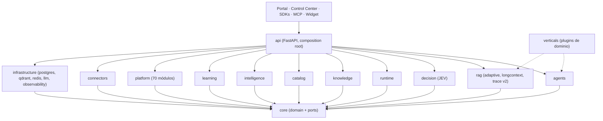

<div align="center">


# Zent — Plataforma de IA empresarial

**Knowledge OS · Decision Engine (JEV) · Agentes y Workflows · Trazabilidad total**

Orquesta conocimiento, decisiones y ejecución de IA sobre los datos privados de cada organización —multi-tenant, auditable y operable— con Portal de cliente, Control Center de plataforma, API REST, SDKs, MCP y widget embebible.

[](https://github.com/yoredstorm/zent_rag/actions/workflows/ci.yml)


[Quickstart](#quickstart) · [Capacidades](#capacidades) · [Arquitectura](#arquitectura) · [API](#api-sdks-y-mcp) · [Roadmap](#roadmap--lo-que-viene) · [Documentación](#documentación)

</div>

Zent empezó como RAG-as-a-Service y hoy es bastante más que eso: una plataforma que **ingiere y modela el conocimiento** de una empresa, **decide con juicio explícito** (Decision Engine / JEV), **ejecuta** agentes y workflows con presupuesto y guardrails, **responde con evidencia citable** y **traza cada decisión de punta a punta** en una estructura canónica auditable.

```python
from zent import Zent

client = Zent(api_key="zent_sk_live_...")
resp = client.chat("¿Cuál es el SLA de devoluciones del contrato marco?")
print(resp.answer)
```

> [!TIP]
> OpenAPI interactivo en `/docs`, ReDoc en `/redoc` y contrato versionado (`1.0.0`) en `/api/v1`. Colección executable en [`bruno/`](bruno/).

---

## Índice

- [Qué es Zent](#qué-es-zent)
- [Capacidades](#capacidades)
- [Trazabilidad Schema v2](#trazabilidad-schema-v2--una-sola-verdad)
- [Arquitectura](#arquitectura)
- [Stack tecnológico](#stack-tecnológico)
- [Quickstart](#quickstart)
- [Estructura del repositorio](#estructura-del-repositorio)
- [API, SDKs y MCP](#api-sdks-y-mcp)
- [Configuración](#configuración)
- [Seguridad multi-tenant](#seguridad-multi-tenant)
- [Calidad, tests y CI](#calidad-tests-y-ci)
- [Roadmap — lo que viene](#roadmap--lo-que-viene)
- [Documentación](#documentación)

---

## Qué es Zent

**Turn your business data into an AI workforce.** Una plataforma. Cada negocio, su propia IA.

El cliente conecta sus fuentes (SQL, PDF, CSV/Excel, web, APIs, S3, Google Drive), Zent las normaliza, las modela como conocimiento con evidencia y las expone como agentes, workflows y chat — con el mismo aislamiento multi-tenant, las mismas cuotas y la misma trazabilidad en todos los canales.

```text
 Data                    Knowledge               Decision               Execution              Superficies
 ─────                   ─────────               ────────               ─────────              ───────────
 SQL · PDF · CSV ·   →   Knowledge OS        →   Decision Engine    →   Agentes ·          →   Chat · API ·
 Excel · API · Web ·     (modelo, catálogo,      (JEV, reglas,          Workflows ·            SDKs · MCP ·
 S3 · Drive              evidencia, grafos)      política de riesgo)    herramientas           Widget · Portal
```

### En números

| Indicador | Valor |
|---|---|
| App / contrato API | `0.1.0` · API `1.0.0` en `/api/v1` |
| Superficie REST | 73 archivos de rutas en [`src/api/routes/`](src/api/routes/) |
| Migraciones | 134 versiones Alembic en [`src/infrastructure/db_init/versions/`](src/infrastructure/db_init/versions/) |
| Tests | 296 módulos · 2.747 definiciones de test (incluye arquitectura, aislamiento, e2e) |
| Módulos de plataforma | ~70 subpaquetes en [`src/platform/`](src/platform/) |
| ADRs y guías | 30 documentos en [`docs/architecture/`](docs/architecture/) |
| SDKs | Python `zent` `1.0.0` · Node `zent-node` `1.0.0` |
| MCP | 5 tools en `/mcp` con RBAC, cuota y rate limit por tool |
| Observabilidad | Prometheus + Loki + Promtail + Grafana + OpenTelemetry |

### Dos productos, una API

| Producto | Quién | Qué administra |
|---|---|---|
| **Customer Portal** | La empresa cliente (tenant) | Chat, conocimiento, agentes, workflows, evaluación, uso, plan y facturación, seguridad, integraciones |
| **Zent Control Center** | El dueño de la plataforma | Tenants, planes y suscripciones, consumo y costos de IA, model ops, Decision Engine, SOC, revenue, capacity, operación |

### Casos de uso

- **Chat corporativo sobre docs + DB** — políticas, contratos, catálogos, tickets; respuestas con citas.
- **Analítica conversacional** — preguntas de negocio vía SQL-first con validación AST y rol read-only.
- **Agentes operativos** — tools allowlisted, presupuesto de costo, verificación JEV y aprobaciones humanas.
- **Workflows con significado** — “decime qué automatizar”: intención de negocio → plan semántico → grafo → simulación → aprobación.
- **Copiloto en IDE / Claude** — tools MCP (`search_knowledge`, `query_database`, `execute_agent`, …).
- **QA de calidad de IA** — datasets versionados, LLM-judge, regresión entre deploys y quality gates.

---

## Capacidades

### Knowledge OS — del dato crudo al conocimiento durable

- **Ingesta por fuente** con jobs durables (retry, resume por `cursor_snapshot`, dead letter) en [`src/knowledge/`](src/knowledge/). Un solo camino: toda fuente se convierte en `StructuredDocument` antes de indexarse o compilarse.
- **Structured documents**: parsers PDF/DOCX/HTML/XLSX/CSV que producen `StructuredDocument` con layout, tablas, unidades y secciones; las tablas de PDF entran al índice como bloques `TABLE` con su ruta de sección.
- **Knowledge Compiler** ([`src/knowledge/compiler/`](src/knowledge/compiler/)): convierte cada fuente entendida en conocimiento canónico — unidades semánticas → entidades con identidad canónica y alias → hechos → relaciones → reglas → conflictos clasificados → evidencia enlazada. Corre automáticamente al terminar cada ingesta, refuerza lo que ya existe (no duplica) y nunca publica conocimiento sin provenance.
- **Tabular (SQL-first)**: Excel/CSV como DATOS, no como texto — detección de estructura, perfilado, schema, row/cell provenance y consultas SQL-first.
- **Document Understanding**: layout, unidades, enriquecimiento y vistas de documento.
- **Conectores**: registry (`sql`, `file`, `csv`, `excel`, `web`, `s3`, `api`, gdrive) + **plugin platform** con 12 entry-points (`postgres`, `mysql`, `mssql`, `oracle`, `db2`, `csv`, `excel`, `json_file`, `pdf`, `rest_api`, `graphql`, `s3_compat`).
- **Catálogo semántico** ([`src/catalog/`](src/catalog/)): Discovery Engine, perfilado, authority, schema linking, búsqueda híbrida del catálogo y Mapping Studio gobernado.
- **Knowledge Model (Knowledge OS, FASE 34)**: objetos, aserciones, evidencia, conflictos — con **Knowledge Learning** para aprendizaje explícito por fuente ([`src/platform/knowledge_model/`](src/platform/knowledge_model/), [`src/platform/knowledge_learning/`](src/platform/knowledge_learning/)).
- **Managed DB** por proveedor y **Data Onboarding** guiado (connect → analyze → review → complete).
- **Metering de ingesta**: tokens y costo real de embeddings y resúmenes por fuente/colección, con presupuesto (`KNOWLEDGE_SUMMARY_BUDGET_USD`).

### Retrieval y respuesta con evidencia

- **Retrieval híbrido**: `vector` · `lexical` (BM25 sparse) · `hybrid` con fusión RRF o weighted, más reranking (`llm` o cross-encoder).
- **Query Intelligence**: clasificación de intención, detección de idioma y `QueryPlan` ([`src/rag/query_intelligence/`](src/rag/query_intelligence/)).
- **Adaptive RAG** (`off|shadow|active|canary`): plan de retrieval, evidence gate, fast path extractivo, rewrite y grounding.
- **Long-Context Engine**: empieza pequeño, señales exactas, expande alrededor de la evidencia, mide cobertura y corta ([`src/rag/longcontext/`](src/rag/longcontext/)).
- **Entity pin**: si la pregunta nombra algo concreto (`byte 105`, `categoría 31`), corre la pata léxica con el label exacto y un barrido acotado por frase; el chunk se cambia por su **sección completa**.
- **Evidence-first gate**: la evidencia es de primera clase (`evidence_id` estable y determinístico); el presupuesto se reparte por relevancia, no por recorte posicional; hay **suficiencia de evidencia** explícita antes de generar.
- **Answerability + abstención estructurada**: si no se puede responder, se explica qué falta (nunca un “no sé” genérico) ([`src/intelligence/`](src/intelligence/)).
- **Response Intelligence**: decide *cómo* explicar (blueprint + `ResponseContract` observable), nunca cambia hechos; **Answer Experience** aplica ritmo por capas, relevancia para la respuesta y formatos de enumeración legibles.
- **Verificación de figuras**: fechas y años afirmados se contrastan contra la evidencia; lo no contenido se corrige una vez (nunca en silencio).
- **Turn intent**: saludos, agradecimientos o preguntas de capacidad no disparan retrieval documental ni falsos `INSUFFICIENT_ANSWER`.
- **Grounding y claims**: modelo `GroundedAnswer`, citas y verificación por claim sobre el Claim Ledger ([`src/rag/grounding/`](src/rag/grounding/)).

### Decision Engine — JEV decide, el orquestador ejecuta

- **Composite de decisión**: `rules` → JEV System One → LLM pequeño → LLM de razonamiento, con circuit breaker y fallback ([`src/decision/`](src/decision/)).
- **Autorización separada**: JEV nunca otorga capabilities; `authorize_decision()` recorta la decisión al candidato autorizado, allowlist de tenant y permisos ([`src/decision/policy.py`](src/decision/policy.py)).
- **Modos**: `legacy` · `shadow` · `jev` · `hybrid` (canary) con muestreo de observación; shadow no cambia la ejecución.
- **Batching System One**: una llamada JEV por fase (`PRE_RETRIEVAL`, `POST_RETRIEVAL`, `POST_GENERATION`, `AGENT_STEP`) con cache request-scoped — [ADR](docs/architecture/decision-engine-batching.md).
- **JEV Preflight**: juicio barato **antes** de pagar generación cara (`PRE_REASONING`, `POST_RECONSTRUCTION`, `PRE_GENERATION`) — [ADR](docs/architecture/jev-preflight.md).
- **Judgment Fabric**: candidatos autorizados → JEV → política de riesgo → dispatcher → verificación, con Control Center de learning, calibración, modelos y costos — [ADR](docs/architecture/judgment-fabric.md).
- **Agent JEV Loop**: UNA llamada JEV por paso del agente (herramienta, falta evidencia, ya se puede responder); el veredicto se compone en código — [ADR](docs/architecture/agent-jev-loop.md).
- **Confianza y probabilidad**: cada juicio expone `selected_probability`, runner-up, margen, entropía, `confidence` y `certainty` con bandas; la UI muestra cada magnitud etiquetada.
- **Learning observacional y calibración**: aprende de traces y usage; **nunca muta producción** sin aprobación.

### Runtime y agentes

- **ZentRuntime**: ciclo `understand → decide → authorize → execute → observe → finish` ([`src/runtime/engine.py`](src/runtime/engine.py)).
- **Wallet de créditos** propiedad del runtime (los modelos no pueden mutarla), **dispatcher** y **executor** que mapean capabilities a handlers existentes sin reimplementar motores.
- **Guardrails por run**: max steps, tool calls, tokens, costo y timeout; **tool guards** con JSON-schema de input, rate limit por tenant y timeout duro ([`src/agents/runtime/`](src/agents/runtime/)).
- **Tools builtin**: `search_knowledge`, `query_tabular_data`, `query_database` (SQL Expert con auto-repair y validación AST vía sqlglot), `call_api` (con guard SSRF) y `marketplace_action`.
- **Agent Studio**: builder con niveles de visibilidad (Esencial / Contextual / Avanzado), presets y perfil de respuesta por agente.
- **Versiones y despliegues**: versioning de agentes, canary/stable, promoción, rollback, entornos y SLOs/incidentes ([`src/platform/deployments/`](src/platform/deployments/), [`src/platform/releases/`](src/platform/releases/)).
- **Human-in-the-loop**: gate de aprobación de tools y colaboración en workspace ([`src/platform/approvals/`](src/platform/approvals/)).

### Workflows y automatización

- **Workflow Architect**: `TEXT → BUSINESS INTENT → SEMANTIC PLAN → VALIDATION → GRAPH → SIMULATION → HUMAN APPROVAL` — sin un segundo motor de workflow — [ADR](docs/architecture/workflow-architect.md).
- **Semantic Core**: `WorkflowContext`, contribuciones con provenance, catálogos de nodos/datos, Execution Inspector y resume — “el workflow transporta significado, no sólo JSON”.
- **Workflow Studio v2**: Data Inspector + Node Debugger + Partial Runs, con complejidad progresiva.
- **Living Workflows**: event sources, data watchers y asistentes proactivos — el agente despierta sólo cuando hace falta, sin loops de LLM.
- **Cognitive Workflows**: modos de conocimiento, extracción/comparación/conflictos, investigación y aprobación con evidencia.
- **Watchers y Assistants**: monitores de datos, inbox de actividad y automatizaciones ([`src/platform/workflows/`](src/platform/workflows/)).

### Inteligencia de negocio

- **Pipeline de answerability**: understanding → planner → evidencia estructurada → gate determinista ([`src/intelligence/`](src/intelligence/)).
- **Razonamiento sobre hechos**: escenario, timeline, transiciones, hipótesis y root cause ([`src/intelligence/reasoning/`](src/intelligence/reasoning/)).
- **Semantic Compiler** y **verified queries**: consultas de negocio verificadas y reutilizables.
- **Company Intelligence**: Company Graph (entidades, relaciones, autoridad) + Discovery (`DISCOVER→SUPPORT→SUGGEST→VALIDATE→CONFIRM`) + Studio navegable — [ADR](docs/architecture/company-intelligence.md).
- **Semántica temporal y resolución de entidades**: “as of”, frases en español, conflictos entre fuentes y analítica comparativa.
- **Benchmark suite y calibración** de la capa de inteligencia.

### Memoria y aprendizaje gobernado

- **Zent Memory**: tipos de memoria observables sobre Judgment Fabric + Evidence/Claim Ledger — sin auto-optimización ([ADR](docs/architecture/zent-memory.md)).
- **Learning Engine**: gaps → advisor → improvements → clusters → patterns (queries verificadas sugeridas) y spider de discovery acotado ([`src/learning/`](src/learning/)).
- **Learning Cycle**: señales → análisis → recomendaciones → promociones con **rollback**, comparaciones y health ([`src/core/domain/learning_cycle.py`](src/core/domain/learning_cycle.py)).
- **Replay con impacto**: evaluación antes/después de aplicar conocimiento aprobado; **nada muta producción en silencio** — [ADR](docs/architecture/self-improving-rag.md).

### Trazabilidad Schema v2 — una sola verdad

> La traza dejó de ser la suma de proyecciones independientes: ahora es **una estructura canónica** de la que todo lo demás deriva.

- `build_traceability()` es el único lugar donde se normaliza, deduplica, interpreta y diagnostica ([`src/rag/traceability.py`](src/rag/traceability.py)).
- **Identidad canónica**: `canonical_source_id` (hash de la identidad física) y `evidence_id` determinístico `ev_<sha256(...)[:16]>`; dedup en 3 capas (exacta, solape, semántica) que nunca cruza fuentes.
- **Conteos separados**: `retrieved ≥ unique ≥ used ≥ cited` y `used ≤ selected` **no se asumen: se verifican** (Invariant Engine, 12 invariantes).
- **JEV con semántica real**: `executed`, `checks`, `material_intervention`, `changed_route` — una decisión `generate` por default no cuenta como intervención.
- **Diagnóstico explicable**: cada item responde *qué significa*, *qué impacto tuvo* y *qué corregir* vía códigos; dimensiones `execution`, `evidence`, `jev`, `generation`, `verification`, `metadata`, `consistency`.
- **Controles y fallbacks taxonómicos**: `MAX_TOKENS_REACHED` se evalúa antes de aceptar un `VERIFIED` y sólo degrada la verificación si el efecto es material.
- **Tiempo honesto**: `wall_clock_ms` (percibido) nunca se mezcla con `accumulated_ms` (medido); paralelismo es información, no error.
- **Compatibilidad**: traces v1 históricos se adaptan en lectura (`upgrade_traceability_v1()`), marcando fidelidad parcial.

Tres vistas, un solo dato — la app de referencia está en **“Ver flujo”** (click derecho en el chat):

| Vista | Para | Componente |
|---|---|---|
| **Historia** | negocio — qué hizo Zent y por qué | [`TraceV2Story.tsx`](portal/src/pages/chat/story/TraceV2Story.tsx) |
| **Rendimiento** | por qué demoró (wall-clock real, llamadas, búsquedas) | [`PerformanceStory`](portal/src/pages/chat/story/) |
| **Técnico / Raw** | ingeniería y debug (tarjetas semánticas, JEV crudo, árbol técnico) | [`TraceV2Technical.tsx`](portal/src/pages/chat/story/TraceV2Technical.tsx) |

Texto y glosario centralizados en [`traceabilityCatalog.ts`](portal/src/pages/chat/traceabilityCatalog.ts); schema completo en [`docs/architecture/traceability-v2.md`](docs/architecture/traceability-v2.md).

### Observabilidad y operación

- **Tracing distribuido** runs/spans con correlación a usage y billing ([`src/platform/tracing/`](src/platform/tracing/)).
- **Realtime**: canal Redis → SSE con summary en vivo ([`src/platform/realtime/`](src/platform/realtime/)).
- **Observability**: salud de DB/Redis/Qdrant/worker/LLM, SLOs y alertas ([`src/platform/observability/`](src/platform/observability/)).
- **DR**: políticas RPO/RTO, backups versionados, drills de failover ([`src/platform/dr/`](src/platform/dr/), [`docs/platform/DISASTER_RECOVERY.md`](docs/platform/DISASTER_RECOVERY.md)).
- **Ops Center**: runbooks, incidentes con severidad/SLA, timeline y escalamiento ([`src/platform/opscenter/`](src/platform/opscenter/)).
- **Multi-región y edge**: failover regional, healthchecks y caching ([`src/platform/edge/`](src/platform/edge/)).
- **Stack PLG**: Prometheus (`/metrics` token-gated), Loki + Promtail, dashboards Grafana preconfigurados y OpenTelemetry.

### Seguridad, gobernanza y compliance

- **Security Center**: posture score, detección de secrets/leaks y findings ([`src/platform/security/`](src/platform/security/)).
- **SOC**: detección en tiempo real y respuestas automáticas ([`src/platform/soc/`](src/platform/soc/)).
- **Risk Center**: registro de riesgos, mitigaciones, heatmap y posture de compliance ([`src/platform/riskcenter/`](src/platform/riskcenter/)).
- **AI Governance**: PII masking, detección de anomalías y políticas por organización ([`src/platform/ai_governance/`](src/platform/ai_governance/)).
- **Governance**: KMS envelope, policies con revisión, audit verify y certificaciones ([`src/platform/governance/`](src/platform/governance/)).
- **Compliance**: reportes por framework (SOC2 / GDPR / ISO) y eventos de cumplimiento ([`src/platform/compliance/`](src/platform/compliance/)).
- **Trust & Safety**: AUP versionado, moderación de contenido e incidentes ([`src/platform/trustsafety/`](src/platform/trustsafety/)).
- **Data compliance**: export ZIP del tenant, anonimización, retención con purga y DSR export/erasure (GDPR) ([`src/platform/datacompliance/`](src/platform/datacompliance/)).
- **Identidad enterprise**: SSO OIDC con JIT provisioning, SCIM v2, MFA/TOTP y step-up ([`src/platform/enterprise/`](src/platform/enterprise/), [`src/api/routes/scim.py`](src/api/routes/scim.py)).
- **ACL documental y delegated permissions**: grupos del usuario → filtros de retrieval; permisos efectivos = intersección caller ∩ agente ∩ tool ∩ política ([`src/platform/acl/`](src/platform/acl/)).
- **Self-purge**: borrado total de datos de una org (Postgres + Qdrant) bajo confirmación explícita.

### Billing, metering y FinOps

- **Billing**: trials, planes, cuotas, API keys, invoices, alerts y webhooks firmados; provider `manual` y **Stripe** opt-in (`[billing-stripe]`, checkout + `Stripe-Signature`).
- **Metering v2**: contadores en tiempo real y rate limits por plan con burst ([`src/platform/metering/`](src/platform/metering/)).
- **Usage idempotente**: eventos con UNIQUE `(request_id, event_type)` + Redis SADD — los reintentos no duplican cobro.
- **Cost Governance (FinOps)**: costos por tag, alertas adaptativas y showback/chargeback ([`src/platform/costgov/`](src/platform/costgov/)).
- **Revenue Intelligence**: ARR/MRR, expansión/contracción, cohortes y forecast ([`src/platform/revenue/`](src/platform/revenue/)).
- **Optimizer y Capacity**: advisor de performance/costo y forecast frente a límites de plan con auto-scaling de colas ([`src/platform/optimizer/`](src/platform/optimizer/), [`src/platform/capacity/`](src/platform/capacity/)).

### AI Model Ops

- **Model Gateway**: routing por condiciones, A/B, fallback chain y presupuestos por modelo ([`src/platform/model_gateway/`](src/platform/model_gateway/)).
- **Model Health**: guardrails por modelo, clasificadores de salida y circuit breakers ([`src/platform/modelhealth/`](src/platform/modelhealth/)).
- **Inference Proxy multi-tenant**: colas por plan, routing por capacidad y logs ([`src/platform/proxy/`](src/platform/proxy/)).
- **AI Gateway**: aliases de modelo virtuales con fallback ([`src/infrastructure/llm/`](src/infrastructure/llm/)).
- **Embeddings**: `bge-m3` (1024-d) con fallback automático de proveedor y circuit breaker.

### Portal, Control Center y ecosistema

- **Customer Portal** (español) con navegación por grupos: Inicio · Conocimiento · Construir · Operar · Evaluar · Desarrollar · Gobernar · Gestionar, más **Company Intelligence** como sección propia.
- **Chat con “Ver flujo”**: streaming SSE, editor de targets (knowledge / agente / workflow), feedback, SQL runner y memoria del run.
- **Knowledge Center**: overview, modelo, calidad, evaluación, understanding, colecciones, documentos, SQL, jobs, playground, workspaces y catálogo.
- **Zent Control Center** (`/control-center`): tenants, suscripciones, uso y costos, model gateway, Decision Engine, AI runtime, realtime, capacity, partners, revenue, SOC, trust, ops center, evals, metering, regions, inference proxy, compliance, auditoría.
- **Marketplace y ecosystem**: listings, reviews verificadas, revenue sharing, partners con subtenants white-label y factoría de productos ([`src/platform/marketplacev2/`](src/platform/marketplacev2/), [`src/platform/partners/`](src/platform/partners/)).
- **Developer Portal**: webhooks HMAC, SDK reference, changelog y status público ([`src/platform/devportal/`](src/platform/devportal/)).
- **Embed**: widget/iframe público por agente (`/embed.js`, `/embed/{public_id}`) con tokens y revocación.
- **Notifications v2**: centro in-app, preferencias de canal y webhooks HMAC ([`src/platform/notifyv2/`](src/platform/notifyv2/)).
- **Feedback y Chat Insights**: CSAT/NPS por agente, embudo, temas, fricción y comparativa por canal ([`src/platform/feedback/`](src/platform/feedback/), [`src/platform/chatinsights/`](src/platform/chatinsights/)).
- **Copilot**: copiloto IA de la plataforma con marketplace, chat con router y telemetría ([`src/platform/copilot/`](src/platform/copilot/)).
- **Onboarding y demos**: onboarding self-serve, data onboarding, Demo Center y transición demo → tenant real.

---

## Arquitectura

Clean Architecture con composición en la capa API; las reglas de dependencia las enforcea [`tests/test_architecture.py`](tests/test_architecture.py).


```mermaid
flowchart TB
  Client["Portal · Control Center · SDKs · MCP · Widget"] --> API["api (FastAPI, composition root)"]
  API --> Agents["agents"]
  API --> RAG["rag (adaptive, longcontext, trace v2)"]
  API --> Decision["decision (JEV)"]
  API --> Runtime["runtime"]
  API --> Knowledge["knowledge"]
  API --> CatalogG["catalog"]
  API --> Intelligence["intelligence"]
  API --> Learning["learning"]
  API --> Platform["platform (70 módulos)"]
  API --> Connectors["connectors"]
  Agents --> Core["core (domain + ports)"]
  RAG --> Core
  Decision --> Core
  Runtime --> Core
  Knowledge --> Core
  CatalogG --> Core
  Intelligence --> Core
  Learning --> Core
  Platform --> Core
  Connectors --> Core
  Infra["infrastructure (postgres, qdrant, redis, llm, observability)"] --> Core
  API --> Infra
  Verticals["verticals (plugins de dominio)"] -.-> Agents
  Verticals -.-> RAG
```

### Capas

```text
┌────────────────────────────────────────────────────────────────────┐
│ API Layer (FastAPI) — composition root                             │
│   /health  /metrics  /docs  /redoc  /api/v1/*  /mcp  /embed.js     │
├────────────────────────────────────────────────────────────────────┤
│ agents/       orchestrator + Agent Runtime (guardrails, JEV loop)  │
│ rag/          chunking · retrieval · rerank · adaptive ·           │
│               longcontext · grounding · evaluation · trace v2      │
│ decision/     JEV · rules · batch · preflight · policy · risk      │
│ runtime/      wallet · dispatcher · executor · efficiency · gates  │
│ catalog/      discovery · semantic catalog · studio · authority    │
│ intelligence/ answerability · reasoning · response · compiler      │
│ learning/     gaps · advisor · improvements · spider · replay      │
│ knowledge/    engine · structure · tabular · understanding · jobs  │
│ connectors/   plugin registry (SQL, files, APIs, S3, Drive)        │
│ platform/     auth · tenants · rbac · billing · usage · finops ·   │
│               soc · governance · dr · marketplace · workflows · …  │
│ mcp_server/   5 tools · policy · audit                             │
├────────────────────────────────────────────────────────────────────┤
│ core/ — isla agnóstica (cero frameworks)                           │
│   domain/  entidades puras (decision, evidence, canonical, …)      │
│   ports/   ABCs (repos, LLM, VectorStore, Cache, SecretStore, …)   │
│   config.py Settings tipados (prefix RAG_, fail-fast prod)         │
├────────────────────────────────────────────────────────────────────┤
│ infrastructure/ — adaptadores (implementan ports)                  │
│   postgres · qdrant · redis · llm (LiteLLM) · observability ·      │
│   resilience (circuit breaker) · secrets (Vault + AES-GCM) ·       │
│   db_init (SQL baseline + Alembic 134 migraciones) · billing       │
├────────────────────────────────────────────────────────────────────┤
│ verticals/ — plugins de dominio (demo_farmacia, …)                 │
│ Observabilidad (PLG) + Portal (nginx) + ingestion-worker           │
└────────────────────────────────────────────────────────────────────┘
```

### Middlewares y loops de fondo

- **Middleware chain** (orden de ejecución): `Trace` → `SecurityHeaders` → `Tenant` → `Csrf` → `OrgCors` → `RateLimit` → `Idempotency` → `BodySizeLimit` → `CORS`.
- **Loops de lifespan**: `region_health`, `cost_alerts`, `escalation`, `retention`, `webhook_deliveries`, `catalog_discovery`, `spider`, `workflow_v2_scheduler`, `workflow_event_consumer`, `workflow_watchers`, `learning_cycle`, `company_discovery` y el **ingestion worker**.

---

## Stack tecnológico

Versiones tomadas de `docker-compose.yml`, `pyproject.toml` y `portal/package.json`.

| Capa | Tecnología | Versión / nota | Rol |
|---|---|---|---|
| **API** | Python + FastAPI + Uvicorn | Python ≥ 3.11 | REST, Pydantic v2, OpenAPI |
| **Portal** | Vite + React + TypeScript + Tailwind | React 19 · RR 7 · Vite 6 · TS 5.7 · Tailwind 4 | Customer Portal + Control Center |
| **Portal UI** | Radix UI · motion · Phosphor · Recharts · Marked + DOMPurify · Geist | `package.json` | Primitivas accesibles, charts, markdown seguro, tipografía |
| **Portal tests** | Vitest + Testing Library · Playwright + axe | — | Unit, smoke y accesibilidad (a11y) |
| **BD relacional** | PostgreSQL + pgvector | `pgvector/pgvector:pg16` | Orgs, billing, jobs, RBAC, conocimiento canónico |
| **Vector DB** | Qdrant | `v1.13.4` | Dense HNSW + sparse BM25 (named vectors) |
| **Caché / colas** | Redis | `7-alpine` | Rate limit, sesiones, memoria, wakeup de jobs, realtime |
| **LLM / embeddings** | LiteLLM → Novita / OpenAI / Anthropic | `litellm>=1.40` | Proxy unificado; `bge-m3` 1024-d con fallback DeepInfra |
| **Migrations** | Alembic | `>=1.14` | 134 versiones (`001` → `134`) + SQL baseline |
| **MCP** | Model Context Protocol | `mcp>=2.0` | Streamable HTTP stateless en `/mcp` |
| **Observabilidad** | Prometheus · Loki · Promtail · Grafana · OTel | `2.54.1` · `3.2.0` · `3.2.0` · `11.3.0` | Métricas, logs, dashboards, tracing |
| **Tests / lint** | PyTest · Ruff · Mypy · Bandit · Pyright | extras `[dev]` | CI y calidad |
| **Secrets** | HashiCorp Vault (opcional) + AES-256-GCM | `hvac` | Credenciales de connectors y plataforma |
| **API client** | Bruno | carpeta `bruno/` | Colección executable |

<details>
<summary>Extras de instalación (<code>pyproject.toml</code>)</summary>

| Extra | Contenido |
|---|---|
| `[prod]` | Runtime: FastAPI, SQLAlchemy async, asyncpg, LiteLLM, Qdrant, Alembic, sqlglot, hvac, bcrypt + pyotp, markitdown/pdfplumber/python-docx/openpyxl, boto3, OTel, … |
| `[connectors]` | Drivers SQL opcionales: PyMySQL, pyodbc, oracledb, ibm-db-sa |
| `[jev]` | `typesafe-sdk` (JEV System One) |
| `[billing-stripe]` | `stripe` para checkout y webhooks |
| `[dev]` | Ruff, Mypy, Bandit, Pyright, PyTest (+asyncio/timeout), httpx |

</details>

> [!NOTE]
> Ollama (`ollama/ollama:0.6.5`) queda como servicio opcional comentado en `docker-compose.yml` para embeddings locales; el default es `bge-m3` cloud con fallback automático.

---

## Quickstart

### Requisitos

- Docker + Docker Compose v2
- ~6 GB RAM libres · ~8 GB disco
- API key LLM (Novita / OpenAI / Anthropic) para generación y embeddings cloud

### Levantar el stack

```bash
git clone https://github.com/yoredstorm/zent_rag.git
cd zent_rag
cp .env.example .env
# Editar .env: RAG_LITELLM_API_KEY, secretos, etc.

docker compose up -d --build
docker compose ps
```

> [!IMPORTANT]
> En producción los secretos van en Vault (o tu secret manager) y `RAG_ENVIRONMENT=production` activa el fail-fast de secretos inseguros, CORS `*` y endpoints de admin.

### Servicios y URLs

| Servicio | URL | Notas |
|---|---|---|
| **Customer Portal** | http://localhost:8080 | Signup trial / login |
| **Control Center** | http://localhost:8080/control-center | Plataforma (platform admin) |
| **API / Swagger** | http://localhost:8000/docs | También vía portal `/docs` |
| **MCP** | http://localhost:8000/mcp | Bearer API key |
| **Grafana** | http://localhost:3000 | ver `GRAFANA_ADMIN_*` |
| **Prometheus** | http://localhost:9090 | métricas del scrape |
| **PostgreSQL** | localhost:5432 | usuario `rag_user` |

**Servicios Compose:** `api`, `portal`, `ingestion-worker`, `postgres`, `qdrant`, `redis`, `prometheus`, `loki`, `promtail`, `grafana`.

### SDKs

```bash
pip install -e sdk/python
```

```python
from zent import Zent, AsyncZent

client = Zent(api_key="zent_sk_live_...")          # default: http://localhost:8000/api/v1
print(client.chat("¿Cuál es la política de reembolsos?").answer)

async with AsyncZent(api_key="zent_sk_live_...") as az:
    async for event in az.chat.stream("Resume el contrato marco"):
        print(event)
```

Node:

```bash
cd sdk/node && npm install && npm run build
```

Guías: [sdk/python/README.md](sdk/python/README.md) · [sdk/node/README.md](sdk/node/README.md).

### Flujo típico en el portal

1. **Trial** → http://localhost:8080/signup
2. **Datos** → Data onboarding o Knowledge Center → conectar/ subir fuentes
3. **Chat** → Chat demo (con streaming y “Ver flujo”)
4. **Construir** → Agent Studio / Workflow Studio
5. **Medir y gobernar** → Evaluation, Usage, Security, Billing

### Comandos útiles

```bash
docker compose logs -f api
docker compose up -d --build api

pip install -e ".[dev]"
pytest tests/ -v
ruff check src/ tests/ sdk/python
```

<details>
<summary>CLIs operativas (en contenedor)</summary>

```bash
# Eval: importar dataset, correr target, comparar regresión
docker compose exec api python src/scripts/eval_engine.py \
  import-dataset --golden src/verticals/demo_farmacia/golden/rag_farmacia.json
docker compose exec api python src/scripts/eval_engine.py run --dataset-id <uuid> --target rag
docker compose exec api python src/scripts/eval_engine.py compare --baseline <a> --current <b>

# Benchmark de retrieval (vector | lexical | hybrid)
docker compose exec api python src/scripts/benchmark_retrieval.py --strategy hybrid

# Billing: invoices y conciliación
docker compose exec api python src/scripts/billing_invoice.py --dry-run
docker compose exec api python src/scripts/billing_reconcile.py

# Knowledge V2: estado de cutover y backfill
docker compose exec api python src/scripts/knowledge_v2_status.py
docker compose exec api python src/scripts/knowledge_v2_backfill.py

# Migraciones de Qdrant (payloads y named vectors)
docker compose exec api python src/scripts/migrate_qdrant_org_payload.py
docker compose exec api python src/scripts/migrate_qdrant_hybrid.py
```

</details>

---

## Estructura del repositorio

```text
zent_RAG/
├── src/
│   ├── api/                 # FastAPI: main, middleware, 73 rutas en routes/
│   ├── mcp_server/          # MCP Streamable HTTP montado en /mcp
│   ├── core/                # domain + ports + config (isla sin frameworks)
│   ├── agents/              # orchestrator, runtime, tools, policies
│   ├── rag/                 # retrieval, adaptive, longcontext, trace v2, eval
│   ├── decision/            # Decision Engine: JEV, batch, preflight, policy
│   ├── runtime/             # wallet, dispatcher, executor, gates, efficiency
│   ├── catalog/             # Discovery Engine + Semantic Catalog + Studio
│   ├── intelligence/        # answerability, reasoning, response, compiler
│   ├── learning/            # gaps, advisor, improvements, spider, replay
│   ├── knowledge/           # fuente → normalizar → chunk → indexar (V2)
│   ├── connectors/          # plugin platform (SQL, files, APIs, S3, Drive)
│   ├── platform/            # ~70 módulos: auth, billing, soc, dr, workflows, …
│   ├── infrastructure/      # postgres, qdrant, redis, llm, secrets, db_init
│   ├── verticals/           # plugins de dominio (demo_farmacia, …)
│   └── scripts/             # CLIs operativas: eval, billing, benchmarks, V2
│
├── portal/                  # Vite + React 19 — Customer Portal + Control Center
├── sdk/
│   ├── python/              # paquete zent
│   └── node/                # paquete zent-node
├── tests/                   # 296 módulos: arquitectura, seguridad, RAG, agentes…
├── docs/                    # architecture (30) · developers · intelligence · platform
├── config/                  # prometheus, loki, promtail, grafana
├── deploy/k8s/              # overlay Kustomize (opcional, al escalar)
├── bruno/                   # colección API (RAG, Admin, Billing, Ingestion, …)
├── docker-compose.yml       # stack completo (dev)
├── docker-compose.prod.yml  # perfil prod (managed services externos)
├── Dockerfile.api           # multi-stage, non-root, healthcheck
├── worker_entry.py          # entrypoint del ingestion-worker
├── pyproject.toml
└── alembic.ini
```

---

## API, SDKs y MCP

Base: **`/api/v1`**. Autenticación: `Authorization: Bearer <token>`; las rutas públicas (signup/login, planes, webhooks, embed, share) son la excepción.

| Dominio | Endpoints representativos |
|---|---|
| **Auth e identidad** | `/auth/signup` · `/auth/login` · `/auth/me` · `/auth/sso/*` · `/scim/v2/*` |
| **RAG y query** | `/rag/query` · `/rag/query/stream` · `/rag/federated` · `/query` |
| **Ejecuciones** | `GET /executions/{kind}/{id}/flow` — traza v2 canónica (con upgrade v1) |
| **Agentes** | CRUD `/agents` · `/agents/{id}/run[/stream]` · `/agents/runs/{run_id}` · `/agent-versions` |
| **Runtime y decisión** | `/platform/runtime/*` (dashboard, wallets, efficiency, experiments) · `/platform/decision/*` (traces, learning, calibration, preflight, explain) |
| **Workflows** | CRUD `/workflows` · copilot intent/compile · watchers · runs · `/public/workflows` |
| **Inteligencia** | `/intelligence/*` (verified queries, results, automations) · `/cognitive/*` · `/adaptive/*` |
| **Conocimiento** | `/knowledge-bases` · `/sources` · `/jobs` · `/knowledge/*` (modelo, learning) · `/catalog/*` · `/managed-db/*` |
| **Company** | `/company-graph/*` · `/company-discovery/*` · `/company-studio/*` |
| **Memoria y aprendizaje** | `/memory/*` · `/learning/*` · `/learning/cycle/*` · `/training/*` |
| **Eval y feedback** | `/eval/*` (datasets, runs, compare) · `/feedback` · `/chat-insights/*` |
| **Plataforma** | `/platform/*` (finops, plans, model-gateway, security, ops, dr, governance, cost-governance, revenue, capacity, partners, metering, proxy, regions, trust) |
| **Billing y usage** | `/billing/*` (plans, subscription, usage, invoices, alerts) · `/payments_webhook` |
| **Gobernanza** | `/governance/*` · `/soc/*` · `/risk-center/*` · `/dr/*` · `/self-purge/*` · `/migrations/*` |
| **Ecosistema** | `/marketplace/*` · `/products/*` · `/integrations/*` · `/gateway/routes` · `/deployments/*` · `/releases/*` |
| **Notificaciones** | `/notifications/*` (in-app, preferencias, deliveries) |
| **Embed y share** | `/embed/*` + `/embed.js` · `/share/agents/{token}` |

### MCP (`/mcp`)

| Tool | Permiso | Descripción |
|---|---|---|
| `search_knowledge` | `rag:read` | Búsqueda semántica en la KB del tenant |
| `query_database` | `rag:read` | NL → SQL read-only |
| `get_document` | `rag:read` | Chunks por `document_id` |
| `execute_agent` | `agents:execute` | Run de agente |
| `get_usage` | `usage:read` | Agregados de uso |

Política por org en `config_json['mcp']` (tools habilitadas, rol mínimo, RPM por tool) + DNS-rebinding protection (`RAG_RAG_MCP_ALLOWED_HOSTS`).

### SDKs

| SDK | Recursos | Garantías |
|---|---|---|
| Python `zent` | `chat` (sync/async + stream SSE) · `rag` · `agents` · `connectors` · `usage` | retries con backoff en 429/5xx, `Idempotency-Key` automático, errores tipados (`APIError`, `AuthenticationError`, `PermissionDeniedError`, `RateLimitError`) |
| Node `zent-node` | mismos recursos + helper `chat()` | idem con `AbortController` y streaming SSE |

---

## Configuración

Todas las settings usan prefijo **`RAG_`** (`pydantic-settings` en [`src/core/config.py`](src/core/config.py)). Catálogo completo: [`.env.example`](.env.example).

| Variable | Default / ejemplo | Descripción |
|---|---|---|
| `RAG_ENVIRONMENT` | `development` | `production` activa fail-fast de secretos/config insegura |
| `RAG_POSTGRES_*` | host/user/db | PostgreSQL app + `RAG_POSTGRES_READONLY_*` para SQL Expert |
| `RAG_QDRANT_HOST` / `PORT` | localhost:6333 | Vector store |
| `RAG_REDIS_URL` | redis://… | Caché, colas, memoria y rate limit |
| `RAG_LITELLM_API_BASE` / `KEY` | — | Proxy LLM |
| `RAG_LITELLM_DEFAULT_MODEL` | `gpt-4o-mini` | Modelo chat por defecto |
| `RAG_EMBEDDING_MODEL` | `openai/baai/bge-m3` | Embeddings cloud (1024-d) |
| `RAG_PORTAL_SESSION_KEY` | (dev hex) | AES-256-GCM — **rotar en prod** |
| `RAG_DECISION_ROUTING_MODE` | `legacy` | `legacy` · `shadow` · `jev` · `hybrid` |
| `RAG_RUNTIME_*` | — | Guardrails del runtime (steps, costo, JEV loop, figuras) |
| `RAG_RAG_MCP_ENABLED` | `true` | Montar `/mcp` |

Grupos del `.env.example` (más de 300 variables `RAG_`): entorno · PostgreSQL · Qdrant · Redis · LiteLLM · embeddings · performance de ingesta · Decision Engine (JEV) · Adaptive RAG · batching · JEV Preflight · Response Intelligence · Agent JEV Loop · Judgment Fabric · Zent AI Runtime · portal auth · RAG · billing · Knowledge Platform · worker · Vault · rate limiting · infra compose · Grafana · memory foundation · learning cycle · SDK.

---

## Seguridad multi-tenant

1. **La identidad manda** — el tenant sale sólo del Bearer validado (API key SHA-256 o sesión AES-256-GCM). No hay JWT.
2. **Anti-spoof** — `X-Organization-Id` / `X-User-Id` / rol en body no definen identidad; si conflictúan → **403** (`TenantMiddleware`).
3. **TenantContext** se propaga a API, RAG, Vector Store, SQL, connectors, usage, billing y audit.
4. **RBAC + ACL** — `memberships → roles → permissions` (`owner` / `admin` / `member` / `viewer`) y grupos documentales para filtros de retrieval.
5. **404 (no 403)** al tocar recursos de otra org — no se revela existencia.
6. **Qdrant** — colección compartida con filtro obligatorio `organization_id`.
7. **SQL Expert** — SELECT-only + validación AST + overwrite de predicados org + rol Postgres `READ ONLY`.
8. **CSRF double-submit** (`X-Zent-Csrf`), body-size limit, trusted proxies para `X-Forwarded-For` e idempotencia en mutaciones.
9. **Detección de prompt-injection**, guards SSRF (connectors y tool `call_api`), redaction de secrets y DNS-rebinding protection en `/mcp`.
10. **Enterprise**: SSO OIDC + SCIM v2 + MFA/TOTP + step-up; auditoría inmutable en `audit_logs` scoped a la org.
11. **Tests**: `test_tenant_isolation.py`, `test_identity_hardening.py`, `test_security_hardening.py`, `test_organization_filter_injection.py`, entre otros.

---

## Calidad, tests y CI

- **296 módulos de test** con 2.747 casos definidos: arquitectura, aislamiento multi-tenant, seguridad, RAG/retrieval, trazabilidad v1/v2, decisiones, workflows, platform y DR.
- **E2E del portal** con Playwright (smoke + accesibilidad `axe`).
- **Quality gates** por org/workspace con bloqueo de regresiones de calidad.
- **Evaluation Engine**: golden sets v2, métricas deterministas + LLM-judge (`faithfulness`, `hallucination_rate`), snapshot por deploy y compare de regresión.

Jobs de CI ([`.github/workflows/ci.yml`](.github/workflows/ci.yml)): `secrets-scan` (gitleaks) · `lint` (ruff) · `pip-audit` · `test` (pgvector + Qdrant + Redis, alembic, pytest) · `sdk-python` · `sdk-node` · `portal` (typecheck, lint, test, build) · `portal-e2e` · `kustomize` (render del overlay) · `build` (Docker).

```bash
pytest tests/ -v          # timeout guard de 5 min por test
ruff check src/ tests/ sdk/python
mypy src/
cd portal && npm run typecheck && npm test && npm run build
```

---

## Roadmap — lo que viene

El plan canónico vive en [`docs/platform/ZENT_PLATFORM_ROADMAP.md`](docs/platform/ZENT_PLATFORM_ROADMAP.md) y los planes ejecutables en [`docs/superpowers/plans/`](docs/superpowers/plans/). Esta sección resume la frontera actual; sin fechas comprometidas.

| Horizonte | Iniciativa | Detalle |
|---|---|---|
| **En consolidación** | **Cognitive OS** | Activación de los motores cognitivos hoy flag-gated sobre el conocimiento canónico del Knowledge OS |
| **En consolidación** | **Memoria Zent** | Llevar los tipos de memoria de la fundación observable al runtime de agentes y workflows con métricas de impacto |
| **En consolidación** | **Aprendizaje gobernado** | Promociones y rollback del learning cycle con aprobación humana y replay de impacto |
| **Próximo** | **Alertmanager + alerting** | Reglas ya definidas en [`config/prometheus/alert-rules.yml`](config/prometheus/alert-rules.yml); falta servicio y wiring |
| **Próximo** | **SDKs en PyPI / npm** | Paquetes `zent` y `zent-node` `1.0.0` listos localmente; empaquetado y release público |
| **Próximo** | **Más conectores** | SharePoint, Notion, Snowflake, BigQuery, Kafka, ERP/CRM y data warehouses vía plugin registry |
| **Próximo** | **RAG multimodal** | Imágenes y diagramas en PDFs con modelos de visión en la normalización |
| **Próximo** | **Contadores históricos de uso** | Overages exactos por agente/connector con contadores dedicados (hoy derivados de eventos) |
| **Exploración** | **Caché semántica** | Reducir costo/latencia de consultas repetidas con similitud de embeddings |
| **Exploración** | **Query rewriting multi-hop** | Descomposición de preguntas complejas en sub-queries con planificación |
| **Exploración** | **Fine-tuning de embeddings por vertical** | Ajuste de `bge-m3` por dominio para jerga técnica |
| **Exploración** | **Tenancy avanzado** | BYO vector store / BYO LLM endpoint por organización enterprise |
| **Exploración** | **Compliance enterprise** | Packs de retención, DPA y certificaciones extendidas (GDPR/HIPAA) |
| **Exploración** | **Multi-región completo** | Replicación de Qdrant/Postgres con enrutamiento por región (la base edge/regions existe) |
| **Exploración** | **Kubernetes al escalar** | Kubernetes **no es requisito de venta**: el camino de prod es Compose + servicios managed. Overlay Kustomize y runbook listos en [`deploy/k8s/`](deploy/k8s/); sólo con carga real |

---

## Documentación

| Documento | Contenido |
|---|---|
| [`docs/architecture/traceability-v2.md`](docs/architecture/traceability-v2.md) | Traceability Schema v2: contrato canónico, invariantes, vistas |
| [`docs/architecture/execution-story.md`](docs/architecture/execution-story.md) | “Ver flujo” como historia auditable human-first |
| [`docs/architecture/decision-engine.md`](docs/architecture/decision-engine.md) | Decision Engine (JEV), Adaptive RAG, dispatcher y rollout |
| [`docs/architecture/judgment-fabric.md`](docs/architecture/judgment-fabric.md) | Selección de targets con riesgo, política y verificación |
| [`docs/architecture/jev-preflight.md`](docs/architecture/jev-preflight.md) | Juicio barato antes de la generación cara |
| [`docs/architecture/agent-jev-loop.md`](docs/architecture/agent-jev-loop.md) | Juicio por paso del agente y veredicto compuesto |
| [`docs/architecture/response-intelligence.md`](docs/architecture/response-intelligence.md) | Forma de explicar, contrato de respuesta y gate de presentación |
| [`docs/architecture/answer-experience.md`](docs/architecture/answer-experience.md) | Experiencia de lectura, capas y límites materiales |
| [`docs/architecture/evidence-first-gate.md`](docs/architecture/evidence-first-gate.md) | Evidencia de primera clase, suficiencia y política del gate |
| [`docs/architecture/knowledge-os.md`](docs/architecture/knowledge-os.md) | **Knowledge OS**: pipeline canónico, identidad, multi-representación y leyes del compilador |
| [`docs/architecture/knowledge-cognitive-os.md`](docs/architecture/knowledge-cognitive-os.md) | Knowledge Operating System cognitivo (migraciones 102–108) |
| [`docs/architecture/workflow-architect.md`](docs/architecture/workflow-architect.md) | Workflows: intención de negocio → grafo → aprobación |
| [`docs/architecture/company-intelligence.md`](docs/architecture/company-intelligence.md) | Company Graph y descubrimiento empresarial |
| [`docs/architecture/zent-memory.md`](docs/architecture/zent-memory.md) | Memoria Zent: tipos, límites y no-objetivos |
| [`docs/platform/ZENT_PLATFORM_ROADMAP.md`](docs/platform/ZENT_PLATFORM_ROADMAP.md) | Roadmap canónico de plataforma (fases 00–14) |
| [`docs/platform/PRODUCTION.md`](docs/platform/PRODUCTION.md) · [`SECURITY_RUNBOOK.md`](docs/platform/SECURITY_RUNBOOK.md) · [`DISASTER_RECOVERY.md`](docs/platform/DISASTER_RECOVERY.md) | Runbooks de operación |
| [`docs/developers/`](docs/developers/) · [`docs/intelligence/`](docs/intelligence/) | Guías de desarrollo e inteligencia |
| [`docs/product-ui.md`](docs/product-ui.md) | Arquitectura de información y experiencia del portal |
| SDKs | [sdk/python/README.md](sdk/python/README.md) · [sdk/node/README.md](sdk/node/README.md) |
| OpenAPI | `/docs` · `/redoc` · `/api/v1/openapi.json` |

---

<div align="center">
<sub><strong>Zent</strong> — Proprietary. © Zent Platform Team. Todos los derechos reservados. El software, la marca y la documentación no se redistribuyen fuera de los términos acordados con el titular.</sub>
</div>
