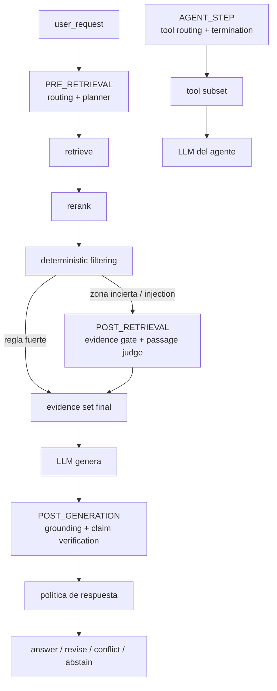

# ADR: batcheo de preguntas System One

Estado: **implementado** (rollout `off` por defecto). Depende de
[decision-engine.md](decision-engine.md).

> Las fases del **JEV Preflight** (`PRE_REASONING`, `POST_RECONSTRUCTION`,
> `PRE_GENERATION`) usan este mismo motor, cache y dedupe: ver
> [jev-preflight.md](jev-preflight.md).

## Contexto

Antes del batching cada etapa pedía su propio `POST /v1/systemone`:

| Etapa | Preguntas | Momento | Código |
|---|---|---|---|
| Routing | capability, domain, complexity, nouls | Antes de retrieval | `src/decision/questions.py` |
| Plan adaptativo | modality, retrieval_strategy, needs_rewrite, needs_reasoning | Antes de retrieval | `src/rag/adaptive/questions.py` |
| Evidence gate | evidence_sufficient, on_topic, direct, quality | Post-retrieval | `src/rag/adaptive/questions.py` |
| Grounding | answer_grounded | Post-LLM | `src/rag/adaptive/questions.py` |
| Tool routing / termination | needs_tool, tool / satisfied | Por paso de agente | `src/runtime/questions.py` |

Con JEV configurado y `ADAPTIVE_RAG_MODE=active` una query hacía 2 llamadas
pre-LLM (routing + plan) más evidence y grounding. Cada una sumaba hasta
`RAG_JEV_TIMEOUT_SECONDS` (8s default) de latencia y costo.

TypeSafe acepta varias preguntas en un mismo `state`; el límite era nuestro:
cada módulo construía su payload por separado.

## Decisión

**Un solo `system_one` por fase de estado**, no por módulo.



| Fase | Módulos fusionados | Estado compartido |
|---|---|---|
| `PRE_RETRIEVAL` | routing + adaptive planner | `user_request`, `classification_kind`, `lexical_ratio`, `sql_heuristic`, `available_capabilities`, `tenant_policy`, `budget` |
| `POST_RETRIEVAL` | evidence gate + passage judge | `user_request`, `passage_candidates`, `evidence_preview`, `n_items`, `max_score`, `coverage` |
| `POST_GENERATION` | grounding + claim verification | `user_request`, `draft_answer`, `claim_candidates`, `evidence_preview` |
| `AGENT_STEP` | tool routing + termination | `user_request`, `tool_results`, `available_tools` |

### Dedupe de señales

`needs_complex_reasoning` (routing) y `needs_reasoning` (planner) son la misma
señal. El id canónico es `needs_reasoning`; `needs_complex_reasoning` queda como
alias declarado (`src/decision/batch.py`). Los consumidores leen por id estable
con alias, nunca por orden:

```python
from src.decision.batch import answer_for, noul_for

noul = noul_for(answers, "needs_reasoning", "needs_complex_reasoning", default=0.0)
```

### Contrato

`src/decision/batch.py`:

- `build_phase_questions(phase, **context) -> PhaseQuestions` compone preguntas
  de los builders existentes sin duplicar ids y valida los ids
  (`validate_question_ids`).
- `answer_for` / `noul_for` / `choice_for` / `score_for` leen respuestas por id
  estable con alias.
- `JudgmentCache`: cache request-scoped in-memory. Clave =
  `request/run + fase + fingerprint de estado + fingerprint de preguntas`.
  - `PRE_RETRIEVAL` proyecta sólo `user_request`: routing y planner comparten
    clave y el planner reutiliza el payload sin segunda llamada.
  - `AGENT_STEP` incluye `tool_results`: cada paso con resultados nuevos exige
    un juicio nuevo.
  - Sin `request_id`/`run_id` no hay cache: nunca se comparte entre requests.
  - No usa Redis a propósito: el juicio sólo vale durante el request/run.
- `compare_payloads` / `record_shadow_diffs`: diff por pregunta (respuesta,
  confianza, acuerdo) sin chain-of-thought.

`DecisionEngine.judge_phase(phase=..., state=..., questions=..., batch_questions=...)`
ejecuta la fase: `off` = llamada legacy del módulo; `shadow` = legacy + batch
observacional; `on` = una llamada por fase con cache y dedupe.
`judge_phase(questions=None)` reutiliza el payload ya juzgado de esa fase.

`call_phase_judge` (`src/decision/judgment.py`) es el puente para los módulos:
con un `DecisionEngine` usa `judge_phase`; con un callable simple mantiene el
contrato previo de `call_judge` (fakes y fallbacks intactos).

## Passage Judge (POST_RETRIEVAL)

`src/rag/adaptive/passages.py`. Determinístico primero:

1. Injection por patrón (EN/ES) se marca antes de cualquier llamada.
2. Score débil (`< evidence_min_score * 0.5`) se descarta sin JEV.
3. Zona fuerte (`structured` / `exact_match` / score ≥ 0.75) no gasta JEV,
   salvo que la pregunta pida comparar/contradecir.
4. El resto (top candidatos acotado por `RAG_DECISION_PASSAGE_MAX`) va a JEV con
   preguntas atómicas por passage: `passage_<i>_relevant`, `_usable`,
   `_contradicts`, `_injection`.

Etiquetas compuestas en código (JEV no etiqueta):

| Composición | Etiqueta |
|---|---|
| injection (determinística o JEV) | `DROP_INJECTION` |
| contradice | `FLAG_CONTRADICTION` |
| no relevante | `DROP_IRRELEVANT` |
| no usable | `DROP_WEAK` |
| resto | `KEEP` |

`apply_passages` saca los `DROP_*` del `retrieval_context` (nunca entran al
prompt del LLM). La inyección queda como evidencia textual sanitizada y
etiquetada (`injection_suspected=true`) en la traza, sin secretos. La regla
determinística no se desmiente con JEV.

## Evidence gate

`EvidenceQuality` ahora consume, además de retrieval score, coverage, exact
match, structured evidence y source diversity: `passage_relevance`,
`contradictions`, `injection_suspected`, `authority` y `freshness` (si ya
existen en la metadata). Reglas fuertes (`structured`, `exact_match`) no se
sobrescriben. Si el Passage Judge descarta todos los candidatos, la evidencia
queda insuficiente (`reason=passages_dropped`).

## Claim verification (POST_GENERATION)

`src/rag/adaptive/claims.py`. El grounding determinístico (overlap) sigue siendo
el cheap first gate:

1. Claims no factuales (saludos, formato, opiniones, preguntas al usuario) →
   `not_verifiable`; no se penalizan.
2. Overlap fuerte (≥ 0.6) **y** números/códigos presentes en la evidencia →
   `supported` sin JEV.
3. Números/códigos que no aparecen en el mejor candidato → banda incierta
   (JEV).
4. El resto → JEV con `claim_<i>_supported` / `claim_<i>_contradicted`.

Veredictos: `supported | unsupported | contradicted | not_verifiable`
(compuestos en código; contradicción gana sobre soporte).

Política de respuesta (`response_policy`, sin loops):

| Situación | Acción |
|---|---|
| todo soportado | responder |
| unsupported menor (≤1 o ≤25%) | regenerar una sola vez (no en streaming) |
| unsupported importante | retry retrieval si queda presupuesto; si no, abstain |
| contradicción (claim o fuentes) | no presentar como hecho; transparentar el conflicto |
| evidencia insuficiente | abstain |

Los claims verificados se registran en el **Claim Ledger** existente
(`ClaimRecord` / `ClaimLedgerRepository`) vía DI desde la composición
(`src/api/deps.py`); `rag/` no importa adaptadores. Se guarda texto, veredicto,
confianza, refs de evidencia, provider/model y timestamp. Nunca
chain-of-thought.

## Agentes (AGENT_STEP)

`src/runtime/agent_step.py` ejecuta tool routing + termination en una llamada
por paso **sólo** cuando ambos features están activos y
`RAG_DECISION_BATCH_MODE=on`. El juicio se pide al cerrar el paso (después del
tool result): termination juzga el estado actual y routing prepara el paso
siguiente sin segunda llamada. Si algún flag está apagado, cada módulo conserva
su llamada y comportamiento previos. `termination` reutiliza el payload de la
fase cuando ya existe (`questions=None`) y sólo si no hay payload pregunta
sólo `satisfied`.

## State builder

`src/runtime/jev_state.py` asigna presupuesto por prioridad (menor = más
importante) y reporta `state_chars` + `truncated_sections`:
`user_request` → acción/tool results → evidencia relevante → choices →
tenant policy → conversación. Nunca se manda la KB completa. El Passage Judge
usa contenido sanitizado en el state.

## Rollout

`RAG_DECISION_BATCH_MODE=off|shadow|on` (default `off`).

- `off`: comportamiento previo, una llamada por módulo.
- `shadow`: corre legacy + batch y guarda el diff (sin CoT) en buffer acotado,
  `zent_decision_batch_shadow_total{phase,agreement}` y
  `decision_traces.payload.batch`; el batch **no** cambia la ejecución.
- `on`: una llamada por fase con cache request-scoped.

Recomendado: `off` → `shadow` (comparar agreement por pregunta) → `on` con
`ADAPTIVE_RAG_MODE=canary` → `on` 100%.

## Observabilidad

Métricas Prometheus:

- `zent_decision_judge_total{outcome, phase}`
- `zent_decision_judge_tokens_total{kind, phase}`
- `zent_decision_judge_latency_seconds{phase}`
- `zent_decision_judge_cost_usd{phase}`
- `zent_decision_judge_dedup_total{phase}` (llamadas evitadas por el cache)
- `zent_decision_batch_total{mode, phase, outcome}`
- `zent_decision_batch_questions_per_call{phase}`
- `zent_decision_batch_shadow_total{phase, agreement}`
- `zent_adaptive_passage_judge_total{verdict}`
- `zent_adaptive_injection_suspected_total{stage}`
- `zent_adaptive_claim_verdict_total{verdict}`
- `zent_adaptive_claims_ledger_total{outcome}`

Las fases de batching se reportan con la etiqueta legacy de su módulo principal
(`post_retrieval` → `evidence`, `post_generation` → `grounding`,
`agent_step` → `tool_routing`) para que los dashboards sigan comparables
antes/después. `usage_events` emite un evento `jev_judge:<fase>` por request y
fase (idempotencia por `(request_id, event_type)`), así que el costo batcheado
no se duplica.

`GET` del Control Center (`src/runtime/dashboard.py`) agrega `batching`:
`calls_per_request`, `cost_per_request`, `latency_ms_per_request`, `by_phase`,
`shadow_diffs_recent` y el modo activo.

## Golden set

`src/rag/evaluation/batching_golden.py` + `tests/test_batching_golden.py`
comparan `rules` / `jev_unbatched` / `jev_batched` / `hybrid` sobre 11 casos
(español, español técnico, SKU/códigos, SQL-like, documentos, mixed,
ambigüedad, spelling, EN/ES, contradictorios, prompt injection). Métricas:
route accuracy, retrieval success, evidence precision, grounding precision,
abstention correctness, latencia, costo y calls/request.

Resultado de referencia (fakes, sin APIs externas):

| Modo | calls/request | route accuracy | evidence precision | abstention |
|---|---|---|---|---|
| rules | 0.00 | 0.75 | 1.00 | 1.00 |
| jev_unbatched | 1.73 | 0.90 | 1.00 | 1.00 |
| jev_batched | 1.00 | 0.90 | 1.00 | 1.00 |
| hybrid | 1.00 | 0.90 | 1.00 | 1.00 |

Dedupe ratio del camino batcheado: **42%**.

## Consecuencias

- Menos latencia y costo por request; una sola llamada puede fallar y caer al
  composite una vez.
- Riesgo: una pregunta mal formada degrada todo el batch. Mitigación: ids
  estables + validación por pregunta + shadow con diff por campo + fallback
  legacy si el batch falla (routing reintenta sólo con sus preguntas).
- El circuit breaker de `jev.system_one` cuenta fases, no módulos; revisar
  `JEV_CIRCUIT_FAILURE_THRESHOLD` al activar.
- `retry_retrieval` post-generación degrada a `abstain` (no hay loop de
  retrieval después del LLM); el retry real vive en el evidence gate.

## No objetivos

- No batchear evidence con pre-retrieval (estados incompatibles).
- No batchear entre requests distintos (clave incluye request/run).
- No eliminar los fallbacks determinísticos: rules/planner siguen resolviendo
  si el payload batcheado no trae una respuesta.
- JEV no genera ni ejecuta: sólo responde preguntas atómicas; el código compone
  etiquetas y autoriza.
