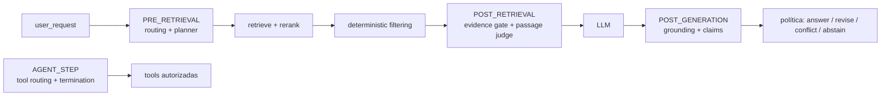

# Decision Engine (JEV) y Adaptive RAG

Estado: implementado, default off. Última revisión: 2026-09.

## Contexto

El chat RAG decidía SQL-first vs RAG con heurísticas locales
(`SqlIntentRouter`) y no existía una capa única que registrara *por qué* se
eligió un camino. Se incorporó TypeSafe/JEV System One como fuente de juicio
(Choice / Score / Noul) y un pipeline adaptativo de retrieval.

## Decisión

JEV **decide**; el orquestador **ejecuta**. La frontera es explícita:

- `src/core/domain/decision.py` — `RoutingDecision`, `DecisionContext`,
  `CapabilitySpec`. Sin frameworks.
- `src/core/ports/decision.py` — puerto `DecisionProvider` y
  `CapabilityRegistry`.
- `src/decision/` — proveedores (`rules`, `jev`, `llm`), composite, policy de
  autorización, trazas, métricas, settings y el hook que consume el
  orquestador.
- `src/runtime/` — capa experimental (`ZentRuntime`, executor, wallet,
  tool routing, termination gate, efficiency score, experiment lab).
- `src/rag/adaptive/` — planner de retrieval, evidence gate, fast path,
  rewrite, grounding, retry.

Reglas no negociables:

1. **JEV nunca ejecuta ni autoriza.** `authorize_decision()` recorta cualquier
   capability fuera de `available_capabilities`, de la allowlist del tenant o
   sin permiso declarado. El fallback seguro es `knowledge.answer`
   (o `respond_directly`).
2. **Shadow y muestreo son observacionales.** `composite` devuelve
   `resolved=False` con candidatos en metadata; `retrieval_hint()` no emite
   señales cuando `metadata["acting"]` es `False`.
3. **Sin JEV configurado** la cadena es rules → LLM pequeño → LLM de
   razonamiento, y con `DECISION_ROUTING_MODE=legacy` nada cambia.
4. **La autorización es por capa:** la capa de decisión valida
   disponibilidad; el rol `customer`, las blocklists SQL y el RBAC de tools
   siguen en los handlers.

## Modos

| Flag | Valores | Efecto |
|---|---|---|
| `RAG_DECISION_ROUTING_MODE` | `legacy` (default) · `shadow` · `jev` · `hybrid` | `hybrid` actúa solo en el canary |
| `RAG_JEV_SHADOW_MODE` | bool | Fuerza observación en cualquier modo |
| `RAG_RUNTIME_SHADOW_SAMPLE_RATE` | 0-1 | Muestreo de observación sobre tráfico legacy |
| `RAG_ADAPTIVE_RAG_MODE` | `off` · `shadow` · `active` · `canary` | Aplica plan de retrieval |
| `RAG_RUNTIME_TOOL_ROUTING_MODE` | `off` · `experimental` | Subconjunto de tools por JEV en agentes |
| `RAG_RUNTIME_TERMINATION_GATE` | `off` · `on` | Gate Noul tras uso de tools |
| `RAG_RUNTIME_SOURCE_AWARE_TOOLS` | bool (default `true`) | Recorta tools según las fuentes del agente |
| `RAG_RUNTIME_FAILED_TOOL_GUARD` | bool (default `true`) | No reintenta una tool que falló para la pregunta |
| `RAG_JEV_CANARY_MODEL` | string (default vacío) | Modelo candidato JEV; vacío = solo `JEV_MODEL` |
| `RAG_JEV_CANARY_PERCENTAGE` | 0-100 (default 0) | % de requests que usa el modelo canary |
| `RAG_DECISION_BATCH_MODE` | `off` (default) · `shadow` · `on` | Una llamada JEV por fase de estado (ver [decision-engine-batching.md](decision-engine-batching.md)) |
| `RAG_DECISION_PASSAGE_JUDGE` | bool (default `true`) | JEV juzga passages dudosos (zona incierta, conflictos, injection) |
| `RAG_DECISION_PASSAGE_MAX` | 1-12 (default 5) | Candidatos máximos al Passage Judge |
| `RAG_DECISION_CLAIMS` | bool (default `true`) | Verificación por claim contra evidencia |
| `RAG_DECISION_CLAIMS_MAX` | 1-12 (default 6) | Claims máximos verificados por respuesta |
| `RAG_DECISION_CLAIMS_LEDGER` | bool (default `true`) | Registra claims verificados en el Claim Ledger |
| `RAG_DECISION_JUDGMENT_CACHE_TTL_SECONDS` | 1-900 (default 120) | TTL del cache request-scoped de juicios |

Rollout recomendado: `legacy` + `RAG_JEV_SHADOW_MODE=true` → comparar
`decision_traces` (agreement) → `hybrid` con canary 5-10 → `jev`.
Adaptive RAG se calibra aparte con `compare_legacy_vs_adaptive` sobre golden
set antes de `active`.

## Capacidades

`BUILTIN_CAPABILITIES` incluye familias que el chat no enruta por heurística
(`agent.*`, `workflow.*`, `tool.*`). Están marcadas `availability="advisory"`
en el registry y `default_capability_ids()` no las ofrece a JEV.

Se ejecutan de dos formas:

1. **Dispatcher con target explícito** (implementado): el request de
   `POST /api/v1/rag/query` puede incluir `agent_id`, `workflow_id`, `run_id`,
   `tool` y `tool_arguments`. Rules las resuelve como intención explícita
   (`metadata.explicit`, actúa en todos los modos), `authorize_decision()`
   valida y `CapabilityDispatcher` ejecuta el handler registrado por el
   composition root (`agent_runtime`, `workflow_engine`, `tool_registry`).
   Permisos por handler: `agents:execute`, `workflows:run` y el permiso de la
   tool si declara uno (`tool:query_database` y `tool:call_api` están
   sembrados para owner/admin; migraciones 119 y 122).
2. **Endpoints propios**: `POST /agents/{id}/run`, `POST /workflows/{id}/run`,
   tool registry vía agentes/MCP.

El chat sin target sigue ejecutando: `knowledge.*`, `database.*`, `llm.*`,
`respond_directly`, `document.read`.

Allowlist por tenant: `organizations.config_json["decision"]` acepta
`{"capability_allowlist": ["knowledge.answer", ...]}`; el hook lo pasa como
`tenant_policy` y `authorize_decision()` lo aplica antes de emitir señales de
routing.

## Herramientas según las fuentes (runtime de agentes)

Antes del loop ReAct, el runtime recorta las tools del agente a las que aplican
a sus fuentes (`RAG_RUNTIME_SOURCE_AWARE_TOOLS=true`, default on):

| Tool | Se mantiene si... |
|---|---|
| `search_knowledge` | siempre |
| `query_tabular_data` | hay fuentes `csv`/`excel` (o `sql`) |
| `query_database` | hay fuentes `sql` |
| `call_api` | el tenant tiene `agent.api_allowlist` |

Si el agente no declara `source_ids`, se miran las fuentes de la organización.
Las omisiones se registran como paso `tool_filter` en "Ver flujo". En la misma
línea, `RAG_RUNTIME_FAILED_TOOL_GUARD=true` impide reintentar una tool que falló
para la misma pregunta (solo errores transitorios permiten reintento) y
`QueryDatabaseTool` rechaza sin LLM las preguntas de definición/identidad
("quién es X") cuando no hay señal analítica.

## Confianza de ruta: Choice vs Noul (P0.1)

En decisiones `route` (workflow AI decision) hay dos señales distintas y **no
se mezclan**:

| Señal | Pregunta | Campo |
|---|---|---|
| Choice confidence | ¿qué ruta elige el modelo y con qué probabilidad? | `route.confidence` |
| Noul warranted | ¿la ruta elegida está claramente justificada por el estado? | `confidence_ok.noul` |

La certeza de un Noul es distancia de 0.5 (`noul_certainty`). Un Noul **0.05**
significa "la ruta no está justificada" con certeza 0.90; usar esa certeza como
confianza de ruta convertiría una señal negativa en confianza alta. Reglas
vigentes en `interpret()`:

1. Noul en banda YES (`>= DECISION_NOUL_YES`): `warranted=True`; la confianza
   efectiva es la del Choice (sin inflar).
2. Noul en banda NO (`<= DECISION_NOUL_NO`): `warranted=False`; la confianza
   efectiva se degrada a `min(choice_confidence, noul)` y la decisión queda
   `low_confidence`.
3. Noul incierto: `warranted=None` y se activa la política
   `on_low_confidence` aunque el Choice supere el threshold.
4. Sin `confidence_ok`: comportamiento legacy basado solo en el Choice.

`AiDecisionOutcome` expone `choice_confidence`, `warranted` y
`warranted_certainty` por separado (también en `to_output()`).

## Noul 0.0 (P0.2)

`valor or default` colapsa un Noul válido de `0.0` en el default. Todos los
lectores de Noul usan `safe_noul()` / `noul_from_answer()`
(`src/decision/questions.py`): `None`/missing/inválido → default; `0.0`,
`1.0` y `False` (0.0) se conservan. Cubre routing, tool routing, termination,
answer gate, adaptive planner y workflow AI decision.

## Pricing canónico (P0.3)

El Pricing Registry (`pricing_models` / `provider_cost_history`,
`src/platform/billing/pricing.py`) es la fuente canónica de costo para JEV y
LLM del Decision Engine. `src/decision/costs.py::resolve_cost()` aplica:

1. `get_price(provider/model)` del registry y `estimate_cost_from_price()`
   (input/output/embedding por 1k + `request_cost`; `cost_kind` se conserva).
2. Fallback `estimated_cost_per_1k` de las settings **solo** si el registry no
   está disponible (DB caída, tabla ausente).

El provider JEV usa `provider="jev"` y el modelo efectivo; no hay fórmula de
precio hardcodeada en `JevDecisionProvider`. El costo queda en
`estimated_cost` y `metadata.cost_source` (`registry` | `legacy` | `none`).

## JudgmentContext (P0.4)

`engine.judge(state=..., questions=..., context=JudgmentContext(...))`
transporta `organization_id`, `request_id`, `phase`, `provider`, `model` y,
opcionalmente, `agent_id`, `workflow_id`, `capability`, `run_id`, `user_id`,
`deployment_id` y `trace_id`.

- El contexto es **opcional**: `call_judge()` solo lo pasa a judges que
  declaran `context` (o `**kwargs`), así callers y fakes previos siguen
  funcionando.
- Cada juicio produce un usage event `jev_judge:<phase>` cuando hay
  organización y request/run. La idempotencia `(request_id, event_type)` de
  `usage_events` evita doble cobro en retries; fases distintas no se pisan.
- Sin tenant context el juicio corre igual y solo se mide en métricas.

## Fases y observabilidad (P0.6)

Fases legacy: `routing` (decide), `pre_retrieval`, `evidence`, `grounding`,
`tool_routing`, `termination`, `answer_gate`, `workflow_decision`.

Fases de batching (`RAG_DECISION_BATCH_MODE=on|shadow`): `pre_retrieval`,
`post_retrieval`, `post_generation`, `agent_step`. Se reportan con la etiqueta
legacy de su módulo principal para que los dashboards sigan comparables.

- `zent_decision_judge_total{outcome, phase}`
- `zent_decision_judge_tokens_total{kind, phase}`
- `zent_decision_judge_latency_seconds{phase}`
- `zent_decision_judge_cost_usd{phase}`
- `zent_decision_judge_dedup_total{phase}` (llamadas evitadas por el cache)
- `zent_decision_batch_total{mode, phase, outcome}`
- `zent_decision_batch_questions_per_call{phase}`
- `zent_decision_batch_shadow_total{phase, agreement}`

`decision_traces.payload.model` y `usage_events.model` guardan el modelo JEV
efectivo. Para distinguir producción de candidato/canary: `JEV_MODEL` +
`JEV_CANARY_MODEL`/`JEV_CANARY_PERCENTAGE`; `metadata.model_role` queda
`production` o `canary`.

## Pipeline de respuesta (batching + jueces selectivos)

JEV decide/juzga; el LLM genera; el código autoriza/ejecuta.

- Passage Judge: descarta irrelevantes/débiles, flaggea contradicciones y saca
  prompt injection del contexto del LLM (evidencia sanitizada y etiquetada).
- Evidence gate: deterministic-first; JEV sólo en la banda incierta y no pisa
  reglas fuertes (`structured`, `exact_match`).
- Claims: `supported | unsupported | contradicted | not_verifiable` compuestos
  en código; las frases no factuales no se penalizan. Los claims verificados se
  registran en el Claim Ledger existente (best-effort, sin CoT).
- Política: una regeneración como máximo, sin loops; contradicción nunca se
  presenta como hecho.

Detalle completo en [decision-engine-batching.md](decision-engine-batching.md).

## Judgment Fabric (Knowledge · Database · Agents · Workflows · Tools)

Desde la fase de batching, el Decision Engine es el **Judgment Fabric** común:
JEV juzga dentro de CandidateSets autorizados, la política re-autoriza y el
runtime ejecuta. Agents/Workflows/Tools ya no exigen target explícito cuando
`RAG_DECISION_TARGET_SELECTION=shadow|on`.

| Flag | Valores | Efecto |
|---|---|---|
| `RAG_DECISION_TARGET_SELECTION` | `off` (default) · `shadow` · `on` | Selección de target asistida por JEV |
| `RAG_DECISION_RISK_MAX_SELECTABLE` | `low` · `medium` · `high` (default) · `critical` | Riesgo máximo auto-seleccionable |
| `RAG_DECISION_RISK_*_CHOICE` | 0-1 | Umbrales de Choice por riesgo (centralizados) |
| `RAG_DECISION_RISK_*_FALLBACK` | `respond_directly` · `ask_clarification` · `default_target` · `human_review` | Acción ante duda |

Diseño completo, política de riesgo, dos señales para HIGH/CRITICAL,
aprendizaje/calibración y Control Center:
[judgment-fabric.md](judgment-fabric.md).

## Trazas y costo

- `decision_traces` (migración 120) guarda cada decisión; `update_actual()`
  completa `actual_capability` y `agreement` después de ejecutar, en todos los
  modos, no solo shadow. El payload incluye `model` (P0.5).
- `engine.judge()` emite usage events `jev_judge:<phase>` con
  provider/model/tokens/costo cuando recibe `JudgmentContext` con tenant.
- `tenant_wallets` y `efficiency_score_weights` (migración 121) alimentan el
  Control Center; los pesos por env son solo default inicial.

## Límites conocidos

- Con `RAG_DECISION_BATCH_MODE=off` cada etapa usa su propia llamada System One.
  El batcheo (`on`) fusiona routing + planner, evidence + passages,
  grounding + claims y tool routing + termination por estado compatible; ver
  [decision-engine-batching.md](decision-engine-batching.md).
- El dispatcher cubre `agent.*`, `workflow.*`, `tool.*` con target explícito.
  JEV no elige *cuál* agente/workflow/tool: sin target no hay ejecución.
- El rewrite de query re-embebe solo en el camino adaptativo; el rerank usa
  el texto reescrito.
- Aún no hay Alertmanager ni dashboards Grafana dedicados a estos flags.
- Los usage events de judge son uno por `(request, fase)`: varias llamadas de
  la misma fase dentro de un request (p. ej. tool routing por paso) dedupean
  por diseño de idempotencia. Si se necesita granularidad por paso, usar
  `run_id`/sub-request distinto.
- `retry_retrieval` post-generación degrada a `abstain`: no hay loop de
  retrieval después del LLM. El retry real vive en el evidence gate
  (`ADAPTIVE_RAG_MAX_RETRIEVAL_ATTEMPTS`).
- La regeneración por claims no corre en streaming (`on_delta`): se conserva el
  draft y queda registrado en la traza (`claims_revision` ausente).

## Compatibilidad legacy (P0)

- `DECISION_ROUTING_MODE=legacy` y `engine.judge()` sin `JudgmentContext`
  mantienen el comportamiento previo.
- `AiDecisionOutcome` agrega campos con default (`choice_confidence=0.0`,
  `warranted=None`, `warranted_certainty=None`): callers que no los leen no
  cambian.
- `engine.judge()` acepta callers viejos (`state`, `questions`) y fakes sin
  `context`.
- `estimated_cost_per_1k` sigue existiendo como fallback; no se eliminó
  ninguna setting.
- `RAG_DECISION_BATCH_MODE=off` (default) conserva una llamada por módulo; el
  Passage Judge y la verificación de claims tienen sus propios flags
  (`RAG_DECISION_PASSAGE_JUDGE`, `RAG_DECISION_CLAIMS`) y defaults seguros.
- `call_phase_judge` cae a `call_judge` con callables sin `judge_phase`:
  providers legacy y fakes de tests siguen funcionando.
- `EvidenceQuality` / `GroundingResult` / `AdaptiveTrace` agregan campos con
  default; los consumidores que no los leen no cambian.
