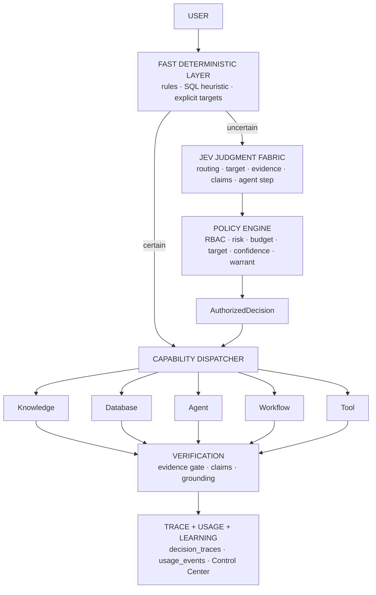

# ADR: Zent Judgment Fabric

Estado: **implementado** (rollout `RAG_DECISION_TARGET_SELECTION=off` por
defecto). Depende de [decision-engine.md](decision-engine.md) y
[decision-engine-batching.md](decision-engine-batching.md).

El **JEV Preflight** ([jev-preflight.md](jev-preflight.md)) es la cara anticipada
del fabric: pregunta antes de retrieval y antes de generar, en packs, y compone
en código la decisión de escalado. Mismo principio, un momento antes:
`JEV juzga → el código compone → el runtime ejecuta`.

## Contexto

Zent decidía con el Decision Engine para Knowledge/Database, pero Agents,
Workflows y Tools exigían target explícito (`agent_id`, `workflow_id`, `tool`)
y cada módulo resolvía sus propios umbrales. Resultado: subsistemas separados
al decidir qué hacer, thresholds dispersos y selección de target imposible sin
confiar en el modelo.

La arquitectura no negociable:

```
JEV judges  →  Policy authorizes  →  Runtime executes
```

JEV nunca autoriza ni ejecuta. El código construye candidatos autorizados,
JEV elige dentro de ese conjunto, la política re-autoriza y el runtime ejecuta.

## Decisión

Un **Judgment Fabric** común para Knowledge, Database, Agents, Workflows,
Tools y Cognitive OS.



### Candidate Resolver (`src/decision/candidates.py`)

Pipeline determinístico, en orden:

```
User Request
  ↓ tenant isolation (provider inyectado, org-scoped)
  ↓ RBAC (permission_satisfied)
  ↓ capability availability (candidate.capabilities)
  ↓ source compatibility (required_sources ⊆ tenant sources)
  ↓ status/enabled
  ↓ risk policy (max_selectable_risk)
  ↓ CandidateSet
  ↓ JEV Choice
  ↓ Policy authorize (re-chequeo, nunca confiar en el filtro inicial)
```

- `Candidate` expone sólo `id`, `name`, `description`, `capabilities`,
  `required_sources`, `risk`, `required_permission`, `cost_class`,
  `availability`, `status`. Nunca secretos, prompts ni config sensible.
- `CandidateRegistry` recibe providers tenant-scoped desde el composition root
  (`src/api/deps.py`): `agent_repo.list_agents`, `list_workflows`, tool
  registry. `src/decision` no importa adaptadores.
- Rechazos con razón estable: `disabled`, `cross_tenant`, `permission`,
  `unavailable`, `sources`, `risk`, `capability`, `allowlist`, `duplicate`.

### Risk-aware thresholds (`src/decision/risk_policy.py`)

`DecisionRiskPolicy` resuelve, por riesgo, el umbral de Choice, si hace falta
`action_warranted`, su umbral, la acción ante duda y si requiere confirmación
humana. Configurable por settings (`RAG_DECISION_RISK_*`) y por tenant
(`tenant_policy.risk_policy`). Ningún módulo inventa números.

| Riesgo | Choice | Warrant | Ante duda |
|---|---|---|---|
| low | 0.60 | no | respond_directly |
| medium | 0.70 | no | ask_clarification |
| high | 0.80 | ≥ 0.65 | human_review |
| critical | 0.90 | ≥ 0.75 | human_review (no auto-seleccionable) |

**Dos señales** para HIGH/CRITICAL: `choice >= umbral` **AND**
`warranted >= umbral`. Nunca `max()`.

### Selección de target (`src/decision/selection.py`)

- `build_target_questions`: `target` (Choice con criterios = candidatos) y
  `action_warranted` (Noul) sólo si la política lo exige.
- Reutiliza el batching: fase `target_selection` con cache request-scoped.
- Reglas determinísticas primero: target explícito gana (no gasta JEV); un
  único candidato ejecuta sin JEV; sin candidatos → acción de política.
- Target fuera del set ofrecido → `invalid_target` → fallback de política.
- `selection_outcome` aplica `default_target` del tenant si está declarado.

### Policy Engine (`src/decision/policy.py`)

`evaluate_policy(decision, context, ...)` devuelve `AuthorizedDecision` con
razón estable: `allowed`, `capability_denied`, `target_not_allowed`,
`missing_target`, `low_confidence`, `action_not_warranted`, `budget_block`,
`rate_limited`, `human_confirmation_required`.

- `authorize_decision` se mantiene como wrapper compatible (muta la decisión
  como antes).
- El dispatcher recibe `authorized=` y **no ejecuta** si la política no
  autorizó o si requiere confirmación humana (`executable == False`).
- Rate limits: se aplican en el borde (middleware HTTP + guardas de tools);
  `evaluate_policy(rate_ok=...)` queda como input explícito para que una capa
  superior (o el Control Center) imponga límites por tenant sin tocar el
  adapter JEV.

### Budget-aware (`src/decision/budget.py`)

JEV recibe un resumen (`budget_class`, `remaining_ratio`, `cost_pressure`),
nunca saldos. `cheap_path_hints` habilita sesgos (fast deterministic, modelo
chico, top_k menor) sin degradar seguridad: la risk policy manda.

### Wiring

- `CapabilityDispatcher.configure_target_selection(candidates, judge, mode,
  cache)` desde `src/api/deps.py`.
- `resolve_target()` → CandidateSet → JEV → policy → `TargetResolution`.
- `src/api/routes/query.py::_maybe_dispatch` intenta selección sólo si
  `RAG_DECISION_TARGET_SELECTION` es `shadow`/`on`; en `on` y autorizado,
  ejecuta como si el target fuera explícito; en cualquier otro caso, RAG.

### Event-driven (`src/decision/event_judgment.py`)

JEV no escucha infraestructura. El dispatcher de eventos normaliza y llama
`judge_event`, que aplica: condiciones determinísticas → (si hace falta) JEV
sobre CandidateSet → política. Devuelve `EventJudgment` (`deterministic`,
`start_workflow`, `escalate_agent`, `execute_tool`, `ask_clarification`,
`human_review`, `ignore`) y **el caller ejecuta**.

### Decision Learning (`src/decision/learning.py`)

Aprendizaje observacional, sólo lectura sobre `decision_traces`/`usage_events`:

- `decision_learning_report`: mismatches JEV vs real por capability, fallbacks
  por intent, selección de targets (tool/agent/workflow), fallback por bucket.
- `confidence_calibration`: buckets 0.50-0.60 … 0.90-1.00 con accuracy real,
  fallback, latencia y costo; `calibration_gap` contra el punto medio.
- `model_comparison`: producción vs candidato/canary; flujo
  `candidate → shadow → evaluation → manual promote`.

Sin fine-tuning, sin mutación automática de prompts, sin promoción automática.

### Cost breakdown (`src/runtime/cost_breakdown.py`)

Categorías: `jev_pre_retrieval`, `jev_evidence`, `jev_grounding`,
`jev_agent_step`, `jev_other`, `routing`, `llm`, `embeddings`, `reranker`,
`tools`, `agents`, `workflows`, `other`. Incluye `cost_per_successful_answer`,
`cost_per_agent_run`, `cost_per_workflow_run` y `by_tenant`. Desglose por
request/run con `request_cost_breakdown`.

### Explicación (`src/decision/explanation.py`)

Modo usuario: ruta, motivo operativo, confianza (alta/media/baja), fuentes,
fallback. Modo admin: preguntas evaluadas, choice, fase, modelo, latencia,
costo y resultado de política. **Nunca chain-of-thought.**

### Workflow AI node

La config sigue siendo amigable (Pregunta, Opciones, Confianza mínima, Si hay
duda: respaldo / revisión / detener / LLM). `parse_config` usa el threshold
central cuando el nodo no define `confidence_min`, y `to_output` agrega
`explanation` en etiquetas de negocio (sin Noul/Choice/Score).

### Evaluación de idioma (`src/rag/evaluation/language_golden.py`)

Golden de español de negocio/técnico/casual, typos, Spanglish, SQL, field
names, códigos/SKUs, registros tipo aviación y abreviaturas. Compara `raw` vs
`canonical` (minúsculas, sin acentos, abreviaturas expandidas, códigos
intactos) con `term_preservation` y `rules_family_accuracy`. La decisión queda
`sin_traduccion_obligatoria`: no se traduce el pedido sin evidencia.

## Control Center

`src/api/routes/decision.py`:

| Endpoint | Sección |
|---|---|
| `GET /status` | AI Runtime + flags (batch, target selection, riesgo) |
| `GET /dashboard` | Decision Health / JEV usage |
| `GET /traces` | Decisiones recientes |
| `GET /learning` | Routing accuracy, mismatches, fallbacks, targets |
| `GET /calibration` | Confidence calibration |
| `GET /models` | Producción vs candidato |
| `GET /costs` | Cost breakdown global/tenant |
| `GET /requests/{id}/costs` | Cost breakdown por request |
| `GET /risk-policy` | Thresholds resueltos (+ override del tenant) |
| `GET /selection` | Observaciones del Judgment Fabric |
| `GET /explain` | Explicación user/admin de un request |

## Rollout

1. `RAG_DECISION_TARGET_SELECTION=shadow` con `RAG_DECISION_BATCH_MODE=on`:
   observar `GET /selection` (candidatos, elección, política) sin ejecutar.
2. Comparar `GET /learning` + `GET /calibration` contra el camino explícito.
3. `on` con `ADAPTIVE_RAG_MODE=canary`; `RAG_DECISION_RISK_MAX_SELECTABLE=high`.
4. Promoción de modelo JEV sólo manual (`JEV_CANARY_MODEL` + `%`).

## Reglas no negociables

NO: chain-of-thought persistido, mutación automática de prompts, selección de
tool/workflow/agent fuera del CandidateSet, autorización por JEV, candidatos
cross-tenant, promoción automática de modelos, loops de fallback caros ocultos.

SÍ: shadow, canary, política explícita, observabilidad, costos, fast paths
determinísticos, revisión humana cuando corresponde.

## Consecuencias

- Knowledge, Agents, Workflows y Tools pasan por el mismo Judgment Fabric sin
  perder tenant isolation, RBAC, cost control ni fallbacks.
- Un target sólo se ejecuta si el código lo autorizó dos veces: en el filtro de
  candidatos y en `evaluate_policy`.
- Riesgo: una política mal configurada puede bloquear selección legítima.
  Mitigación: `GET /risk-policy` muestra los thresholds resueltos y el fallback
  determinístico sigue respondiendo.
