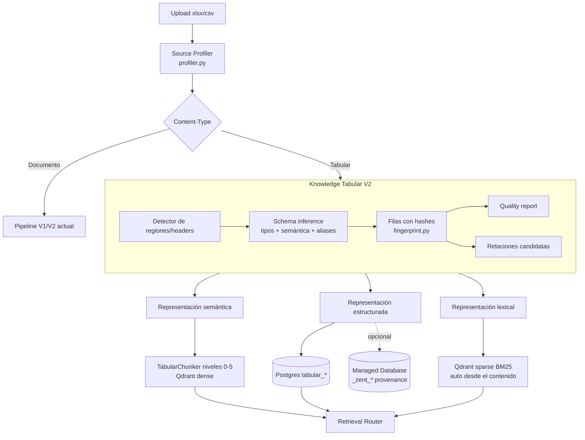
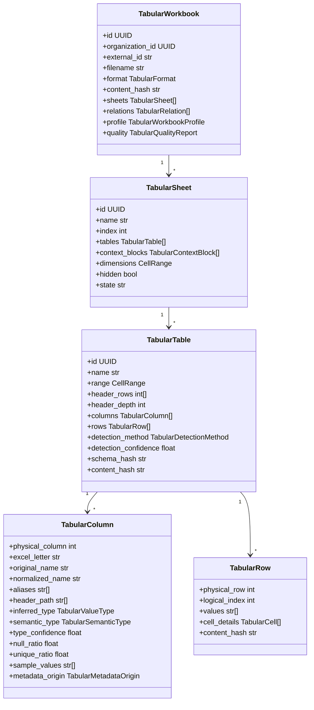
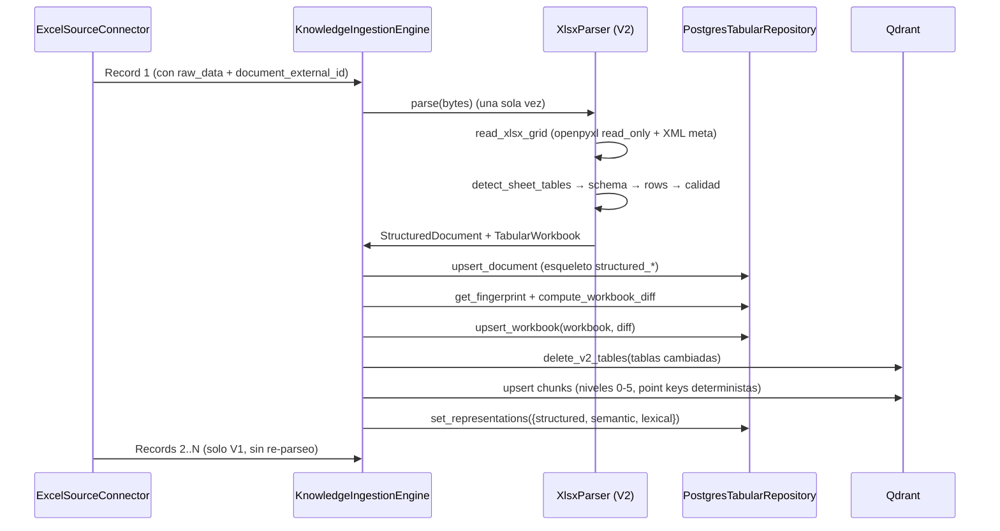
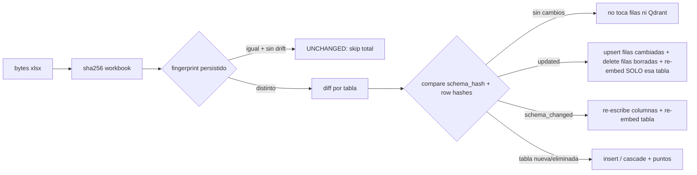
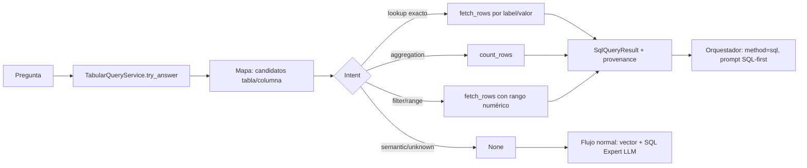

# Ingesta inteligente de datos tabulares (Knowledge Tabular V2)

> Estado: implementado y activo tras `RAG_KNOWLEDGE_V2_ENABLED=true`.
> Ámbito: Excel (`.xlsx`/`.xlsm`) y CSV/TSV. PDF/DOCX/TXT/MD/HTML no cambian.
> Fase: ingestión. El retrieval tabular (routing denso/lexical/SQL) queda
> preparado a nivel de metadata e interfaces, no conectado al orquestador.

## 1. Problema

Hasta esta fase, un Excel se ingestaba así:

```
hoja 1 → fila 1 = headers → cada fila = un Record "columna: valor"
```

Eso conserva los datos pero pierde toda la estructura:

- no existen filas/columnas como entidades (solo texto);
- un título en la fila 1 se convierte en "header";
- los encabezados fuera de la fila 1 no se detectan;
- varias tablas en una hoja se mezclan;
- las posiciones físicas (celda `B35`) y las posiciones de dominio
  (`start_position = 28`) son indistinguibles;
- no hay forma de responder "¿qué posición tiene Carrier Code?" sin que el
  embedding "adivine" la relación;
- CSV sufría exactamente lo mismo.

La regla anterior — "todo archivo es texto" — es incorrecta para tablas.

## 2. Arquitectura existente (punto de partida)

```mermaid
flowchart LR
  A[Upload xlsx/csv] --> B[kb_sources type=excel|csv]
  B --> C[ExcelSourceConnector / CSVSourceConnector]
  C --> D[Records 'campo: valor' por fila]
  D --> E[Chunker fijo 1200]
  E --> F[Embeddings]
  F --> G[Qdrant rag_documents]
  D -.raw_data ausente.-> H[Knowledge V2 StructuredDocument<br/>solo file/pdf/docx/md/html]
```

- `StructuredDocument` (V2) ya existía para documentos: bloques, secciones,
  tablas, chunks parent/child, `structured_documents` en Postgres.
- El pipeline V2 se activaba por `record.raw_data + record.format`, que los
  conectores Excel/CSV **no** entregaban.
- `PostgresTabularRepository` no existía; Managed DB es una base de datos
  Postgres por (org, workspace) que solo se llenaba manualmente por API.

## 3. Nueva arquitectura



Decisiones clave:

1. **Un archivo = un documento estructurado** (no un record por fila). El
   conector adjunta `raw_data + document_external_id` solo al primer record.
2. **El árbol tabular es el modelo canónico**; el Markdown/Qdrant es una vista.
3. **Dual representation** desde el día 1: Postgres `tabular_*` (valores
   exactos, filtros, agregaciones) + Qdrant (descubrimiento semántico) +
   sparse BM25 (códigos exactos: `CAT10`, `R8&&&&&E&`, `YQYR`).
4. **Sin infraestructura nueva**: openpyxl + stdlib XML + Postgres + Qdrant.
5. **Determinista primero**: LLM solo como enriquecimiento opcional (flag off).

## 4. Modelo de datos

`src/core/domain/tabular.py` (puro, sin I/O):



Trazabilidad de metadata (`TabularMetadataOrigin`):
`SOURCE` (leído del archivo) → `DETERMINISTIC` (algoritmo) → `INFERRED`
(heurística con confidence) → `LLM_INFERRED` (reservado, flag off).

### Posición física vs posición de dominio

| Concepto | Dónde vive | Ejemplo |
|---|---|---|
| `CellRange(min_row/max_row/min_col/max_col)` | tabla/hoja | `A4:E8` |
| `TabularCell.address` | celda | `B5` |
| `physical_row` / `physical_column` | fila/columna | fila 5, columna 2 |
| `semantic_type=position` + valor | dato | `Start Position = 28` |

`B5` **no** significa "posición 2": significa celda columna B fila 5. El valor
`28` de dominio se conserva como string exacto en `TabularRow.values`.

## 5. Ciclo de ingestión



Pasos del parser (`src/knowledge/structure/xlsx_parser.py`):

1. `read_xlsx_grid`: una pasada `openpyxl read_only data_only=True` para
   valores; `xlsx_meta` (zipfile + XML) para merged cells, filas/columnas
   ocultas, Tables formales y conteo de fórmulas. Solo si hay fórmulas, una
   segunda pasada conserva el texto `=C2*2` (nunca se evalúa).
2. `build_tabular_workbook`: detección → columnas → filas → calidad → perfil →
   relaciones candidatas.
3. `tabular_document`: esqueleto `StructuredDocument` (hoja + schema de tabla)
   con `document.tabular = workbook`.
4. Límites duros (`RAG_KNOWLEDGE_TABULAR_*`): partial ingestion + warning.

## 6. Detección de tablas y headers

Prioridad: **Table formal de Excel** (`xl/tables/tableN.xml`) > heurística.

Heurística (determinista):

1. Ocupación de celdas → bandas de filas (separadas por filas vacías) y runs
   de columnas contiguas → regiones (soporta tablas lado a lado).
2. Scoring de header por región:
   - fila mayormente texto, valores distintos, relleno ≥ 60%;
   - la fila siguiente introduce tipos numéricos/fecha;
   - penalización a títulos sueltos (1 celda sin merged sobre ≥2 columnas).
3. Multinivel: la fila superior entra como header solo si tiene merged cells o
   ≥2 etiquetas de texto (evita convertir títulos en super-headers).
4. Contexto: hasta 5 filas encima del header, excluyendo rangos de OTRAS tablas
   detectadas, se conservan como `context_blocks` (`title`, `subtitle`, `note`).
   El título se usa como nombre de tabla (`ATPCO RECORD 2 RULES`).
5. Bandas de una columna que son títulos sobre otra tabla se descartan como
   tabla y se convierten en contexto de la tabla siguiente.
6. Encabezados duplicados son válidos (caso real `ATPCO_Attributes`: "Data Row"
   dos veces). La unicidad es una señal suave, nunca un veto; las columnas
   homónimas se indexan con sufijo interno (`data_row`, `data_row_2`) y el
   reporte de calidad emite `duplicate_headers`. El valor raw no se altera.

Caso de aceptación:

```
Fila 1: ATPCO RECORD 2 RULES      → context.title
Fila 2: Field layout specification → context.subtitle
Fila 3: (vacía)                    → separador
Fila 4: Field Name | Start Position | ... → header (header_rows=(4,))
Filas 5-8: datos                   → TabularRow physical_row 5..8
```

## 7. Representación semántica: TabularChunker (niveles 0-5)

| Nivel | `knowledge_type` | Rol | Contenido |
|---|---|---|---|
| 0 | `table_workbook` | parent | resumen del workbook (sheets, tablas, filas, calidad) |
| 1 | `table_sheet` | parent | resumen de hoja (tablas, columnas) |
| 2 | `table_schema` | parent | schema: columnas, tipos, letras, header rows |
| 3 | `table_row_group` | candidato | ventana compacta de filas con headers (cubre TODAS las filas) |
| 4 | `table_row` | candidato | fila con workbook/sheet/tabla/row + `campo: valor` (cap) |
| 5 | `table_cell` | opcional (flag) | `tabla > campo > columna = valor` |

Formato de los row-groups (v3, header corto + filas posicionales):

```
TABLE: <nombre> | SHEET: <hoja> | ROWS: 120-159
KEY: Standard Name | Field Name | Project Name | Match/Action | Description | Definition/Processing | Field Size | Start Loc
NOTE: key columns shown; full row available in the structured layer   (solo tablas anchas)
120: Fare Identification Table 189 | Range 1 Currency | Editorials 2023-11 | match | The currency code... | ... | 3 | 28
```

- En tablas anchas (> `RAG_KNOWLEDGE_TABULAR_WIDE_TABLE_COLUMNS`, 12) los grupos
  rinden columnas clave: semánticas (nombre/descripción) y, reservando slots,
  columnas de **posición/longitud** (`Start Loc`, `Field Size`...), que son las
  más consultadas en data dictionaries. Cap `MAX_GROUP_KEY_COLUMNS` (8) y
  recorte de texto libre (`MAX_FREE_TEXT_CHARS`, 160). El header conserva las
  columnas clave y los valores exactos viven en la capa estructurada y en las
  filas nivel 4.
- Los grupos cubren hasta `RAG_KNOWLEDGE_TABULAR_MAX_GROUP_ROWS` (20000) filas;
  las filas individuales siguen capadas por `MAX_EMBEDDING_ROWS` (200).
- Medido en ATPCO 6750x24: 7121 chunks → 549 (-92%), tokens 723k → 294k
  (-59%), requests de embeddings 223 → 18 (-92%), con cobertura semántica de
  todas las filas (antes solo las primeras 200) y visibilidad del match dentro
  del presupuesto de la tool (`search_knowledge` da 3000 chars a los chunks
  `table_*`, 6000 al primero).

Reglas:

- una fila **nunca** se separa de sus encabezados;
- `parent_id` de metadata apunta al **point id determinista** del padre, de
  modo que la expansión de padres de `StructuredRetriever` funcione;
- los niveles 3/4/5 son candidatos (`v2_chunk=true`), los 0-2 son contexto
  (`v2_parent=true`);
- `RAG_KNOWLEDGE_TABULAR_MAX_EMBEDDING_ROWS` limita filas embebidas por tabla:
  el resto queda en la representación estructurada (no se pierde nada);
- `RAG_KNOWLEDGE_TABULAR_ROW_GROUP_SIZE/OVERLAP` controlan ventanas.

Metadata en Qdrant (ejemplo de chunk de fila):

```json
{
  "knowledge_type": "table_row",
  "format": "xlsx",
  "source_id": "...",
  "external_id": "...",
  "workbook": "ATPCO_TEST.xlsx",
  "workbook_id": "...",
  "sheet": "Record2",
  "sheet_id": "...",
  "table_id": "...",
  "table_name": "ATPCO RECORD 2 RULES",
  "row_start": 5, "row_end": 5, "physical_row": 5,
  "header_rows": [4],
  "columns": ["field_name", "start_position", "end_position", "length", "description"],
  "column_names": ["Field Name", "Start Position", "End Position", "Length", "Description"],
  "values": {"field_name": "Carrier Code", "start_position": "28", "end_position": "29", "length": "2"},
  "parent_id": "<point id del schema>",
  "schema_id": "<point id del schema>",
  "workspace_id": "...", "document_id": "...",
  "v2_tabular": "true", "v2_doc": "true", "v2_chunk": "true", "v2_parent": "false",
  "point_key": "tab:v1:<source>:<external>:<table>:row:5",
  "chunking_strategy": "tabular"
}
```

La representación lexical (sparse BM25) se genera automáticamente por el
adapter de Qdrant desde el contenido: los códigos exactos (`CAT10`, `978`,
`R&&&&&E&`, `YQYR`, `FCLASS`, `TARNO`) quedan indexados sin normalización
destructiva.

## 8. Representación estructurada (Postgres)

Migración `118_tabular_ingestion.py`:

```
tabular_workbooks (1) ──< tabular_sheets (N) ──< tabular_tables (N) ──< tabular_columns (N)
                                                      │
                                                      └──< tabular_rows (N)
tabular_workbooks ──< tabular_relations (N candidatas)
```

- `tabular_rows.values` es JSONB `{normalized_name: raw_value}` (exacto);
  `tabular_rows.cells` conserva fórmulas/merged/dirección (`B5`) cuando
  aportan; GIN `jsonb_path_ops` para filtros de igualdad.
- Toda query va scoped por `organization_id`; `source_id`/`workspace_id` para
  filtrado. Sin RLS: el aislamiento es por repositorio + checks.
- `tabular_relations` guarda candidatos a join/lookup/hierarchy con
  `confidence` y `evidence` — **nunca** se ejecuta un join en ingestión.

Materialización opcional en Managed Database
(`RAG_KNOWLEDGE_TABULAR_MANAGED_DB_ENABLED=true` + DB provisionada):
reutiliza `to_ddl` + `run_schema_admin_sql` y agrega columnas de provenance
`_zent_source_id`, `_zent_workbook`, `_zent_sheet`, `_zent_table_id`,
`_zent_source_row`. Best-effort; nunca rompe la ingesta.

## 9. Incrementalidad (fingerprinting)



- `content_hash` por fila = sha256 de `col=valor` (mismo esquema → hashes
  comparables).
- `schema_hash` por tabla = columnas + tipos + semántica.
- Política conservadora: si el archivo cambia, las tablas **sin cambios** no
  se re-embeben ni se re-escriben; solo se purgan y regeneran las afectadas.
- `pipeline_version` (constante en `src/knowledge/tabular/version.py`) se
  persiste en `metadata` y en el fingerprint: al cambiar detector/heurística,
  un re-sync del mismo archivo fuerza el reproceso de la representación
  derivada (no se salta por "unchanged").
- Recuperación: si la indexación semántica se interrumpió (worker reiniciado a
  mitad), el fingerprint no tiene `representations.semantic` y el siguiente
  sync re-indexa todas las tablas del workbook aunque el archivo no cambie
  (upsert idempotente por `point_key`).
- Política de chunking (`chunking_policy`, hash de la config del
  `TabularChunker`): se persiste junto al workbook. Si cambia (tamaño de
  grupos, columnas clave, caps, versión de render), el engine purga los puntos
  del documento (`delete_v2_document`) y re-indexa completo aunque el contenido
  sea idéntico. Sin esto, un cambio de política dejaría puntos obsoletos.
- **V1 supersede** (`RAG_KNOWLEDGE_TABULAR_SUPERSEDE_V1=true`, requiere V2
  activo): Excel/CSV deja de emitir un record por fila; el conector entrega un
  único record de resumen (nombre, hojas, columnas) con `raw_data` para el
  parser tabular. El delete-detection del registry marca `deleted` los
  `{object_key}:row:{i}` previos y sus puntos se borran. Resultado medido:
  6914 documentos V1 de fila → 1 resumen; re-sync sin cambios = 0 embeddings
  tabulares (antes re-embebía todas las filas). Los valores exactos siguen en
  SQL-first y los agentes tienen el tool `query_tabular_data`.
- **SQL-first en la tool `search_knowledge`**: antes de la búsqueda semántica se
  intenta `TabularQueryService.try_answer` y el resultado entra como bloque
  `[EXACT structured lookup]` (valor + hoja/fila/celda + estrategia). Los chunks
  `table_*` reciben presupuesto propio (3000 chars; 6000 el primero) para que el
  match no quede fuera del corte.
- **Matching determinista**: label más largo gana ("Carrier Code" sobre
  "Carrier"); términos semánticos de métrica ("how long", "position") ganan a
  nombres de columna del texto, salvo que estén contenidos en un nombre más
  largo ("end position"); lookup paginado (1000 filas/página hasta
  `LOOKUP_MAX_ROWS`) para data dictionaries largos; modo lista devuelve filas +
  total ("campos con longitud 2").
- **Dedupe de subidas**: cualquier documento cuyo nombre+extensión (normalizado,
  incluye sufijo "(1)" del navegador) ya exista en la organización responde 409
  con la fuente existente; `force=true` crea copia. Portal: aviso con "Abrir
  existente" / "Crear copia".
- **Probar esta fuente** (`POST /sources/{id}/test-query`): corre el resolutor
  estructurado sobre una fuente y devuelve valor + procedencia (para validar
  confiabilidad sin gastar embeddings).
- **Diccionario de campos** (`tabular_dictionary`): "¿qué significa X?" /
  "define X" resuelve la fila por label y devuelve las columnas de
  documentación (Description/Specifications) con celda citada. Sin embeddings.
  Un label parcial demasiado corto ("Name" dentro de "Standard Name") no
  responde: cae a RAG.
- **Materialización a Managed DB** (P4, `KNOWLEDGE_TABULAR_MANAGED_DB_ENABLED`):
  crea la tabla física `zent_<tabla>` (Excel y CSV; nombre sin el sufijo de
  rango del detector: `ATPCO_Attributes table 1:1-24` → `zent_atpco_attributes`;
  si dos tablas del mismo workbook colisionan, se re-agrega el rango) con
  columnas tipadas + provenance
  `_zent_source_id/_zent_workbook/_zent_sheet/_zent_table_id/_zent_source_row`
  y vuelca TODAS las filas y columnas. Best-effort; la representación canónica
  sigue siendo `tabular_*`. Recuperación: si el workbook nunca se materializó
  (o cambia la política de materialización), el siguiente sync la aplica aunque
  el diff venga UNCHANGED. Fuentes sin workspace usan la Managed DB más
  reciente de la organización. Estado en
  `metadata.materialization_status/materialized_tables` y en
  `GET /sources/{id}/tabular`. Requiere Managed DB provisionada en el
  workspace (trial incluye `managed_db`); el reader recibe SELECT por default
  privileges.
- **Eval set**: `python -m src.scripts.eval_atpco_questions --org <uuid>
  --source <uuid> [--retrieval]` corre 15 casos deterministas
  (posición/longitud/lista/conteo/inversa/diccionario/semántica) con
  provenance.
- **Exponer la tabla materializada** (P4 A+B+C):
  - A. `GET /sources/{id}/table-preview?limit=N` → columnas + primeras filas
    desde el reader de la Managed DB (fallback a `tabular_rows` si no hay
    Managed DB). Portal: botón **Ver datos** en el panel de estructura.
  - B. `POST /sources/{id}/sql` → SELECT-only con transacción read-only, LIMIT
    y timeout, whitelist de **todas las tablas materializadas de la
    organización** (permite joins entre fuentes; el resto del esquema queda
    fuera). Permiso `sources:sql` (owner/admin; migración 119). Portal: botón
    **Consultar SQL** (reusa `SqlRunnerModal`).
  - C. Agentes: tool `query_database` habilitado con permiso
    `tool:query_database` (owner/admin). El tool inyecta el inventario
    `zent_*(columnas...)` como `extra_schema` al SQL Expert (prompt, allowlist
    y EXPLAIN sobre la Managed DB), y lo repite como hint cuando la consulta
    falla o no devuelve filas.
- Reindex manual: `POST /api/v1/sources/{id}/sync` + backfill
  `python -m src.scripts.knowledge_v2_backfill` (incluye `file`, `csv`, `excel`).

## 10. Seguridad

- Excel/CSV tratados como contenido no confiable:
  - `openpyxl read_only` + `data_only=True`/`data_only=False`, nunca macros,
    nunca enlaces externos (`keep_links=False`), nunca evaluación de fórmulas;
  - lectura de metadatos XML con presupuesto de bytes total y por entrada
    (zip bomb / XML gigante) → `XlsxMetaError`;
  - tamaño máximo de archivo (`RAG_KNOWLEDGE_TABULAR_MAX_WORKBOOK_BYTES`);
  - CSV: decodificación con fallbacks seguros, sin `eval`;
  - valores van parametrizados a Postgres (JSONB) y escapados en la
    materialización managed-db.
- Multi-tenant: `organization_id` obligatorio en el port, el adaptador y todas
  las queries; el endpoint `/sources/{id}/tabular` devuelve 404 cross-tenant.
- ACL por chunk: `visibility`/`acl_users`/`acl_groups` se copian del record al
  payload igual que en V1/V2.

## 11. Performance y límites

| Setting | Default | Efecto |
|---|---|---|
| `RAG_KNOWLEDGE_TABULAR_MAX_WORKBOOK_BYTES` | 50 MB | rechazo temprano |
| `RAG_KNOWLEDGE_TABULAR_MAX_SHEETS` | 50 | partial + warning |
| `RAG_KNOWLEDGE_TABULAR_MAX_ROWS_PER_SHEET` | 100 000 | streaming acotado |
| `RAG_KNOWLEDGE_TABULAR_MAX_COLUMNS` | 512 | ancho máximo |
| `RAG_KNOWLEDGE_TABULAR_MAX_CELLS` | 2 000 000 | presupuesto global |
| `RAG_KNOWLEDGE_TABULAR_MAX_EMBEDDING_ROWS` | 5 000 | filas embebidas por tabla (nivel 4) |
| `RAG_KNOWLEDGE_TABULAR_MAX_GROUP_ROWS` | 20 000 | filas cubiertas por row-groups (nivel 3) |
| `RAG_KNOWLEDGE_TABULAR_ROW_GROUP_SIZE/OVERLAP` | 40 / 2 | ventanas de filas |
| `RAG_KNOWLEDGE_TABULAR_GROUP_KEY_COLUMNS` | true | en tablas anchas, row-groups con columnas clave |
| `RAG_KNOWLEDGE_TABULAR_WIDE_TABLE_COLUMNS` | 12 | umbral de tabla ancha |
| `RAG_KNOWLEDGE_TABULAR_MAX_GROUP_KEY_COLUMNS` | 8 | columnas clave por row-group (incluye posición/longitud) |
| `RAG_KNOWLEDGE_TABULAR_MAX_FREE_TEXT_CHARS` | 160 | recorte de texto libre en grupos |
| `RAG_KNOWLEDGE_TABULAR_SUPERSEDE_V1` | false | Excel/CSV sin chunk V1 por fila |
| `RAG_KNOWLEDGE_TABULAR_LOOKUP_MAX_ROWS` | 20 000 | filas escaneadas (paginadas de a 1000) para un lookup exacto |
| `RAG_KNOWLEDGE_TABULAR_MANAGED_DB_ENABLED` | false | materializar tablas `zent_*` en la Managed DB del workspace |
| `RAG_KNOWLEDGE_TABULAR_CELL_CHUNKS_ENABLED` | false | nivel 5 |
| `RAG_KNOWLEDGE_TABULAR_MANAGED_DB_ENABLED` | false | materialización managed-db |

Implementación: sin pandas/polars (no están en el proyecto); una sola pasada de
valores, inserción por lotes (500 filas), sin loops O(N²). Los límites generan
`limits_hit` en el perfil y warnings de calidad, nunca fallos silenciosos.

## 12. Observabilidad

Métricas añadidas (`src/infrastructure/observability/metrics.py`):

`knowledge_tabular_ingestion_total`, `knowledge_tabular_parse_latency_seconds`,
`knowledge_tabular_tables_detected`, `knowledge_tabular_rows_processed_total`,
`knowledge_tabular_rows_upserted_total`, `knowledge_tabular_cells_processed_total`,
`knowledge_tabular_chunks_created_total{level}`, `knowledge_tabular_embeddings_created_total`,
`knowledge_tabular_parse_errors_total{stage}`, `knowledge_tabular_schema_changes_total`,
`knowledge_tabular_quality_warnings_total{code}`,
`rag_retrieval_stage_latency_seconds{stage}` (query_embedding, dense_search,
lexical_search, candidates, rerank, parent_expansion, context_build, total).

Logs estructurados con `workbook_id`, `change_kind`, `tables`, `rows_inserted`,
`rows_updated`, `rows_deleted`, `changed_tables`, `levels`. Nunca se loguea el
contenido completo de una tabla.

## 13. Mapa del Excel (schema map)
El "mapa" es una vista compacta de la representación estructurada, sin filas:
`workbook → sheet → table → columnas (tipo físico, tipo semántico, aliases)`.

- `src/knowledge/tabular/map.py`: `build_tabular_map(repo, org, source_ids=...,
  knowledge_base_id=...)` + `render_tabular_map_text(...)` (prompt-safe, con
  presupuesto de tablas/columnas) + `find_candidate_tables(...)` (ranking
  determinista por nombre de tabla/hoja/columna/alias/semántica).
- API de solo lectura:
  - `GET /api/v1/knowledge-bases/{kb_id}/tabular-map` (`kbs:read`) → JSON +
    `rendered`.
  - `GET /api/v1/sources/{source_id}/tabular` incluye `map` renderizado.
- Ejemplo de render:

```
EXCEL MAP: 1 workbook(s), 1 table(s)
Workbook: ATPCO_TEST.xlsx (xlsx, 1 sheet(s), 1 table(s), 4 row(s), quality 0.99)
  Sheet: Record2 | Table: ATPCO RECORD 2 RULES (4 row(s), 5 column(s), header row(s) [4])
    A Field Name [name, string] aliases: name, field, label
    B Start Position [position, integer] aliases: position, start, start_position
    ...
```

## 14. SQL-first sobre Excel/CSV en la consulta

Prioridad: **estructurado > SQL Expert LLM > vector search**.



- Router determinista (sin LLM): `classify_tabular_question` detecta
  `exact_lookup` ("¿qué posición tiene Carrier Code?"), `aggregation`
  ("¿cuántos campos tienen length 2?"), `filter` ("campos entre 20 y 40") y
  `semantic` ("qué significa ...").
- Un `SqlQueryResult` real sale del servicio (con `sql` de auditoría, filas
  exactas y `metadata.provenance`: workbook/sheet/tabla/fila/celda). El
  orquestador lo trata como SQL-first (`result.method="sql"`,
  `result.sql_query`, `result.structured_output`).
- Ambigüedad: si dos tablas empatan y responden distinto → `None` y sigue el
  RAG normal. Rol `customer` no ejecuta agregaciones (misma regla que el SQL
  Expert).
- Interruptores: `RAG_KNOWLEDGE_TABULAR_SQL_FIRST`,
  `RAG_KNOWLEDGE_TABULAR_SQL_MIN_CONFIDENCE`,
  `RAG_KNOWLEDGE_TABULAR_LOOKUP_MAX_ROWS`.
- Golden (§34) también valida este camino: las 4 preguntas ATPCO se responden
  por SQL estructurado con `exact_value_accuracy=1.0` y
  `citation_accuracy=1.0` sin embeddings.

## 15. Auto-ingesta al consultar (lazy tabular)

`src/knowledge/tabular/lazy.py::TabularLazyIngestionService`:

1. Busca fuentes `excel`/`csv` del scope sin `tabular_workbooks`.
2. Rate limit compartido con lazy ingestion SQL (`rag:lazy_rl:*`, Redis +
   fallback en memoria).
3. Parsea y persiste SOLO la representación estructurada (bounded por
   `RAG_LAZY_INGEST_TIMEOUT_SECONDS` y `RAG_LAZY_INGEST_MAX_ROWS_PER_TABLE`),
   en thread para no bloquear el event loop.
4. Encola el sync normal (`sync_source:excel|csv`) para completar chunks y
   embeddings sin bloquear la respuesta.
5. Métricas reutilizadas: `rag_lazy_ingestion_triggers_total`,
   `rag_lazy_ingestion_rows_indexed_total`, `rag_lazy_ingestion_latency_seconds`.

`TabularQueryService.try_answer` dispara el lazy cuando no hay tablas
candidatas, y reintenta el mapa después. Interruptor:
`RAG_KNOWLEDGE_TABULAR_LAZY_ENABLED`.

`search_knowledge` (agent tool): latencia por etapa (`query_embedding_ms`,
`retrieve_ms`, `total_ms`), métrica `rag_retrieval_stage_latency_seconds`, y
timeout configurable `RAG_SEARCH_KNOWLEDGE_TIMEOUT_SECONDS` (default 20 s; ya
no hereda 10 s).

## 16. Migración y compatibilidad

- V1 (Markdown → chunks) y V2 documental no cambian: PDF/DOCX/TXT/MD/HTML
  siguen funcionando igual (tests existentes verdes).
- Excel/CSV: V1 se mantiene byte-idéntico (mismo `Record` por fila); V2/tabular
  es aditivo y solo corre con `RAG_KNOWLEDGE_V2_ENABLED=true`.
- Fuentes Excel/CSV ya cargadas: re-ingesta con `POST /sources/{id}/sync`
  (o `python -m src.scripts.knowledge_v2_backfill`) genera la representación
  estructurada sin borrar la KB ni reindexar documentos.
- La migración `118` es idempotente (`IF NOT EXISTS`); downgrade elimina solo
  las tablas `tabular_*`.
- Docker: `Dockerfile.api` ya instala `openpyxl` (extra prod) y el `CMD` aplica
  `alembic upgrade head` (incluye la 118) antes de uvicorn. En
  `docker-compose.yml`/`docker-compose.prod.yml` el `ingestion-worker` espera
  `api: condition: service_healthy` para no consumir jobs Excel/CSV antes de
  que existan las tablas tabulares. Todos los flags
  `RAG_KNOWLEDGE_TABULAR_*` están en `.env.example`, en los dos compose y en
  `deploy/k8s/configmap.yaml`. Sin dependencias nuevas de imagen.

## 17. Testing

| Archivo | Qué cubre |
|---|---|
| `tests/test_tabular_model.py` | dominio, direcciones, tipos, semántica, diffs, relaciones |
| `tests/test_tabular_profiler.py` | ATPCO, multi-sheet, multi-header, multi-tabla, merged, fechas/fórmulas, códigos, ocultos, Excel Table, límites, CSV dialectos |
| `tests/test_tabular_parsers.py` | registro XLSX/CSV, StructuredDocument, errores |
| `tests/test_tabular_chunker.py` | niveles 0-5, parents deterministas, filtro incremental, caps |
| `tests/test_tabular_repository.py` | Postgres real: upsert, fingerprint, incremental, tenant isolation, cascade |
| `tests/test_tabular_ingestion_engine.py` | engine end-to-end V1+V2+tabular, incremental, aislamiento |
| `tests/test_tabular_golden.py` | golden dataset (§34) con table/row/column recall, exact value y citation |
| `tests/test_tabular_managed_db.py` | proposal + SQL de materialización managed-db |
| `tests/test_tabular_api.py` | contratos `/sources/{id}/tabular` y `/knowledge-bases/{id}/tabular-map` + 404 cross-tenant |
| `tests/test_tabular_query.py` | mapa, ranking de candidatos, router de intención y SQL-first (lookup, agregación, rango, ambigüedad, rol customer, hook lazy) |
| `tests/test_tabular_sql_first.py` | orquestador: tabular gana al SQL Expert, fallback cuando no hay señal, flag off |
| `tests/test_tabular_lazy.py` | auto-ingesta al consultar: estructura + job encolado, flag off, skip de ya ingestado |

Golden dataset: `tests/golden/tabular_golden.json` (4 preguntas del caso
ATPCO). Resultado actual: `table_recall@5=1.0`, `row_recall@5=1.0`,
`column_recall@5=1.0`, `exact_value_accuracy=1.0`, `citation_accuracy=1.0`.

## 18. Limitaciones conocidas

- `xls` legacy (BIFF) no soportado por openpyxl (falla con error claro).
- El nivel 5 (celda) está off por defecto: es la representación más explosiva.
- La representación semántica de tablas > `MAX_EMBEDDING_ROWS` embebe solo las
  primeras N filas; el resto vive en la estructura (consultable vía SQL).
- El router SQL-first cubre lookup exacto, `COUNT` con filtro puntual y rango
  numérico. Agregaciones compuestas (SUM/AVG/GROUP BY, joins entre tablas) aún
  pasan por el SQL Expert LLM: las relaciones quedan guardadas como señales.
- La auto-ingesta al consultar persiste la estructura; los embeddings llegan
  con el job de sync (asíncrono). Una pregunta semántica inmediata después de
  la auto-ingesta puede requerir reintento.
- La materialización Managed DB no se ejecuta en CI (requiere provisioning);
  sus unidades (proposal/SQL) sí están testeadas.
- `tabular_relations` se persisten como señales; no hay revisión humana aún.
- El mapa no incluye valores de filas (por diseño): el muestreo de valores por
  columna (`sample_values`) existe en el repositorio y se usa en el schema.
