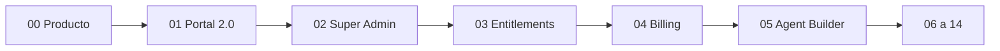

# Zent Platform Roadmap

> Índice canónico para convertir Zent de plataforma técnica en SaaS demostrable, vendible y operable.
> Fecha de auditoría: 2026-08-29. Versión de app: `0.1.0`. Contrato API: `1.0.0`.
>
> **No reescribir el core.** Cada fase evoluciona lo que ya existe.
> Planes ejecutables: [`docs/superpowers/plans/`](../superpowers/plans/).

---

## Cómo usar este documento

1. Leer **Current State** y **Gaps** (qué no hay que volver a construir).
2. Ejecutar las fases **en orden**, una por chat/PR, pegando el plan de esa fase al agente.
3. Cerrar una fase solo si pasan sus criterios de aceptación, tests y lint.
4. No saltar la regla de seguridad de la Fase 02: Super Admin incluye identidad de platform admin + audit de impersonate.

Orden confirmado:

```
00 Producto
 → 01 Customer Portal 2.0
 → 02 Super Admin
 → 03 Entitlements
 → 04 Billing (Stripe)
 → 05 Agent Builder
 → 06 Embedded Chat
 → 07 Security
 → 08 FinOps
 → 09 RAG Evaluation UI
 → 10 AI Gateway
 → 11 Production infra
 → 12 Integrations
 → 13 API Marketplace
 → 14 Kubernetes (opcional)
```



---

## Posicionamiento (Fase 00 — freeze)

Detalle canónico: [`PRODUCT.md`](PRODUCT.md) · [`INFORMATION_ARCHITECTURE.md`](INFORMATION_ARCHITECTURE.md) · [`PRESENTATION.md`](PRESENTATION.md).

**Zent** es una **AI Data Platform / RAG-as-a-Service** para empresas.

No es “un chatbot con documentos”.

Conecta datos de negocio (SQL, PDF, CSV, Excel, APIs, web, S3; más adelante Drive/ERP/CRM/DWH) y los convierte en:

```
Knowledge → AI Agent → Chat / API / Embedded Widget
```

Dos productos, **un** ecosistema, **una** API (`/api/v1`):

| Producto | Quién | Superficie |
|---|---|---|
| **Customer Portal** | Empresa cliente | Chat, Knowledge, usuarios, keys, uso, plan, facturación, agentes, integraciones |
| **Zent Control Center** | Dueño de Zent | Clientes, tenants, planes, suscripciones, consumo, costos de IA, límites, errores, feature flags, auditoría |

Glosario:

- **Organization** = tenant = customer. `organization_id` es la raíz de aislamiento.
- **Platform admin** = operador de Zent (no es `owner` de un tenant).
- **Organization admin** = `owner` / `admin` del tenant.
- **Entitlement** = feature o límite enforceable (no el JSON de display `plans.features`).

---

## Current State

Inventario verificado en el repo el 2026-08-29. Lo que está aquí **se reutiliza**, no se recrea.

### Stack y capas

- FastAPI en [`src/api/main.py`](../../src/api/main.py); API pública `1.0.0` en `/api/v1`.
- Clean Architecture: `src/core` (domain + ports) → `src/platform` → `src/infrastructure`. Tests de arquitectura en [`tests/test_architecture.py`](../../tests/test_architecture.py).
- Postgres + pgvector, Qdrant, Redis, Ollama (embeddings BGE-M3), worker de ingestión.
- Observabilidad Compose: Prometheus, Loki, Promtail, Grafana.
- Alembic: [`src/infrastructure/db_init/versions/`](../../src/infrastructure/db_init/versions/) (`001`–`012`). SQL fresco: `01`–`15` + seeds.
- Portal: Vite + React 19 + React Router 7 + Tailwind 4 en [`portal/`](../../portal/).
- SDKs: [`sdk/python`](../../sdk/python/), [`sdk/node`](../../sdk/node/).
- CI: [`.github/workflows/ci.yml`](../../.github/workflows/ci.yml) (gitleaks, ruff, pytest).

### Multi-tenant e identidad

- Tenant = fila en `organizations`. Contexto: [`TenantContext`](../../src/core/domain/entities.py) + [`TenantMiddleware`](../../src/api/tenant_middleware.py).
- Identidad **solo** del Bearer. Header `X-Organization-Id` no es fuente de verdad; mismatch → 403.
- Qdrant: colección compartida `rag_documents` + filtro obligatorio `organization_id` ([`src/infrastructure/qdrant/vector_store.py`](../../src/infrastructure/qdrant/vector_store.py)).
- Redis: claves prefijadas por org (`rag:usage:…`, `rag:ingest_lock:…`, `rag:conv:…`).
- Tests: [`tests/test_tenant_isolation.py`](../../tests/test_tenant_isolation.py), [`tests/test_organization_filter_injection.py`](../../tests/test_organization_filter_injection.py).

### Auth y RBAC

- API keys: SHA-256, prefijo `zent_sk_live` (legacy `rag_live_` / `rag_test_`). Scopes en [`src/platform/auth/scopes.py`](../../src/platform/auth/scopes.py).
- Sesiones portal: `rag_sess_…` AES-256-GCM ([`src/platform/auth/session.py`](../../src/platform/auth/session.py)). **No hay JWT.**
- Signup/login: `POST /api/v1/auth/signup|login|logout`, `GET /api/v1/auth/me`.
- Roles de sistema: `owner`, `admin`, `member`, `viewer` ([`src/infrastructure/db_init/02-rbac.sql`](../../src/infrastructure/db_init/02-rbac.sql)).
- `require_platform_admin` exige scope `admin:*` y **rechaza sesiones portal** ([`src/platform/rbac/policy.py`](../../src/platform/rbac/policy.py)). Esto bloquea un Control Center usable hasta la Fase 02.

### Billing y usage (scaffolding)

Tablas: `plans`, `billing_cycles`, `subscriptions`, `api_keys`, `request_quota`, `usage_events`, `pricing_models`, `usage_quotas`, `usage_alerts`, `billing_events`, `invoices`, `payments`.

Planes seed: `trial`, `starter`, `pro`, `enterprise` ([`03-billing.sql`](../../src/infrastructure/db_init/03-billing.sql) + columnas extra en [`14-billing-platform.sql`](../../src/infrastructure/db_init/14-billing-platform.sql)).

- Límites de recursos: [`src/platform/billing/plan_limits.py`](../../src/platform/billing/plan_limits.py) (`agents`, `knowledge_bases`, `connectors`, `users`).
- Provider: `PAYMENT_PROVIDER=manual`. Stripe **lanza** si se configura ([`src/infrastructure/billing/provider.py`](../../src/infrastructure/billing/provider.py)).
- Puerto: [`src/core/ports/payment_provider.py`](../../src/core/ports/payment_provider.py).
- Self-service upgrade gated: `SELF_SERVICE_UPGRADE_ENABLED` default `false`.
- Admin API (key `admin:*`): `GET /api/v1/billing/admin/subscriptions`, `GET /admin/organizations`, `DELETE /admin/subscriptions/{id}`.

`plans.features` es JSON de **display**, no un motor de entitlements.

### Knowledge, RAG, agents, eval

- Fuentes: `sql`, `file`, `csv`, `excel`, `web`, `s3`, `api` ([`src/knowledge/connectors/registry.py`](../../src/knowledge/connectors/registry.py)).
- APIs: `/api/v1/ingestion`, `/api/v1/sources`, `/api/v1/jobs`, `/api/v1/knowledge-bases`, `/api/v1/connectors`.
- RAG: `POST /api/v1/rag/query` + stream. Hybrid + rerank.
- Agents: tabla `agents` + `agent_runs`; CRUD + `POST /api/v1/agents/{id}/run` (+ stream).
- Prompts de org: `/api/v1/admin/prompt`.
- Eval: `/api/v1/eval` (feedback, stats, datasets, runs, compare) — **sin UI de producto**.
- Audit org-scoped: `GET /api/v1/audit-logs`.

### Portal customer (hoy)

Rutas en [`portal/src/App.tsx`](../../portal/src/App.tsx): `/login`, `/signup`, `/`, `/chat`, `/ingestion`, `/projects`, `/knowledge-bases`, `/agents`, `/connectors`, `/users`, `/keys`, `/usage`, `/prompts`, `/audit`.

Existe: dashboard con cuota + chart de requests, chat streaming, ingestión SQL, keys, usage tabular, audit, CRUD plano de projects/KBs/agents/connectors.

Falta: `/billing`, `/settings`, invites (modelo `InviteUserRequest` **sin endpoint**), Knowledge Center unificado, Agent Builder, widget, `/admin`, nav agrupada, charts de latencia/coste/errores.

### Infra Compose

Servicios: `api`, `portal`, `ingestion-worker`, `postgres`, `qdrant`, `redis`, `ollama`, `prometheus`, `loki`, `promtail`, `grafana`.

No hay: LiteLLM proxy container, Stripe, mailer, scheduler dedicado, widget CDN, Kubernetes.

---

## Gaps

Agrupados por lo que **falta para SaaS**, no por “features de marketing”.

### Producto / UX

- Dos shells de producto (customer vs control center) no existen; hay un solo portal tenant.
- Dashboard incompleto vs el mock SaaS (tokens, chunks, coste, errores, top users/queries).
- Knowledge Center fragmentado (`/ingestion` vs `/knowledge-bases` vs `/connectors`).
- Agent Builder: CRUD, no builder (prompt/tools/KBs/playground en UI).
- Embed widget: ausente.
- Billing UI customer: ausente (la API de invoices/planes sí existe).
- Invites, password reset, MFA, SSO: ausentes.

### Control plane

- No hay usuario/sesión de platform admin (solo API key `admin:*`).
- No hay impersonate, pause/suspend con UX, feature flags, tickets, ni métricas de plataforma (MRR/ARR) en UI.
- No hay `subscription_events` de negocio (sí `billing_events` de webhooks).

### Monetización

- Sin Stripe adapter.
- Sin entitlements como fuente de verdad.
- FinOps (margen por customer, cost/request) no está expuesto como producto.

### Seguridad / prod

- Mucho ya está (hashing, rate limit, idempotency, body limit, tenant tests, gitleaks).
- Falta: platform-admin session, CORS por org, scanning de contenedores, SSO, rotation de secrets como runbook, DR documentado, K8s.

### Integraciones

- No hay Google Drive, SharePoint, Notion, Snowflake, BigQuery, Kafka (roadmap README).

---

## Target Architecture

```
                    ZENT AI PLATFORM
                          │
         ┌────────────────┴────────────────┐
         │                               │
    CUSTOMER                      ZENT SUPER ADMIN
         │                               │
  Customer Portal                  Control Center
         │                               │
  Chat Knowledge Usage            Customers Billing Platform
         │                               │
         └──────────────┬───────────────┘
                        │
                   API / Gateway
                        │
         ┌──────────────┼─────────────────┐
         │              │                 │
    RAG Engine    Billing Engine      Identity/RBAC
         │              │                 │
    Qdrant SQL LLM  Plans Usage Invoices  Users Roles Audit
         │
      Workers / Ingestion
```

Reglas que **no cambian**:

- Una API FastAPI. Dos UIs (mismo repo `portal/`, rutas `/` vs `/admin`).
- Aislamiento por `organization_id` en SQL, Qdrant payload, Redis, audit.
- Clean Architecture y ports (`PaymentProvider`, repos).
- Qdrant **no** se parte en una colección por tenant en estas fases (filtro payload). BYOC es largo plazo.

Flujo de dinero objetivo (Fases 03–04):

```
Subscription → Entitlements → Usage → Invoice → Payment
```

---

## Phases

Cada fase tiene un plan en `docs/superpowers/plans/2026-08-29-phase-XX-*.md`.

| Fase | Plan | Prioridad | Depende de | Entregable |
|---|---|---|---|---|
| 00 | [phase-00-product](../superpowers/plans/2026-08-29-phase-00-product.md) | crítica | — | Freeze de producto + IA + slides |
| 01 | [phase-01-customer-portal](../superpowers/plans/2026-08-29-phase-01-customer-portal.md) | crítica | 00 | Portal 2.0 demostrable |
| 02 | [phase-02-super-admin](../superpowers/plans/2026-08-29-phase-02-super-admin.md) | crítica | 01 | Control Center operable |
| 03 | [phase-03-entitlements](../superpowers/plans/2026-08-29-phase-03-entitlements.md) | crítica | 02 | Planes configurables sin deploy |
| 04 | [phase-04-billing](../superpowers/plans/2026-08-29-phase-04-billing.md) | crítica | 03 | Stripe + checkout self-service |
| 05 | [phase-05-agent-builder](../superpowers/plans/2026-08-29-phase-05-agent-builder.md) | crítica | 03 | Builder + playground |
| 06 | [phase-06-embedded-chat](../superpowers/plans/2026-08-29-phase-06-embedded-chat.md) | alta | 05 | Widget embed |
| 07 | [phase-07-security](../superpowers/plans/2026-08-29-phase-07-security.md) | crítica | 02 | Hardening pre-enterprise |
| 08 | [phase-08-finops](../superpowers/plans/2026-08-29-phase-08-finops.md) | alta | 04 | Márgenes y AI economics |
| 09 | [phase-09-rag-evaluation](../superpowers/plans/2026-08-29-phase-09-rag-evaluation.md) | alta | 01 | UI sobre eval engine existente |
| 10 | [phase-10-ai-gateway](../superpowers/plans/2026-08-29-phase-10-ai-gateway.md) | media | 05 | Router de modelos |
| 11 | [phase-11-production-infra](../superpowers/plans/2026-08-29-phase-11-production-infra.md) | crítica | 07 | Docker + managed services |
| 12 | [phase-12-integrations](../superpowers/plans/2026-08-29-phase-12-integrations.md) | media | 01 | Drive/SharePoint/etc. plugins |
| 13 | [phase-13-marketplace](../superpowers/plans/2026-08-29-phase-13-marketplace.md) | baja | 04 | Developer keys live/test |
| 14 | [phase-14-kubernetes](../superpowers/plans/2026-08-29-phase-14-kubernetes.md) | opcional | 11 | K8s solo al escalar |

Seguridad **dentro** de 02 (no diferir): platform-admin session, impersonate + audit, tests de que un tenant no ve el control plane.

---

## Database Changes (mapa)

No se tiran tablas existentes. Solo additive.

- **02:** `users.is_platform_admin` (o `platform_users`) + sesiones `typ=platform`; columnas de impersonation audit en `audit_logs.metadata`.
- **03:** `plan_entitlements` (`plan_id`, `key`, `value_type`, `value`); opcional `organization_entitlement_overrides`; `subscription_events`.
- **04:** columnas Stripe ya previstas (`payment_provider`, `provider_customer_id`, `provider_subscription_id`); no duplicar invoices.
- **05:** `agents.config_json` ya existe — usarlo para knowledge IDs, temperature, tone, limits. Evitar columna nueva si cabe.
- **06:** `agents.config_json.embed` (allowed origins, theme) o tabla `embed_tokens`.
- **08:** vistas o tablas agregadas de coste (pueden ser queries sobre `usage_events` + `pricing_models` + `subscriptions`).
- **12:** ningún schema nuevo si el connector plugin reutiliza `connectors` / `kb_sources`.

Próxima migración Alembic: **`013_…`**.

---

## API Changes (mapa)

Contrato `1.0.0`: **solo additive**. No romper SDKs.

- **01:** `POST /api/v1/organizations/invites`; `GET /api/v1/billing/invoices` ya existe — usarlo en UI. Dashboard extras: preferir extender `GET /billing/usage` (tokens, errors, top) antes de un endpoint nuevo.
- **02:** `POST /api/v1/auth/platform/login`; `GET /api/v1/platform/metrics`; `POST /api/v1/admin/organizations/{id}/impersonate`; acciones pause/suspend/reset-usage. Reusar listados admin de billing.
- **03:** `GET /api/v1/billing/entitlements`; admin CRUD de entitlements por plan.
- **04:** `POST /api/v1/billing/checkout`; webhooks Stripe en ruta existente `/api/v1/billing/webhooks/{provider}`.
- **05:** `PATCH /api/v1/agents/{id}` ya acepta `system_prompt`, `tools`, `model` — extender payload, no segundo recurso.
- **06:** `GET /api/v1/agents/{id}/embed` (snippet + public token).
- **09:** UI sobre `/api/v1/eval/*` existentes.

---

## Frontend Changes (mapa)

Un solo app Vite. Dos layouts:

- Customer: nav agrupada `Chat | Knowledge | Usage | Workspace | Settings`.
- Admin: `/admin/*` con auth de platform admin.

Knowledge Center (Fase 01) unifica, no duplica páginas muertas:

```
/knowledge
  /sources
  /collections   (knowledge_bases)
  /documents     (source_documents)
  /sql           (legacy ingestion tables)
  /jobs
  /playground    (POST /rag/query de prueba)
```

Redirects 301/router desde `/ingestion` y `/knowledge-bases` hacia el centro.

---

## Infra / Security / Billing / Demo / Production

### Infra

- Hoy: Docker Compose (demo).
- Fase 11: Compose o equivalente + **managed** PG / Redis / Qdrant / object storage. Cloudflare delante.
- Fase 14: Kubernetes **solo** si hay carga real. No para “verse enterprise”.

### Security

- Base ya sólida (tenant isolation, hashing, RBAC tenant, audit org, gitleaks).
- 02: platform identity + impersonate audit.
- 07: headers, CORS por org, CSRF portal, scanning de imágenes, más tests de aislamiento, secret rotation runbook.
- SSO/OIDC: Fase 07 **fuera de alcance** salvo que un diseño lo marque como blocker de venta.

### Billing

- 03: entitlements.
- 04: Stripe adapter + checkout; `manual` permanece para enterprise y tests.
- 08: coste interno vs precio cobrado.

### Demo / presentación

Historia (no “stack técnico”):

1. Zent — Turn your business data into an AI workforce.
2. Problema: ERP/CRM/SQL/Excel/PDF fragmentados.
3. Solución: Data → Zent → Knowledge → Agents → Answers.
4. Arquitectura (Frontend → API → RAG / SQL / Qdrant / LLM).
5. Customer Experience (dashboard, knowledge, agent, chat, API).
6. Business Control (Control Center).
7. AI Economics (margen).
8. Security (multi-tenant, RBAC, audit, keys).
9. Scale (1 → 1000 customers).
10. One platform. Every business. Its own AI.

La demo vive cuando 01 + 02 + 05 están hechos. 04/08 pulen el slide de economics con números reales.

### Production go-live

Checklist mínimo: Fases 01, 02, 03, 04, 07, 11. Agent Builder (05) es el diferenciador comercial; embed (06) es el acelerador de venta.

---

## Protocolo de cada fase (agentes)

Todo plan de fase obliga al agente a:

1. Inspeccionar arquitectura existente (paths del plan).
2. No reescribir lo que funciona.
3. Identificar componentes reutilizables.
4. Diseñar cambios additive.
5. Implementar.
6. Añadir migraciones.
7. Añadir tests.
8. Actualizar API.
9. Actualizar frontend (si aplica).
10. Actualizar documentación.
11. Correr tests.
12. Correr lint.
13. Verificar compatibilidad hacia atrás.
14. Reportar archivos cambiados.
15. Reportar riesgos residuales.

### Global Constraints (todas las fases)

- Identidad de tenant **solo** del Bearer; nunca confiar `X-Organization-Id` ni `organization_id` del body.
- No romper API `1.0.0` (additive only).
- `core/` no importa `infrastructure` ni FastAPI.
- Copy del portal en **español** (el existente).
- Tests: `pytest`; lint: `ruff check src/ tests/ sdk/python`.
- Migraciones: siguiente id `013+` en `src/infrastructure/db_init/versions/` y SQL fresco si un volume nuevo debe nacer completo.
- Default `PAYMENT_PROVIDER=manual` hasta que Fase 04 lo documente como opcional.
- No introducir Kubernetes, SSO, ni Drive “de paso” en fases que no los listan.

---

## Do not touch

Salvo que un plan de fase lo pida explícitamente:

- Reemplazar Qdrant por otra vector DB.
- Colección Qdrant por tenant.
- JWT en lugar de `rag_sess_` / API keys.
- Segundo frontend (Next.js, etc.).
- Segundo agent runtime.
- Tirar `ManualPaymentProvider`.
- Reescribir eval engine.
- Mover el dominio a un monolito sin capas.

---

## Ejecución

| Siguiente paso | Plan |
|---|---|
| Cerrar copy / IA / slides | Fase 00 |
| Primera implementación de código | Fase 01 |

Criterio de cierre de fase: checkboxes del plan, tests de esa fase en verde, lint, API compatible, riesgos escritos al final del PR.
